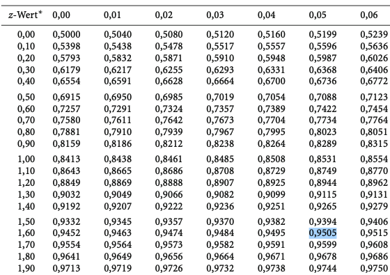
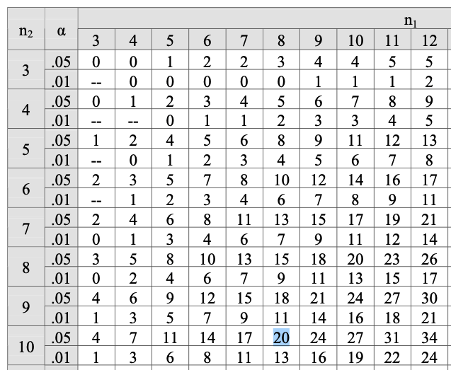
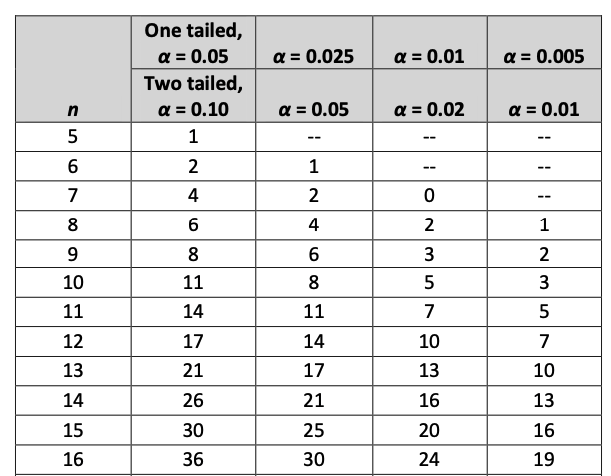
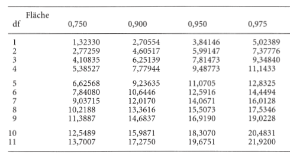

```{r setup, include=FALSE}
options(htmltools.dir.version = FALSE)

library(tidyverse)
library(kableExtra)
library(ggplot2)
library(plotly)
library(htmlwidgets)
library(plotly)
library(MASS)
library(ggpubr)
library(xaringanthemer)
library(xaringanExtra)
library(sjPlot)
library(sjmisc)
options(scipen = 999)

style_duo_accent(
  primary_color = "#621C37",
  secondary_color = "#EE0071",
  background_image = "blank.png"
)

xaringanExtra::use_xaringan_extra(c("tile_view"))

use_scribble(
  pen_color = "#EE0071",
  pen_size = 4
  )

knitr::opts_chunk$set(
  fig.retina = TRUE,
  warning = FALSE,
  message = FALSE
)

Xname = ""
Yname = ""
nudgnumber = 3
my_green = "#EE0071"
```

name: Title slide
class: middle, left
<br><br><br><br><br><br><br>
# Statistik II
***
### Einheit 12: Robuste Tests
##### `r format(as.Date(data.frame(readxl::read_excel("Modul Quantitative Methoden II_Termine.xlsx"))$Datum), "%d.%m.%Y")[12]` | Prof. Dr. Stephan Goerigk

---
class: top, left
### Robuste Tests

#### Notwendigkeit

* t-Test, ANOVA, etc. sind **parametrische Verfahren**

* Parametrische Verfahren: Verfahren, die bestimmte **Verteilungseigenschaften** der Daten voraussetzen

  * Normalverteilung
  * Varianzhomogenität
  * ...
  
* PROBLEM: Sind diese Voraussetzungen verletzt, liefern Sie keine akkuraten Ergebnisse

* Was macht man, wenn diese Voraussetzungen verletzt sind?

$\rightarrow$ Alternative Verfahrensklasse: **nonparametrische Verfahren**

---
class: top, left
### Robuste Tests

#### Nonparametrische Verfahren

* Stellen keine so rigiden Anforderungen an die Daten

  * Normalverteilung (in der Population) in der Regel nicht erfordert
  
  * benötigen kein Intervallskalenniveau
  
ABER:

* gelockerte Ansprüche führen zu eingeschränkten Aussagemöglichkeiten

* Reduzierte Annahmen im Vergleich zu parametrischen Verfahren:

  * Ordinalskalenniveau
  
  * zufällige Zuordnung von Versuchspersonen

* Daher: Falls möglich werden parametrische Verfahren bevorzugt (beziehen mehr Informationen ein)

---
class: top, left
### Robuste Tests

#### Nonparametrische Verfahren

**Logik nonparametrischer Tests:**

* Nonparametrische Tests setzen in der Regel Ordinalskalenniveau voraus

  * Arbeiten mit der Betrachtung von Rangplätzen
  
  * Versuchspersonen werden aufgrund ihrer Messwerte einem Rang zugeordnet
  
  * durch Verwendung von Rängen wird künstliche Äquidistanz zwischen Werten erzeugt (Rangabstand von genau 1)
  
$\rightarrow$ Nonparametrische Verfahren Arbeiten nicht mit Populationsverteilungen, sondern legen eigene Verteilung (Rangverteilung) zugrunde

---
class: top, left
### Robuste Tests

#### Nonparametrische Verfahren

* Parametrische Verfahren haben häufig ein nonparametrisches Äquivalent

* Es gilt als Alternative, wenn Voraussetzungen verletzt  oder Stichproben sehr klein sind

```{r echo=F}
d = data.frame(Parametrisch = c("Unabhängiger t-Test",
                                "Abhängiger t-Test",
                                "ANOVA ohne Messwiederholung",
                                "ANOVA mit Messwiederholung"),
               Nonparametrisch = c("Mann-Whitney U-Test",
                                   "Wilcoxon Test",
                                   "Kruskal-Wallis H-Test",
                                   "Fridman-Test"))

knitr::kable(d,
             booktabs = T,
             longtable = F) %>%
  kable_classic(full_width = T,
                  font_size = 16)
```

---
class: top, left
### Robuste Tests

#### Nonparametrische Verfahren

**Mann-Whitney U-Test**

* Test zum Vergleich von zwei Gruppen/Kategorien

* Wird dem unabhängigen t-Test in folgenden Szenarien vorgezogen

  * kein Intervallskalenniveau der $AV$
  
  * Merkmal ist in der Population nicht normalverteilt (Test der NV auf Basis der Stichprobendaten)
  
  * Varianzhomogenität nicht gegeben
  
* $H_0:$ Es besteht kein Unterschied zwischen den beiden Gruppen hinsichtlich der AV.

* Methode: Vergleich der Rangplätze der Personen innerhalb der beiden Gruppen im Vergleich zur Gesamtstichprobe

* Teststatistik: U-Wert (sagt aus, ob sich die beiden Gruppen in der Rangplatzverteilung signifikant unterscheiden)

---
class: top, left
### Robuste Tests

#### Nonparametrische Verfahren

**Mann-Whitney U-Test**

Bestimmung der Rangplätze:

* Jede Person erhält basierend auf ihrem Messwert einen Rangplatz

  * Person mit dem niedrigsten Messwert auf der $AV$ erhält Rangplatz 1
  
  * Nächste Person erhält Platz 2
  
  * ...

* WICHTIG: Bei der Zuordnung des Ranges einer Person spielt ihre Gruppenzugehörigkeit zunächst keine Rolle

$\rightarrow$ Erstellung **einer** Rangreihe für alle Personen in der Stichprobe

---
class: top, left
### Robuste Tests

#### Nonparametrische Verfahren

**Mann-Whitney U-Test**

<small>

Gruppenspezifische Zusammenfassung:

* Nach Bildung der Rangreihe für jede Gruppe

  * Summe der Rangplätze berechnen 
  
  * durchschnittlichen Rangplatz der Gruppe berechnen

***

.pull-left[

Summe der Rangplätze einer Gruppe berechnen:

$$T_i = \sum\limits _{m=1}^{n_i}R_{mi}$$

mit:

* $i:$ Gruppe
* $n_i:$ Anzahl der Personen in Gruppe $i$
* $R_{mi}:$ Rang der m-ten Person in Gruppe $i$
]

.pull-right[
Mittlere Rangsumme einer Gruppe berechnen:

$$\bar{R}_i = \frac{T_i}{n_i}$$

]

---
class: top, left
### Robuste Tests

#### Nonparametrische Verfahren


.pull-left[

**Mann-Whitney U-Test**

Beispiel: "Mentaler Schmerz"

* Hypothese: *Depressive Patient:innen geben höhere Werte bei "Mentalen Schmerzen" an als Patient:innen mit Zwangsstörungen.*

* $AV:$ Mentale Schmerzskale (0-30 Punkte)

* $UV: Diagnose$

* Normalverteilung fraglich $\rightarrow$ U-Test soll verwendet werden
]

.pull-right[
```{r echo=F}
d = data.frame("Mentaler Schmerz (Dep.)" = c(24, 18, 21, 28, 17, 9, 20, 26, "", ""),
               "Rang (Dep.)" = c(15, 10, 13, 18, 9, 4, 12, 17, "", ""),
              "Mentaler Schmerz (Zw.)" = c(14, 8,16,5,22,12,25,3,11,19),
               "Rang (Zw.)" = c(7,3,8,2,14,6,16,1,5,11))

names(d) = c("Mentaler Schmerz (Dep.)",
             "Rang (Dep.)",
             "Mentaler Schmerz (Zw.)",
             "Rang (Zw.)")
d$`Rang (Dep.)` = as.character(d$`Rang (Dep.)`)
d$`Rang (Dep.)`[1:8] = paste0(d$`Rang (Dep.)`[1:8], ".")

d$`Rang (Zw.)` = as.character(d$`Rang (Zw.)`)
d$`Rang (Zw.)` = paste0(d$`Rang (Zw.)`, ".")

knitr::kable(d,
             booktabs = T,
             longtable = F) %>%
  kable_classic(full_width = T,
                  font_size = 16)
```
]

***

```{r echo=F}
d = data.frame(matrix(nrow = 1, ncol = 18))

names(d) = 18:1
d[1,] = c("D", "D", "Z", "D", "Z", "D", "D", "Z", "D", "D", "Z", "Z", "Z", "Z", "D", "Z", "Z", "Z")

knitr::kable(d,
             booktabs = T,
             longtable = F) %>%
  kable_classic(full_width = T,
                  font_size = 16)
```


---
class: top, left
### Robuste Tests

#### Nonparametrische Verfahren


.pull-left[

**Mann-Whitney U-Test**

Berechnung Summe der Rangplätze:

$$T_D= \sum\limits _{m=1}^{8}R_{mD} = 15+10+13+18+...=98$$

$$T_Z= \sum\limits _{m=1}^{10}R_{mZ} = 7+3+8+2+...=73$$
]

.pull-right[
```{r echo=F}
d = data.frame("Mentaler Schmerz (Dep.)" = c(24, 18, 21, 28, 17, 9, 20, 26, "", ""),
               "Rang (Dep.)" = c(15, 10, 13, 18, 9, 4, 12, 17, "", ""),
              "Mentaler Schmerz (Zw.)" = c(14, 8,16,5,22,12,25,3,11,19),
               "Rang (Zw.)" = c(7,3,8,2,14,6,16,1,5,11))

names(d) = c("Mentaler Schmerz (Dep.)",
             "Rang (Dep.)",
             "Mentaler Schmerz (Zw.)",
             "Rang (Zw.)")
d$`Rang (Dep.)` = as.character(d$`Rang (Dep.)`)
d$`Rang (Dep.)`[1:8] = paste0(d$`Rang (Dep.)`[1:8], ".")

d$`Rang (Zw.)` = as.character(d$`Rang (Zw.)`)
d$`Rang (Zw.)` = paste0(d$`Rang (Zw.)`, ".")

knitr::kable(d,
             booktabs = T,
             longtable = F) %>%
  kable_classic(full_width = T,
                  font_size = 16)
```
]

---
class: top, left
### Robuste Tests

#### Nonparametrische Verfahren

.pull-left[

**Mann-Whitney U-Test**

Berechnung durchschnittliche Rangplätze:

$$\bar{R}_D= \frac{T_D}{n_D} = \frac{98}{8}=12.25$$

$$\bar{R}_Z= \frac{T_Z}{n_Z} = \frac{73}{10}=7.3$$
]

.pull-right[
```{r echo=F}
d = data.frame("Mentaler Schmerz (Dep.)" = c(24, 18, 21, 28, 17, 9, 20, 26, "", ""),
               "Rang (Dep.)" = c(15, 10, 13, 18, 9, 4, 12, 17, "", ""),
              "Mentaler Schmerz (Zw.)" = c(14, 8,16,5,22,12,25,3,11,19),
               "Rang (Zw.)" = c(7,3,8,2,14,6,16,1,5,11))

names(d) = c("Mentaler Schmerz (Dep.)",
             "Rang (Dep.)",
             "Mentaler Schmerz (Zw.)",
             "Rang (Zw.)")
d$`Rang (Dep.)` = as.character(d$`Rang (Dep.)`)
d$`Rang (Dep.)`[1:8] = paste0(d$`Rang (Dep.)`[1:8], ".")

d$`Rang (Zw.)` = as.character(d$`Rang (Zw.)`)
d$`Rang (Zw.)` = paste0(d$`Rang (Zw.)`, ".")

knitr::kable(d,
             booktabs = T,
             longtable = F) %>%
  kable_classic(full_width = T,
                  font_size = 16)
```
]


---
class: top, left
### Robuste Tests

#### Nonparametrische Verfahren

**Mann-Whitney U-Test**

<small>

Berechnung von $U$ und $U'$:

* Der Wert $U$ ist die Summe der Rangplatzüberschreitungen

* Rangplatzüberschreitungen = Anzahl der Personen aus der anderen Gruppe die den Rang einer Person überschreiten

```{r echo=F}
d = data.frame(matrix(nrow = 1, ncol = 18))

names(d) = 18:1
d[1,] = c("D", "D", "Z", "D", "Z", "D", "D", "Z", "D", "D", "Z", "Z", "Z", "Z", "D", "Z", "Z", "Z")

knitr::kable(d,
             booktabs = T,
             longtable = F) %>%
  kable_classic(full_width = T,
                  font_size = 16)
```

* z.B.:  D18 wird von keinem Rangplatz der Zwangspatien:innen überschritten (0 Rangplatzüberschreitungen)
* D17 wird von keinem Rangplatz der Zwangspatien:innen überschritten (0 Rangplatzüberschreitungen)
* D15 wird von einem Rangplatz der Zwangspatien:innen überschritten (1 Rangplatzüberschreitungen)
* ...

$U=0+0+1+2+2+3+3+7=18$ 

Oder einfacher (ohne Einzelwerte): $U=n_D \cdot n_Z + \frac{n_D \cdot (n_D + 1)}{2}-T_D = 8 \cdot 10 + \frac{8 \cdot (8 + 1)}{2}-98=18$

$\rightarrow$ Zwangspatient:innen überschreiten Ränge der Depressiven sehr selten.

---
class: top, left
### Robuste Tests

#### Nonparametrische Verfahren

**Mann-Whitney U-Test**

<small>

Berechnung von $U$ und $U'$:

* Der Wert $U'$ ist die Summe der Rangplatzunterschreitungen

* Rangplatzunterschreitungen = Anzahl der Personen aus der anderen Gruppe die den Rang einer Person unterschreiten

```{r echo=F}
d = data.frame(matrix(nrow = 1, ncol = 18))

names(d) = 18:1
d[1,] = c("D", "D", "Z", "D", "Z", "D", "D", "Z", "D", "D", "Z", "Z", "Z", "Z", "D", "Z", "Z", "Z")

knitr::kable(d,
             booktabs = T,
             longtable = F) %>%
  kable_classic(full_width = T,
                  font_size = 16)
```

* z.B.:  D18 wird von allen Zwangspatien:innen unterschritten (10 Rangplatzunterschreitungen)
* D17 wird von allen Zwangspatien:innen unterschritten (10 Rangplatzunterschreitungen)
* D15 wird von 9 Zwangspatien:innen unterschritten (9 Rangplatzunterschreitungen)
* ...

$U'=10+10+9+8+8+7+7+3=62$ 

Oder einfacher (ohne Einzelwerte): $U'=n_D \cdot n_Z + \frac{n_Z \cdot (n_Z + 1)}{2}-T_Z = 8 \cdot 10 + \frac{10 \cdot (10 + 1)}{2}-73=62$

$\rightarrow$ Zwangspatient:innen unterschreiten Ränge der Depressiven sehr häufig.

---
class: top, left
### Robuste Tests

#### Nonparametrische Verfahren

**Mann-Whitney U-Test - Signifikanzprüfung**

* $H_0:$ Kein bedeutsamer Unterschied in den Rangplatzüber- und unterschreitungen der Gruppen

* Stichprobenkennwerteverteilung der U-Werte erlaubt Bestimmung der Wahrscheinlichkeit eines empirischen Ergebnisses unter Annahme der $H_0$

Vorgehen:

1. Berechnung von $U$ bzw. $U'$

2. Berechnung des, unter $H_0$ erwarteten mittleren $U$-Werts $(\mu_U)$

3. Berechnung der Streuung der Stichprobenkennwerteverteilung

4. Empirischen und kritischen Wert berechnen (und diese vergleichen)

---
class: top, left
### Robuste Tests

#### Nonparametrische Verfahren

**Mann-Whitney U-Test - Signifikanzprüfung**

$H_0$ des U-Tests:

* Beziehung zwischen $U$ und $U':$

$$U= n_D \cdot n_Z - U'$$
  * Je stärker der Gruppenunterschied, desto mehr Rangüberschreitungen und weniger Rangunterschreitungen gibt es.
  
  * Gleich viele Rangüberschreitungen und - unterschreitungen $\rightarrow$ Kein Gruppenunterschied

* Folglich ist lautet die $H_0$ des U-Tests:

$$U=U'$$
---
class: top, left
### Robuste Tests

#### Nonparametrische Verfahren

**Mann-Whitney U-Test - Signifikanzprüfung**

<small>

Berechnung des, unter $H_0$ erwarteten mittleren $U$-Werts $(\mu_U):$

* Unter Annahme der $H_0: U = U'$ ergibt sich  $\mu_U$ aus:

$$\mu_U = \frac{n_D \cdot n_Z}{2}$$

* Im Beispiel:

$$\mu_U = \frac{8 \cdot 10}{2}=40$$

* Eigenschaften von $\mu_U:$

  * Enspricht dem Mittelwertsunterschied von 0 in der Stichprobenkennwerteverteilung des unabhängigen t-Tests
  
  * Starke Abweichungen des empirischen $U$-Werts von $\mu_U$ in positive/negative Richtung sprechen gegen $H_0$
  
  * Theoretische widerholte Stochprobenziehung resultiert in symmetrische Verteilung um $\mu_U$ (rechts: Rangüberschreitungen; links: Rangunterschreitungen)
  
---
class: top, left
### Robuste Tests

#### Nonparametrische Verfahren

**Mann-Whitney U-Test - Signifikanzprüfung**
 
Berechnung der Streuung der Stichprobenkennwerteverteilung:

* Frage: Welche Awreichung des empirischen $U$-Werts von $\mu_U$ ist ausreichend für signifikantes Ergebnis?

* Alle denkbaren Werte von $U$ und $U'$ verteilen sich symmetrisch um $\mu_U$

* Streuung der $U$-Werte um $\mu_U$ wir berechnet als:

$$\sigma_U=\sqrt{\frac{n_D \cdot n_Z \cdot (n_D + n_Z +1)}{12}}$$

Im Beispiel: 

$$\sigma_U=\sqrt{\frac{8 \cdot 10 \cdot (8 + 10 +1)}{12}}=11.25$$

---
class: top, left
### Robuste Tests

#### Nonparametrische Verfahren

**Mann-Whitney U-Test - Signifikanzprüfung**

$U$-Test bei großen Stichproben:

* Was heißt groß? $\rightarrow$ Einzelgruppengrößen $> 20$ (und ca. gleich groß) 

* Es ist dann von Approximation an Normalverteilung anzunehmen

* Günstige Folge: Standardnormalverteilung darf als Prüfverteilung herangezogen werden

* empirischer $U$-Wert,  $\mu_U$ und $\sigma_U$ können in Formel zur z-Standardisierung eingesetzt werden:

$$z_U = \frac{U-\mu_U}{\sigma_U}$$
---
class: top, left
### Robuste Tests

.pull-left[

#### Nonparametrische Verfahren

**Mann-Whitney U-Test - Signifikanzprüfung**

$U$-Test bei großen Stichproben - Beispiel:

$$z_U = \frac{U-\mu_U}{\sigma_U} = \frac{18-40}{11.25} = -1.96$$

* Nachsehen kritischer $z$-Wert in Tabelle (gerichtete Hypothese, $\alpha=.05$)

$$z_{krit} = -1.65$$

Test auf Signifikanz:

$$|-1.96| > |-1.65|$$ 

* $z_U > z_{krit}\rightarrow$ Gruppenunterschied ist signifikant $(H_0$ verwerfen).
]


.pull-right[
.center[
```{r eval = TRUE, echo = F, out.width = "550px"}

```
]

Anders gesagt: Signifikant weniger Rangplatzüberschreitungen der Zwangspatient:innen als Rangplatzunterschreitungen
]

---
class: top, left
### Robuste Tests
.pull-left[
#### Nonparametrische Verfahren

**Mann-Whitney U-Test - Signifikanzprüfung**

$U$-Test bei kleinen Stichproben (beide n < 20):

* Approximation an Normalverteilung nicht anzunehmen

* $U$-Tabelle enthält exakte Wahrscheinlichkeiten der $U$-Werte unter der $H_0$

* $U_{krit}$ muss aus dieser Tabelle abgelesen werden (eine Tabelle für einseitige und eine für zweiseitige Tests)
]
.pull-right[

$U$-Tabelle für gerichtete Hypothesen (einseitig):
.center[
```{r eval = TRUE, echo = F, out.width = "550px"}

```
]
]


---
class: top, left
### Robuste Tests
.pull-left[
#### Nonparametrische Verfahren

**Mann-Whitney U-Test - Signifikanzprüfung**

$U$-Test bei kleinen Stichproben (beide n < 20):

* Relevante Größen für die U-Verteilung:
  * $\mu_U=40$ (Mitte der $U$-Verteilung)
  * $U_{emp}=18$ (liegt links der Mitte)
  * $U'_{emp}=62$ (liegt rechts der Mitte)
  * $U_{krit} = 20$

* $U_{emp}=18$ weiter weg von $\mu_U$ als $U_{krit} = 20$

$\rightarrow$ Auch exakter Test ist signifikant.

]
.pull-right[

$U$-Tabelle für gerichtete Hypothesen (einseitig):
.center[
```{r eval = TRUE, echo = F, out.width = "550px"}

```
]
]

---
class: top, left
### Robuste Tests

#### Nonparametrische Verfahren

**Mann-Whitney U-Test - Verbundene Ränge**

<small>

* Es kann vorkommen, dass sich mehrere Personen einen Rang teilen

* Zuweisung des Rangplatzes: Personen erhalten durchschnittlichen Rang 

  * z.B. für geteilte Plätze 10 und 11 erhalten beide Personen den Rang $\frac{10 + 11}{2} = 10.5$

* An dem beschriebenen Vorgehen ändert sich lediglich die Formel der Streuung:

$$\sigma_U=\sqrt{\frac{n_1 \cdot n_2}{N \cdot (N-1)}} \cdot \sqrt{(\frac{N^3-N}{12}) - \sum\limits _{i=1}^{k} \frac{t^3_i-t_i}{12}}$$

mit:

* $N=n_1+n_2$

* $t_1.$ Anzahl Personen die Rang $i$ teilen

* $k:$ Gesamtzahl verbundener Ränge

---
class: top, left
### Robuste Tests

#### Nonparametrische Verfahren

**Mann-Whitney U-Test in R**

```{r echo=F}
d = data.frame("Mentaler Schmerz (Dep.)" = c(24, 18, 21, 28, 17, 9, 20, 26, NA, NA),
               "Rang (Dep.)" = c(15, 10, 13, 18, 9, 4, 12, 17, "", ""),
              "Mentaler Schmerz (Zw.)" = c(14, 8,16,5,22,12,25,3,11,19),
               "Rang (Zw.)" = c(7,3,8,2,14,6,16,1,5,11))

names(d) = c("Mentaler Schmerz (Dep.)",
             "Rang (Dep.)",
             "Mentaler Schmerz (Zw.)",
             "Rang (Zw.)")
```

```{r}
wilcox.test(d$`Mentaler Schmerz (Dep.)`, d$`Mentaler Schmerz (Zw.)`, 
            correct  = F, 
            paired = FALSE, 
            alternative = "greater")
```


---
class: top, left
### Robuste Tests

#### Nonparametrische Verfahren

**Wilcoxon-Test**

<small>

* Nonparametrisches Pendant für abhängigen t-Test

* Nutzt ebenfalls Bildung einer Rangreihe

Vorgehen:

1. Bilden der Differenz zwischen Messwertpaaren (wie bei abhängigem t-Test)

2. Bilden des Betrags jedes Differenzwerts 

  * Vorzeichen wird ignoriert
  * Differenzen = 0 werden ebenfalls ignoriert
  * Nulldifferenzen werden von Anzahl $(N)$ abgezogen

3. Rangreihe aus Beträgen der Differenzwerte bilden

  * kleinster Wert erhält 1. Rang
  * Bei Rangbindungen selbes Vorgehen wie bei $U$-Test

4. Rangplätze, die zuvor negative Differenz hatten, erhalten ein negatives Vorzeichen (gerichtete Ränge, *engl. signed Ranks*)

---
class: top, left
### Robuste Tests

#### Nonparametrische Verfahren

**Wilcoxon-Test**

$H_0$ des Wilcoxon-Tests:

* $H_0:$ Es besteht kein Unterschied zwischen den Messzeitpunkten.

* Numerische Formulierung der $H_0:$ Gleiche Anzahl von positiven und negativen Differenzen (gerichteten Rängen)

Berechnung des Testwerts $W$ des Wilcoxon-Tests:

$$W=|min(\sum R_{positiv} \cdot \sum R_{negaiv})|$$
---
class: top, left
### Robuste Tests

#### Nonparametrische Verfahren

.pull-left[

**Wilcoxon-Test**

Beispiel: Lebensqualität vor und nach Therapie

* $AV:$ Lebensqualität (1-10 Punkte)

* $UV:$ Zeit (prä vs. post) 

Frage: Signifikante Verbesserung der Lebensqualität?`

]

.pull-right[
```{r echo=F}
d = data.frame(
  Prä = c(6,5,3,6,4,7,4,5,6),
  Post = c(7,8,5,6,9,6,8,7,8),
  Differenz = c(1,3,2,0,5,-1,4,2,2),
  Betrag = c(1,3,2, NA, 5,1,4,2,2), 
  Rang = c(1.5, 6, 4, NA,8,1.5,7,4,4),
  gerichteteRang = c( 1.5, 6,4, NA, 8, -1.5, 7,4,4)
)

names(d)[names(d) == "gerichteteRang"] = "gerichteter Rang"

knitr::kable(d,
             booktabs = T,
             longtable = F) %>%
  kable_classic(full_width = T,
                  font_size = 16)
```

]


---
class: top, left
### Robuste Tests

#### Nonparametrische Verfahren

.pull-left[

**Wilcoxon-Test**

Berechnung der Summe positiver und negativer Ränge:

$$\sum R_{positiv} = 1.5 + 6 + 4+ 8+7+4+4=34.5$$
$$\sum R_{negativ} = -1.5$$

$$W=|min(\sum R_{positiv} \cdot \sum R_{negaiv})|=1.5$$

]

.pull-right[
```{r echo=F}
d = data.frame(
  Prä = c(6,5,3,6,4,7,4,5,6),
  Post = c(7,8,5,6,9,6,8,7,8),
  Differenz = c(1,3,2,0,5,-1,4,2,2),
  Betrag = c(1,3,2, NA, 5,1,4,2,2), 
  Rang = c(1.5, 6, 4, NA,8,1.5,7,4,4),
  gerichteteRang = c( 1.5, 6,4, NA, 8, -1.5, 7,4,4)
)

names(d)[names(d) == "gerichteteRang"] = "gerichteter Rang"

knitr::kable(d,
             booktabs = T,
             longtable = F) %>%
  kable_classic(full_width = T,
                  font_size = 16)
```

]

---
class: top, left
### Robuste Tests

#### Nonparametrische Verfahren

.pull-left[

**Wilcoxon-Test - Signifikanztest**

* $W_{emp}=1.5$

* $W_{krit}$ in Tabelle nachschlagen

  * $W_{\alpha=.05} = 4$
  
* exakter W Wert liegt links von $W_{krit}$ (Achtung: gerichtet)

* Test ist signifikant

]

.pull-right[
.center[
```{r eval = TRUE, echo = F, out.width = "550px"}

```
]
]

---
class: top, left
### Robuste Tests

#### Nonparametrische Verfahren

**Wilcoxon-Test in R**

```{r}
wilcox.test(d$Prä, d$Post, 
            correct = FALSE, 
            paired = TRUE)
```


---
class: top, left
### Robuste Tests

#### Nonparametrische Verfahren

**Kruskal-Wallis H-Test**

<small>

* Alternative für ANOVA ohne Messwiederholung (aka. Rangvarianzanalyse)

* Nutzt ebenfalls Bildung einer Rangreihe (analog zum U-Test)

$$T_i = \sum\limits _{m=1}^{n_i}R_{mi}$$

* Anschließend Rangsummen quadrieren und durch $n$ der Gruppen teilen:

$$\sum\limits _{i=1}^{p}\frac{T^2_i}{n_i}$$
mit:
* $p:$ Anzahl der Gruppen

---
class: top, left
### Robuste Tests

#### Nonparametrische Verfahren

.pull-left[

**Kruskal-Wallis H-Test**

Beispiel: Prüfungsangst

* $AV:$ Prüfungsangst (0-30 Punkte)

* $UV:$ Alter (jung, mittel, alt)

* Frage: Gibt es Unterschiede in der Prüfungsangst, in Abhängigkeit vom Alter?

]
.pull-right[
```{r echo=F}
d = data.frame(
  Jung = c(22,9,16,19,13),
  JungR = c(15,7.5,13,14,11),
  Mittel = c(8,12,6,9,4),
  MittelR = c(5.5,9.5,3,7.5,1),
  Alt = c(14,8,12,5,7),
  AltR = c(12,5.5,9.5,2,4)
)

names(d) = c("Jung", "Rang Jung",  "Mittel", "Rang Mittel", "Alt", "Rang Alt")

knitr::kable(d,
             booktabs = T,
             longtable = F) %>%
  kable_classic(full_width = T,
                  font_size = 16)
```
]


---
class: top, left
### Robuste Tests

#### Nonparametrische Verfahren

**Kruskal-Wallis H-Test**

Berechnung der Teststatistik $(H):$

$$H = [\frac{12}{N \cdot (N+1)}] \cdot [\sum\limits _{i=1}^{p}\frac{T^2_i}{n_i}]-3 \cdot (N+1)$$

* Verteilung des $H$-Werts approximiert $\chi^2$-Verteilung mit $df=p-1$ wenn keine der Gruppen $n_i<5$ aufweist

Im Beispiel:

$$\sum\limits _{i=1}^{p}\frac{T^2_i}{n_i} = \frac{60.5^2}{5} + \frac{26.5^2}{5} + \frac{33^2}{5} = 1090.3$$

$$H = [\frac{12}{15 \cdot (15+1)}] \cdot [1090.3]-3 \cdot (15+1) = 6.52$$
---
class: top, left
### Robuste Tests

#### Nonparametrische Verfahren

.pull-left[

**Kruskal-Wallis H-Test - Signifikanztest**

* $H = 6.52$

* $df = p-1 = 3-1 = 2$

* $\chi^2_{krit}$ in  $\chi^2$-Tabelle nachsehen

* $\chi^2_{krit} = 5.99$

* $H > \chi^2_{krit}$ $\rightarrow$ Test signifikant (Es besteht ein Gruppenunterschied, $H_0$ verwerfen)

]

.pull-right[
```{r eval = TRUE, echo = F, out.width = "550px"}

```
]


---
class: top, left
### Take-aways

.full-width[.content-box-gray[
* Mann-Whitney U-Test, Wilcoxon-Test und Kruskal Wallis H-Test sind Tests zur Auswertung von **Rangdaten**.

* Sie werden als verteilungsfreie oder **nonparametrische** Verfahren bezeichnet.

* Nonparametrische Tests stellen **weniger strenge Anforderungen** an die Daten (robust) als parametrische Tests.

* Bei **ausreichend großen Stichproben** kann zur Signifikanzprüfung die Standardnormalverteilung oder die $\chi^2$-Verteilung verwendet werden (asymptotischer Test).

* Bei **kleinen Stichproben** verwendet man die genauen Wahrscheinlichkeiten der Teststatistiken auf Ihrer jeweilien Verteilung.

]
]


