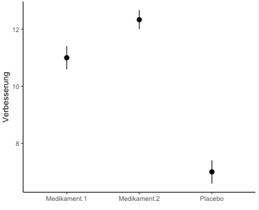
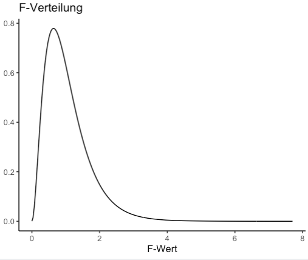
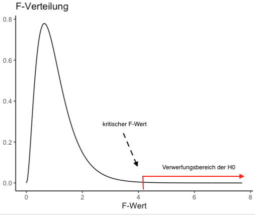
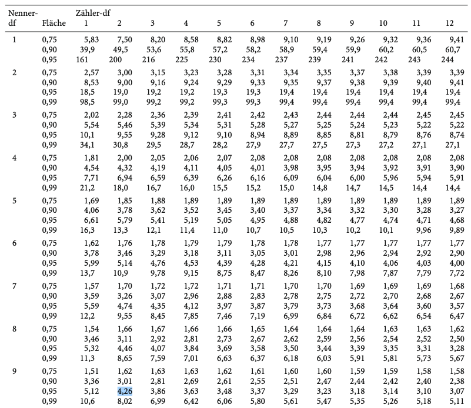

```{r setup, include=FALSE}
options(htmltools.dir.version = FALSE)

library(tidyverse)
library(kableExtra)
library(ggplot2)
library(plotly)
library(htmlwidgets)
library(MASS)
library(ggpubr)
library(xaringanthemer)
library(xaringanExtra)

style_duo_accent(
  primary_color = "#621C37",
  secondary_color = "#EE0071",
  background_image = "blank.png"
)

xaringanExtra::use_xaringan_extra(c("tile_view"))

use_scribble(
  pen_color = "#EE0071",
  pen_size = 4
  )

knitr::opts_chunk$set(
  fig.retina = TRUE,
  warning = FALSE,
  message = FALSE
)
```

name: Title slide
class: middle, left
<br><br><br><br><br><br><br>
# Statistik II
***
### Einheit 1: Einfaktorielle Varianzanalyse (1)
##### `r format(as.Date(data.frame(readxl::read_excel("Modul Quantitative Methoden II_Termine.xlsx"))$Datum), "%d.%m.%Y")[1]` | Prof. Dr. Stephan Goerigk

---
class: top, left
name: Contact Slide

### Kontakt

.pull-left[
Prof. Dr. phil. Stephan Goerigk 

Psychologische Methodenlehre

Infanteriestraße 11a · 80797 München · 

[stephan.goerigk@charlotte-fresenius-uni.de](mailto:stephan.goerigk@charlotte-fresenius-uni.de)

Zoom Sprechstunde (bitte per Email anmelden): 

Meeting-ID: 284 567 8838

Kenncode: 807174

[Publikationen](https://scholar.google.at/citations?user=nlvO-e4AAAAJ&hl=de)

[Commitment to Research Transparency](http://www.researchtransparency.org)
]

.pull-right[
.center[
<br><br><br>
.bottom[]
]
]

---
class: top, left
### Übersicht Lehrveranstaltung 

Termine:
* 14 Termine
* Mittwoch 13:05 - 14:35 (Audimax)

Begleitendes Seminar:
* Dozentin: Sara Vragolic ([sara.vragolic@charlotte-fresenius-uni.de](mailto:sara.vragolic@charlotte-fresenius-uni.de))

Materialien:
* werden auf [Studynet](https://studynet.hs-fresenius.de/ilias.php?baseClass=ilrepositorygui&cmdNode=zx:oz&cmdClass=ilobjfoldergui&ref_id=26259) bereitgestellt

Prüfungsleistung:
* Klausur 90 min
* 1/3 geschlossene Fragen (z.B. MC) & 2/3 offene Fragen und Rechnungen

---
class: top, left
### Termine

```{r echo = F}
df = readxl::read_xlsx("Modul Quantitative Methoden II_Termine.xlsx", sheet = "Tabellenblatt1")[1:14, 1:3]
df$Datum = format(as.Date(df$Datum), "%d.%m.%Y")
df %>%
  kbl() %>%
  kable_classic(full_width = T, position = "left", font_size = 15)
```

---
class: top, left
### Material (bitte mitbringen)

Es werden händische Berechnungen durchgeführt.

* Taschenrechner

* Lineal

* Bleistift

* kariertes Papier

* Folien ersetzen nicht den Vorlesungsbesuch

---
class: top, left
### Einfaktorielle Varianzanalyse (ANOVA)

.pull-left[

#### Kurzvorstellung

* In der psychologischen Forschung weit verbreiteter und beliebter inferenzstatistischer Test

* ANOVA: engl. *Analysis of Variance*

* Anwendung: Vergleich nicht nur zweier (t-Test), sondern mehrerer Mittelwerte (Gruppen/Zeitpunkte)

* Verallgemeinerung des t-Tests, da vergleichbare Argumentationsweise

$\rightarrow$ Wir testen gegen die Nullhypothese $(H_0)$ und verwerfen diese bei einem signifikanten Ergebnis
]
.pull-right[
```{r echo = F}
ggpubr::ggarrange(ggplot(data.frame(x = c(-6, 6)), aes(x = x)) +
    stat_function(fun = dnorm, args = list(-2, 1),
                  aes(colour = "Gruppe 1")) +
  stat_function(fun = dnorm, args = list(0, 1),
                  aes(colour = "Gruppe 2")) +
    ggtitle("t-Test") +
    labs(colour = "") +
  theme_classic() +
  theme(text = element_text(size = 25), axis.text.y = element_blank(), axis.ticks.y = element_blank()),
  ggplot(data.frame(x = c(-6, 6)), aes(x = x)) +
    stat_function(fun = dnorm, args = list(-2, 1),
                  aes(colour = "Gruppe 1")) +
  stat_function(fun = dnorm, args = list(0, 1),
                  aes(colour = "Gruppe 2")) +
    stat_function(fun = dnorm, args = list(2, 1),
                  aes(colour = "Gruppe 3")) +
    labs(colour = "") +
    ggtitle("ANOVA") +
  theme_classic() +
  theme(text = element_text(size = 25), axis.text.y = element_blank(), axis.ticks.y = element_blank()), nrow = 2)
```
]

---
class: top, left
### Einfaktorielle Varianzanalyse (ANOVA)

.pull-left[

#### Kurzvorstellung

##### Klinisches Beispiel

* Klassisches Design: Behandlung (z.B. Medikament 1) vs. Placebo

* ANOVA: Erweiterung durch eine weitere Behandlungsoption (z.B. Medikament 2)

***

* Klärbare Forschungsfragen: 

  * Unterscheiden sich die 3 Mittelwerte voneinander?
  
  * Welche Gruppe ist welcher Gruppe überlegen (hat den höheren/niedrigeren Mittelwert)?

]
.pull-right[
```{r echo = F}
ggpubr::ggarrange(ggplot(data.frame(x = c(-6, 6)), aes(x = x)) +
    stat_function(fun = dnorm, args = list(-2, 1),
                  aes(colour = "Placebo")) +
  stat_function(fun = dnorm, args = list(0, 1),
                  aes(colour = "Medikament 1")) +
    ggtitle("t-Test") +
    labs(colour = "") +
  theme_classic() +
  theme(text = element_text(size = 25), axis.text.y = element_blank(), axis.ticks.y = element_blank()),
  ggplot(data.frame(x = c(-6, 6)), aes(x = x)) +
     stat_function(fun = dnorm, args = list(-2, 1),
                  aes(colour = "Placebo")) +
  stat_function(fun = dnorm, args = list(0, 1),
                  aes(colour = "Medikament 1")) +
    stat_function(fun = dnorm, args = list(2, 1),
                  aes(colour = "Medikament 2")) +
    labs(colour = "") +
    ggtitle("ANOVA") +
  theme_classic() +
  theme(text = element_text(size = 25), axis.text.y = element_blank(), axis.ticks.y = element_blank()), nrow = 2)
```
]

---
class: top, left
### Einfaktorielle Varianzanalyse (ANOVA)

#### Warum brauchen wir die ANOVA?


* Wir kennen bereits den t-Test:

  * t-Test kann Mittelwerte von 2 Gruppen vergleichen
  
  * t-Wert prüft, wie wahrscheinlich eine Mittelwertsdifferenz unter Annahme der $H_0$ ist 

***

**Intuitive Überlegung:**

* Können wir mit dem t-Test auch mehr als 2 Mittelwerte vergleichen?

* Wie sähe dies bei unserem Beispiel aus?
  * t-Test (1): Placebo vs. Medikament 1
  * t-Test (2): Placebo vs. Medikament 2
  * t-Test (3): Medikament 1 vs. Medikament 2

$\rightarrow$ Zwar mit steigender Anzahl an Vergleichen immer aufwendiger, aber man könnte bekanntes Verfahren beibehalten!


---
class: top, left
### Einfaktorielle Varianzanalyse (ANOVA)

#### Warum brauchen wir die ANOVA?

* Wir kennen bereits den t-Test

  * kann Mittelwerte von 2 Gruppen vergleichen
  * t-Wert prüft, wie wahrscheinlich eine Mittelwertsdifferenz unter Annahme der $H_0$ ist 

.pull-left[
**FRAGE:**

* Können wir mit dem t-Test auch mehr als 2 Mittelwerte vergleichen?
* Wie sähe dies bei unserem Beispiel aus:
  * t-Test (1): Placebo vs. Medikament 1
  * t-Test (2): Placebo vs. Medikament 2
  * t-Test (3): Medikament 1 vs. Medikament 2

$\rightarrow$ Ist zwar mit steigender Anzahl an Vergleichen immer aufwendiger, aber man könnte beim bekannten Verfahren bleiben!
]
.pull-right[
**Es ergeben sich jedoch 2 Probleme:**

1. $\alpha$-Fehlerkumulierung
2. Verringerung der Teststärke
]

---
class: top, left
### Einfaktorielle Varianzanalyse (ANOVA)

#### Warum brauchen wir die ANOVA?

** $\alpha$-Fehlerkumulierung**

* Tritt auf, wenn zur Prüfung einer Hypothese mehrere Tests an denselben Daten gerechnet werden

GRUND:

* Jeder Test testet gegen das a priori festgelegte Niveau (z.B. $\alpha=.05$)

* Zur Erinnerung: $\alpha$-Fehler = Wahrscheinlichkeit für einen Fehler 1. Art $(H_0$ fälschlicherweise verwerfen)

* Beim Rechnen mehrerer Tests kumuliert sich der $\alpha$-Fehler (kumulieren = anhäufen)

* Folge: Das Gesamt $\alpha-$Niveau entspricht nicht mehr dem der Einzeltests:

$$\alpha_{gesamt}=1-(1-\alpha_{Test})^m$$ 

* Beispiel 3 Gruppen: $\alpha_{gesamt}=1-(1-0.05)^3=0.14$

$\rightarrow$ Fehler 1. Art nicht mehr zu 5% sondern zu 14% wahrscheinlich!

---
class: top, left
### Einfaktorielle Varianzanalyse (ANOVA)

#### Warum brauchen wir die ANOVA?

**Vorteil der ANOVA:**

* Die ANOVA ist ein sogenannter **Omnibustest**.

* D.h. es werden alle Mittelwerte auf einmal miteinander verglichen.

Veranschaulichung:

* $H_0:$ t-Test (x3)
  * $\mu_1 = \mu_2$
  * $\mu_1 = \mu_3$
  * $\mu_2 = \mu_3$

* $H_0:$ ANOVA
  * $\mu_1 = \mu_2 = \mu_3$

---
class: top, left
### Einfaktorielle Varianzanalyse (ANOVA)

#### Warum brauchen wir die ANOVA?

** $\alpha$-Fehlerkumulierung**

* Die $\alpha$-Fehlerkumulierung tritt nur dann auf, wenn mehrere Tests für eine Hypothese an denselben Daten durchgeführt werden

* Würden für jeden Einzelvergleich neue Stichproben gezogen, wären mehrere Tests zulässig

VORSICHT: 

* $\alpha$-Fehlerkumulierung gilt grundsätzlich für alle Arten statistischer Tests!

  * Gilt auch für ANOVAs: mehrere ANOVAs am selben Datensatz durchgeführt führen auch zu $\alpha$-Fehlerkumulierung
  
* Bei dem **einmaligen** Vergleich mehrerer Mittelwerte befreit uns die ANOVA aber von diesem Problem

---
class: top, left
### Einfaktorielle Varianzanalyse (ANOVA)

#### Warum brauchen wir die ANOVA?

**Verringerung der Teststärke $(\lambda)$**

* Beim Rechnnen mehrerer t-Tests $\rightarrow$ es gehen immer nur Teile der Gesamtstichprobe in die Analyse ein

* z.B. 3 Tests: Jeder Test mit $\frac{2}{3}$ der Gesamtstichprobe (bei gleich großen Gruppen)

* Test, der alle Gruppen gleichzeitig vergleicht, hat eine höhere Teststärke:

$$\lambda=\phi^2 \cdot N = \frac{\Omega^2}{1-\Omega^2}\cdot N $$
$\rightarrow$ Unter Zugrundelegung des gleichen Populationseffekts $(\Omega^2)$ ist die Teststärke $(\lambda)$ direkt von Stichprobengröße $(N)$ abhängig.

---
class: top, left
### Einfaktorielle Varianzanalyse (ANOVA)

#### Prinzip der Varianzanalyse

**Name der Varianzanalyse:**

* Simultanvergleich der Mittelwerte wird über Betrachtung von Varianzen (systematische und unsystematische) erreicht
  
* Aus dem Vergleich dieser Varianzen wird die Entscheidungsregel abgeleitet

***

**Historisch:**

* Geht zurück auf Sir Ronald Fisher

* ANOVA = Vergleich systematischer Einflüsse (systematische Varianz) und unsystematischer Einflüsse (Residualvarianz)

* Quotient der beiden Varianzen ergibt den F-Wert (Teststatistik der ANOVA - ähnlich t-Wert)

* Daher wird ANOVA auch "F-Test" genannt

---
class: top, left
### Einfaktorielle Varianzanalyse (ANOVA)

#### Prinzip der Varianzanalyse

Beispiel: Vergleich der 3 Behandlungsgruppen - Werte entsprechen Verbesserung nach Behandlung

.pull-left[
```{r echo = F}
df = data.frame(Placebo = c(6,7,7,8),
                `Medikament 1` = c(10,11,11,12),
                `Medikament 2` = c(11, 12, 12, 13))
kable(df[,])
```
]

.pull-right[
Verbesserung scheint sich (rein numerisch) zwischen Gruppen zu unterscheiden:

* $\bar{x}_{Placebo}=7$
* $\bar{x}_{Med1}=11$
* $\bar{x}_{Med2}=12$

]

<br>
Größe der Unterschiede zwischen den gemessenen Werten = Varianz $(\hat{\sigma}_x^2):$

$$\hat{\sigma}_x^2=\frac{\sum\limits _{i=1}^{n}(x_{i}-\bar{x})^2}{n-1}$$
---
class: top, left
### Einfaktorielle Varianzanalyse (ANOVA)

#### Prinzip der Varianzanalyse

<small>

**Varianz:**

$$\hat{\sigma}_x^2=\frac{\sum\limits _{i=1}^{n}(x_{i}-\bar{x})^2}{n-1}$$

* Zur allgemeineren Verwendung der Formel ändern wir die Schreibweise etwas:

  * QS = Quadratsumme
  * df = Freiheitsgerade der Verteilung

$$QS_x=\sum\limits _{i=1}^{n}(x_{i}-\bar{x})^2$$
$$df_x=n-1$$

Allgemeine Schreibweise:

$$\hat{\sigma}_x^2=\frac{QS_x}{df_x}$$
</small>

---
class: top, left
### Einfaktorielle Varianzanalyse (ANOVA)

#### Prinzip der Varianzanalyse

**Die Gesamtvarianz:**

* Variation aller Messwerte, **ohne Unterteilung in Versuchsbedingungen** (Gruppen)

* Gibt an, wie stark sich Personen, ungeachtet ihrer Gruppenzugehörigkeit, voneinander unterscheiden

Berechnung: 

* Jeden Wert in Varianzformel vom Gesamtmittelwert $(\bar{G})$ abziehen

* Gesamtmittelwert $(\bar{G})$: Mittelwert aller Messwerte der gesamten Stichprobe

$$\hat{\sigma}_{gesamt}^2=\frac{QS_{gesamt}}{df_{gesamt}}=\frac{\sum\limits _{i=1}^{p}\sum\limits _{m=1}^{n}(x_{mi}-\bar{G})^2}{N-1}$$
---
class: top, left
### Einfaktorielle Varianzanalyse (ANOVA)

#### Prinzip der Varianzanalyse
.pull-left[

<small>
**Die Gesamtvarianz:**


```{r echo = F}
df = data.frame(Placebo = c(6,7,7,8),
                `Medikament 1` = c(10,11,11,12),
                `Medikament 2` = c(11, 12, 12, 13))
kable(df[,])
```
]

.pull-right[
```{r echo=F, message=FALSE, warning=FALSE, out.width = "250px"}
# df_long= pivot_longer(df, cols = 1:3)
# 
# ggplot(data = df_long, aes(x = name, y = value)) +
#   stat_summary() +
#   labs(x = "", y= "Verbesserung") +
#   theme_classic()
```
.center[
```{r eval = TRUE, echo = F, out.width = "350px"}

```
]
]

$$\bar{G}=\frac{\sum\limits _{i=1}^{p}\sum\limits _{m=1}^{n}x_{mi}}{N}=\frac{\sum\limits _{i=1}^{3}\sum\limits _{m=1}^{4}x_{mi}}{12}= \frac{6+7+7+8+...+13}{12}=10$$
$$\hat{\sigma}_{gesamt}^2=\frac{QS_{gesamt}}{df_{gesamt}}=\frac{(6-10)^2+(7-10)^2+...+(13-10)^2}{12-1}=5.63$$

</small>

---
class: top, left
### Einfaktorielle Varianzanalyse (ANOVA)

#### Prinzip der Varianzanalyse

**Zerlegung der Gesamtvarianz:**

Zentrale, die Gesamtvarianz betreffende, Fragen:

* Warum variieren die gemessenen Werte der Personen?

* Warum verbessern sich einige Patienten stärker als andere?

Bei der ANOVA gibt es 2 Ursachen für die Gesamtvarianz:

1. systematische Einflüsse

2. unsystematische Einflüsse

$$\hat{\sigma}_{gesamt}^2=\hat{\sigma}_{sys}^2 + \hat{\sigma}_{Res}^2$$

---
class: top, left
### Einfaktorielle Varianzanalyse (ANOVA)

#### Prinzip der Varianzanalyse

**Zerlegung der Gesamtvarianz:**

.pull-left[
**Systematische Einflüsse:**

* gehen auf in Studie verwendete Manipulation zurück

* z.B. Vorher klar zugeteilte Verabreichung eines Medikaments

* Können auch natürliche Gruppenzugehörigkeiten sein (z.B. Geschlecht, Diagnose, etc.)

* gemessen als **systematische Varianz/Effektvarianz**
]

.pull-right[
**Unsystematische Einflüsse:**
* Wirken auf die Meswerte, sind aber nicht von Studie intendiert

* Unterschiede zwischen Personen, unabhängig von Manipulation

* können zeitlich stabil oder instabil sein (z.B. Motivation, Tagesstimmung, Persönlichkeit, Messfehler...)

* gemessen als **Residualvarianz**
]

---
class: top, left
### Einfaktorielle Varianzanalyse (ANOVA)

#### Prinzip der Varianzanalyse

**Schätzung der Residualvarianz:**

* Residualvarianz wird durch die durchschnittliche Varianz innerhalb jeder Bedingung geschätzt

* aka. Varianz der Messwerte innerhalb der Einzelgruppen

* Man spricht daher auch von der **Varianzschätzung innerhalb**

* Unterschiede **zwischen den Gruppen** spielen für diese Berechnung keine Rolle

$$\hat{\sigma}_i^2=\frac{\sum\limits _{m=1}^{n}(x_{mi}-\bar{A})^2}{n-1}$$
$\rightarrow$ Quadrierte Abweichung jedes Messwerts $(x_{mi})$ von seinem jeweiligen Gruppenmittelwert $(\bar{A})$

<small>
Good-to-know: "Varianz innerhalb" bezieht sich streng genommen auf die Varianzen innerhalb jeder einzelnen Gruppe. Der Begriff wird jedoch auch synonym für die Residualvarianz, also die über alle Gruppen hinweg gemittelte Varianz innerhalb verwendet
</small>


---
class: top, left
### Einfaktorielle Varianzanalyse (ANOVA)

#### Prinzip der Varianzanalyse

**Schätzung der Residualvarianz:**

* Unter idealen Bedingungen sollten Varianzen innerhalb aller Gruppen gleich sein (Varianzhomogenität)

* Dies ist allerdings auf Stichprobenebene (kleinere Gruppe als Gesamtpopulation) selten der Fall

Idee, um ungleiche Varianzen zu berücksichtigen: 

* Die Berechnung der **durchschnittlichen Varianz innerhalb** erfolgt durch die Addition der Varianzen innerhalb der einzelnen Gruppen 

* Diese Summe wird geteilt durch die Anzahl der Gruppen $(p)$

$$\hat{\sigma}_{Res}^2=\hat{\sigma}_{innerhalb}^2 = \frac{\sum\limits _{i=1}^{p}\hat{\sigma}_{i}^2}{p}=\frac{\hat{\sigma}_{1}^2 + \hat{\sigma}_{2}^2+ ...+\hat{\sigma}_{p}^2}{p}$$
---
class: top, left
### Einfaktorielle Varianzanalyse (ANOVA)

#### Prinzip der Varianzanalyse

**Schätzung der Residualvarianz:**

Unter der Annahme gleich großer Gruppen, lässt sich die Formel auch wie folgt darstellen:

$$\hat{\sigma}_{Res}^2=\hat{\sigma}_{innerhalb}^2 = \frac{\sum\limits _{i=1}^{p}\hat{\sigma}_{i}^2}{p}=\frac{\sum\limits _{i=1}^{p}\sum\limits _{m=1}^{n}(x_{mi}-\bar{A}_i)^2}{p \cdot (n-1)}$$
mit $p$ = Anzahl der verglichenen Gruppen.

Diese Darstellung ermöglicht die separate Betrachtung von Quadratsummen und Freiheitsgraden (Schreibweise von oben):

$$\hat{\sigma}_{innerhalb}^2= \frac{QS_{innerhalb}}{df_{innerhalb}}$$

---
class: top, left
### Einfaktorielle Varianzanalyse (ANOVA)

#### Prinzip der Varianzanalyse

<small>
**Schätzung der Residualvarianz:**

Beispiel: Residualvarianz errechnet sich aus:

$$\hat{\sigma}_{innerhalb}^2= \frac{\hat{\sigma}_{Placebo}^2 + \hat{\sigma}_{Med1}^2 + \hat{\sigma}_{Med2}^2}{3}$$
Berechnung Varianz innerhalb Gruppe Placebo:

$$\hat{\sigma}_{Placebo}^2=\frac{\sum\limits _{m=1}^{n}(x_{mi}-\bar{A})^2}{n-1}=\frac{(6-7)^2 + (7-7)^2 + (7-7)^2+(8-7)^2}{4-1}=0.67$$
Für die anderen beiden Gruppen ergibt sich (kann nachgerechnet werden):

$$\hat{\sigma}_{Med1}^2 = \hat{\sigma}_{Med2}^2=0.67;df_{innerhalb}=p \cdot (n-1)$$
$$\hat{\sigma}_{innerhalb}^2= \frac{0.67 + 0.67 + 0.67}{3}=0.67$$
</small>

---
class: top, left
### Einfaktorielle Varianzanalyse (ANOVA)

#### Prinzip der Varianzanalyse

**Schätzung der Residualvarianz:**

* Bei der Berechnung der Residualvarianz spielen Unterschiede zwischen den Gruppenmittelwerten (durchschnittliche Symptomverbesserung der Gruppen) keine Rolle

Grund: 

* Jeder Messwert wird mit dem eigenen Gruppenmittelwert verglichen

* Die Gruppen werden unabhängig betrachtet und der Durschnitt aus ihren Varianzen gebildet 

* Denn: Varianz innerhalb soll nur unsystematische Einflüsse erfassen

---
class: top, left
### Einfaktorielle Varianzanalyse (ANOVA)

#### Prinzip der Varianzanalyse
<small>
**Schätzung der systematischen Varianz:**

* beschreibt Unterschiede, die durch die UV verursacht worden sind

* Schätzung mittels Stichprobenmittelwerten (Stichprobenmittelwerte = erwartungstreue Schätzer der Populationsmittelwerte)

**Kontext der Varianzanalyse (Varianz zwischen): **

* Experimenteller Einfluss auf die Gesamtvarianz wird über die Unterschiede der Gruppenmittelwerte geschätzt

* Unterschiede zwischen Gruppenmittelwerten = **Varianz zwischen**

* **Varianz zwischen** = Quadrierte Abweichung der Gruppenmittelwerte vom Gesamtmittelwert

**ACHTUNG: **

* Varianz zwischen schätzt nicht nur systematische, sondern auch Residualvarianz
* Gruppenmittelwerte sind selber nur geschätzte Werte (mit unsystematischen Einflüssen behaftet) 
* Schätzgüte des Mittelwerts = Standardfehler

</small>

---
class: top, left
### Einfaktorielle Varianzanalyse (ANOVA)

#### Prinzip der Varianzanalyse

**Schätzung der systematischen Varianz:**

* Einsetzen der Gruppenmittelwerte $(\bar{A}_{i})$ und des Gesamtmittelwerts $(\bar{G})$ in die Varianzformel

* Freiheitsgrade ergeben sich aus der Anzahl der Gruppen

* Der Zähler muss mit der Anzahl der Versuchspersonen (n) in einer Gruppe multipliziert werden, um Genauigkeit der Mittelwerte als Populationsschätzer zu berücksichtigen

$$\hat{\sigma}_{zwischen}^2=\frac{QS_{zwischen}}{df_{zwischen}}= \frac{n \cdot \sum\limits _{i=1}^{p}(\bar{A}_i-\bar{G})^2}{p-1}$$
Wenn kein Effekt der UV vorliegt...
* Ist die Effektvarianz = 0 (kein Unterschied zwischen Mittelwerten)
* Schätzt die Zwischenvarianz lediglich Residualvarianz

---
class: top, left
### Einfaktorielle Varianzanalyse (ANOVA)

#### Prinzip der Varianzanalyse

**Schätzung der systematischen Varianz:**

Beispiel:

$$\hat{\sigma}_{zwischen}^2= \frac{n \cdot \sum\limits _{i=1}^{p}(\bar{A}_i-\bar{G})^2}{p-1}= \frac{4 \cdot [(7-10)^2 + (11-10)^2 + (12-10)^2]}{3-1}=\frac{56}{2}=28$$

* Die **Varianz zwischen** den Gruppen $(\hat{\sigma}_{zwischen}^2=28)$ ist deutlich größer als die zuvor berechnete Residualvarianz $(\hat{\sigma}_{innerhalb}^2=0.67)$.

* Frage (s.h. Hypothese): Ist dieser Unterschied statistisch signifikant?

---
class: top, left
### Einfaktorielle Varianzanalyse (ANOVA)

#### Prinzip der Varianzanalyse

**Signifikanztestung der ANOVA - Der F-Quotient:**

* Verhältnis der **Varianz zwischen** und der **Varianz innerhalb**

* Beide schätzen auf unterschiedlichem Weg die gleiche Residualvarianz

* Aber: In der **Varianz zwischen** ist zusätzlich die gesuchte **Effektvarianz enthalten**

* In der **Varianz innerhalb** ist lediglich die Residualvarianz enthalten

$$F_{(df_{Zähler}; df_{Nenner})}=\frac{\hat{\sigma}_{zwischen}^2}{\hat{\sigma}_{innerhalb}^2}$$
$$df_{Zähler}=df_{zwischen}=p-1$$
$$df_{Nenner}=df_{innerhalb}=p \cdot (n-1)$$

---
class: top, left
### Einfaktorielle Varianzanalyse (ANOVA)

#### Prinzip der Varianzanalyse

**Signifikanztestung der ANOVA - Der F-Quotient:**

* F-Wert ist die Teststatistik der ANOVA (wie t-Wert beim t-Test)

Mögliche Werte und deren Interpretation:

* $F=1$

  * Der F-Wert ist gleich 1 wenn die systematische Varianz gleich 0 ist.
  * Es wird lediglich die Residualvarianz durch sich selbst geteilt
  * Grupppenmittelwerte unterscheiden sich höchstens durch unsystematische Einflüsse

* $F>1$
  * Es gibt einen systematischen Einfluss
  * Gruppenmittelwerte unterscheiden sich nicht nur durch unsystematische, sondern auch wesentlich durch systematische Einflüsse
  
---
class: top, left
### Einfaktorielle Varianzanalyse (ANOVA)

#### Prinzip der Varianzanalyse

.pull-left[
**Signifikanztestung der ANOVA - Der F-Quotient:**

* Annahme der $H_0$ erlaubt Konstruktion der F-Verteilung (Verteilung aller F-Werte die unter dieser Annahme auftreten können)

* Unter der $H_0$ hat die F-Verteilung einen Mittelwert von 1 (F=1)

* Bei Gleichheit der Populationsmittelwerte besteht **Varianz zwischen** nur aus Residualvarianz und nimmt gleichen Wert wie **Varianz innerhalb** an
  
* Negative Werte sind nicht möglich, da Varianzen durch Quadrierung immer positiv sind
]

.pull-right[
.center[
```{r eval = TRUE, echo = F, out.width = "450px"}

```
]
]

---
class: top, left
### Einfaktorielle Varianzanalyse (ANOVA)

#### Prinzip der Varianzanalyse

.pull-left[
**Entscheidungsregel beim F-Test:**

* Unter der $H_0$ ist ein F-Wert von 1 oder nahe 1 zu erwarten

* Wahrscheinlichkeit für einen F-Wert (in Abhängigkeit von Gruppenzahl und Stichprobengröße) kann in der F-Tabelle abgelesen werden

* Logik: Vergleich empirischer F-Wert $(F_{emp})$ mit kritischem F-Wert $(F_{krit})$ unter Annahme des Signifikanzniveaus $(\alpha=.05)$

Wenn $F_{emp} > F_{krit}$ $\rightarrow$ ist die ANOVA signifikant.
]

.pull-right[
.center[
```{r eval = TRUE, echo = F, out.width = "450px"}

```
]
]

---
class: top, left
### Einfaktorielle Varianzanalyse (ANOVA)

#### Prinzip der Varianzanalyse

.pull-left[
**Signifikanztestung der ANOVA - Der F-Quotient:**

Logik der F-Verteilung (analog zum t-Test):
* Aus 3 Populationen werden jeweils $n$ Personen gezogen

* Aus Messwerten werden Inner- und Zwischenvarianz sowie der F-Quotient berechnet

* Vorgang wird (idealerweise unendlich oft) wiederholt

* Resultierende F-Werte ergeben beim Eintragen in das Koordinatensystem die F-Verteilung
]

.pull-right[
.center[
```{r eval = TRUE, echo = F, out.width = "450px"}

```
]
]

---
class: top, left
### Einfaktorielle Varianzanalyse (ANOVA)

.pull-left[
#### Prinzip der Varianzanalyse

**Entscheidungsregel beim F-Test:**

* Bestimmung des kritischen F-Werts (bei $\alpha=.05$ und $p = 3$ und $n = 4$):

* Auswählen von Zähler und Nennerfreiheitsgraden

* Fläche $= 1-\alpha$

* $F_{krit}=4.26$

]
.pull-right[
.center[
```{r eval = TRUE, echo = F, out.width = "650px"}

```
]
]

---
class: top, left
### Einfaktorielle Varianzanalyse (ANOVA)

#### Prinzip der Varianzanalyse

**Alternativhypothese der ANOVA - Was bedeutet ein signifikanter Test?**

* Zwischenvarianz größer als Varianz innerhalb (Manipulation verursacht signifikanten Teil der Gesamtvarianz)

* Mit anderen Worten: Es besteht ein signifikanter (systematischer) Unterschied zwischen den Gruppen

* ACHTUNG: Nur statistische Signifikanz $\rightarrow$ für Relevanz auf inhaltlicher/klinischer Ebene müssen Effektstärken berücksichtigt werden

**VORSICHT:**

* Eine signifikante ANOVA bedeutet lediglich, dass sich **mindestens ein Gruppenmittelwert** signifikant von den anderen unterscheidet 

* Zwischen welchen Gruppen der Unterschied besteht, lässt sich noch nicht sehen

$\rightarrow$ Alternativhypothese der ANOVA ist **immer ungerichtet**

---
class: top, left
### Einfaktorielle Varianzanalyse (ANOVA)

#### Einfaktorielle ANOVA - Rechenbeispiel in R

Unsere Stichprobe ist, für ein realisteres Szenario mit mehr Teststärke, auf insgesamt $N=150$ $(n=50$ pro Gruppe) erweitert worden:

```{r echo = F}
set.seed(123)
df = data.frame(Placebo = rnorm(50, 7, 4),
                `Medikament 1` = rnorm(50, 11, 4),
                `Medikament 2` = rnorm(50, 12, 4))
df = pivot_longer(df, cols = 1:3)
names(df) = c("Gruppe", "Symptome")
df = as.data.frame(df)
df$ID = rownames(df)
```

```{r}
head(df, 10) # erste 10 Zeilen anzeigen
```

---
class: top, left
### Einfaktorielle Varianzanalyse (ANOVA)

#### Einfaktorielle ANOVA - Rechenbeispiel in R

Anzeigen der Deskriptivstatistiken pro Gruppe:

.code60[

```{r}
psych::describeBy(x = df[,c("Symptome", "Gruppe")], group = df$Gruppe)
```

]

---
class: top, left
### Einfaktorielle Varianzanalyse (ANOVA)


<small>

.pull-left[
#### Einfaktorielle ANOVA - Rechenbeispiel in R

Berechnen der ANOVA:

<br><br><br>
```{r out.width = "100px"}
anova(lm(Symptome ~ Gruppe, data = df))
```
]

.pull-right[
* $QS_{total}=QS_{zwischen} +QS_{innerhalb}=582.4+2082.2=2664.6$

* $df_{zwischen}=p-1=2$

* $df_{innerhalb}=p \cdot (n-1) = 3 \cdot (50-1)=147$

* $\hat{\sigma}_{zwischen}^2=\frac{QS_{zwischen}}{df_{zwischen}}=\frac{582.4}{2}=291.2$

* $\hat{\sigma}_{innerhalb}^2=\frac{QS_{innerhalb}}{df_{innerhalb}}=\frac{2082.2}{147}=14.17$

* $F_{(2,147)}=\frac{291.20}{14.17}=20.56$
]

</small>
---
class: top, left
### Take-aways

.full-width[.content-box-gray[

* **ANOVA** = Verfahren für Hypothesen mit einer intervallskalierten AV und einer mehr als 2-stufigen UV

* ANOVA vergleicht im Vergleich zum t-Test auch **mehr als 2 Gruppen** miteinander.

* Durch **simultanen Mittelwertsvergleich** (Omnibustest) werden $\alpha$ -Fehler-Kumulierung und Reduktion der Teststärke vermieden.

* Prinzip basiert auf der Unterscheidung zwischen **systematischer Varianz** und **unsystematischer Varianz**.

* Signifikanztestung über **F-Test**, der systematische und unsystematische Varianz ins Verhältnis zueinander setzt (F-Quotient).

* **Signifikante ANOVA** zeigt einen Unterschied zwischen Mittwelwerten an, jedoch nicht, zwischen welchen Gruppen dieser genau besteht.

* ANOVA alleine kann **keine gerichteten Hypothesen** prüfen.
]

]


