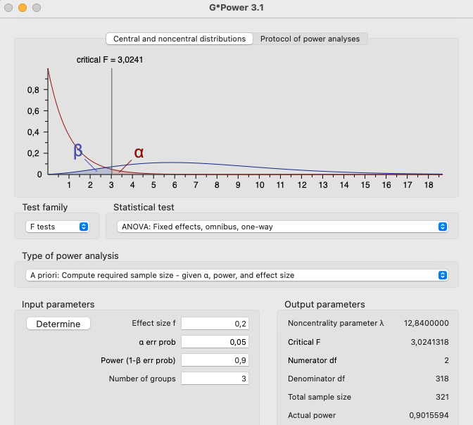

```{r setup, include=FALSE}
options(htmltools.dir.version = FALSE)

library(tidyverse)
library(kableExtra)
library(ggplot2)
library(plotly)
library(htmlwidgets)
library(MASS)
library(ggpubr)
library(xaringanthemer)
library(xaringanExtra)

style_duo_accent(
  primary_color = "#621C37",
  secondary_color = "#EE0071",
  background_image = "blank.png"
)

xaringanExtra::use_xaringan_extra(c("tile_view"))

use_scribble(
  pen_color = "#EE0071",
  pen_size = 4
  )

knitr::opts_chunk$set(
  fig.retina = TRUE,
  warning = FALSE,
  message = FALSE
)
```

name: Title slide
class: middle, left
<br><br><br><br><br><br><br>
# Statistik II
***
### Einheit 2: Einfaktorielle Varianzanalyse (2)
##### `r format(as.Date(data.frame(readxl::read_excel("Modul Quantitative Methoden II_Termine.xlsx"))$Datum), "%d.%m.%Y")[2]` | Prof. Dr. Stephan Goerigk

---
class: top, left
### Einfaktorielle Varianzanalyse (ANOVA)

.pull-left[

#### Determinanten der ANOVA

* Determinanten = Größen, welche die Signifikanz der ANOVA beeinflussen:

  * Signifikanzniveau $(\alpha)$
  
  * Teststärke $(1-\beta)$
  
  * Effektgröße (Unterschied zwischen Mittelwerten)
  
  * Stichprobengröße $(N)$
  
$\rightarrow$ Wir testen gegen die Nullhypothese $(H_0)$ und verwerfen diese bei einem signifikanten Ergebnis
]
.pull-right[
```{r echo = F}
ggpubr::ggarrange(ggplot(data.frame(x = c(-6, 6)), aes(x = x)) +
    stat_function(fun = dnorm, args = list(-2, 1),
                  aes(colour = "Gruppe 1")) +
  stat_function(fun = dnorm, args = list(0, 1),
                  aes(colour = "Gruppe 2")) +
    ggtitle("t-Test") +
    labs(colour = "") +
  theme_classic() +
  theme(text = element_text(size = 25), axis.text.y = element_blank(), axis.ticks.y = element_blank()),
  ggplot(data.frame(x = c(-6, 6)), aes(x = x)) +
    stat_function(fun = dnorm, args = list(-2, 1),
                  aes(colour = "Gruppe 1")) +
  stat_function(fun = dnorm, args = list(0, 1),
                  aes(colour = "Gruppe 2")) +
    stat_function(fun = dnorm, args = list(2, 1),
                  aes(colour = "Gruppe 3")) +
    labs(colour = "") +
    ggtitle("ANOVA") +
  theme_classic() +
  theme(text = element_text(size = 25), axis.text.y = element_blank(), axis.ticks.y = element_blank()), nrow = 2)
```
]

---
class: top, left
### Einfaktorielle Varianzanalyse (ANOVA)

#### Determinanten der ANOVA

```{r echo = F}
set.seed(123)
df = data.frame(Placebo = rnorm(50, 7, 4),
                `Medikament 1` = rnorm(50, 11, 4),
                `Medikament 2` = rnorm(50, 12, 4))
df = pivot_longer(df, cols = 1:3)
names(df) = c("Gruppe", "Symptome")
df = as.data.frame(df)
df$ID = rownames(df)
```

.pull-left[
##### Exkurs: Beziehung zwischen F-Wert und t-Wert

* Für den t-Test gelernte Konzepte können vollständig auf die Varianzanalyse übertragen werden

* t-Test = Vergleich 2er Mittelwerte $\rightarrow$ entspricht ANOVA mit 2-stufigem Faktor (UV)

**Beispiel aus Einheit 1 (2 Stufen):** 

Vergleich Placebo vs. Medikament 1
]

.pull-right[
.center[
```{r echo = F, out.width = "350px"}
ggplot(df[df$Gruppe == "Placebo" | df$Gruppe == "Medikament.1",], aes(x=Gruppe,y=Symptome)) +
  stat_summary(size = 2) +
  theme_classic() +
  theme(text = element_text(size = 30))
```
]
]
---
class: top, left
### Einfaktorielle Varianzanalyse (ANOVA)

#### Determinanten der ANOVA

##### Exkurs: Beziehung zwischen F-Wert und t-Wert

```{r}
t.test(Symptome ~ Gruppe, 
       data = df[df$Gruppe == "Placebo" | df$Gruppe == "Medikament.1",], 
       var.equal = T)
```

---
class: top, left
### Einfaktorielle Varianzanalyse (ANOVA)

#### Determinanten der ANOVA

##### Exkurs: Beziehung zwischen F-Wert und t-Wert

```{r}
anova(lm(Symptome ~ Gruppe, 
         data = df[df$Gruppe == "Placebo" | df$Gruppe == "Medikament.1",]))
```

---
class: top, left
### Einfaktorielle Varianzanalyse (ANOVA)

#### Determinanten der ANOVA

##### Exkurs: Beziehung zwischen F-Wert und t-Wert

$$F_{(1; 98)}=\frac{\hat{\sigma}_{zwischen}^2}{\hat{\sigma}_{innerhalb}^2}=\frac{494.62}{13.42}=36.87$$

$$t_{(98)} = 6.0718$$

$$6.0718^2=36.87$$
* Das Quadrat des t-Werts entspricht dem F-Wert einer einfaktoriellen ANOVA mit zwei Stufen

$\rightarrow$ Die Varianzanalyse ist eine Verallgemeinerung des t-Tests

---
class: top, left
### Einfaktorielle Varianzanalyse (ANOVA)

#### Determinanten der ANOVA

##### Effektstärke

<small>
* Das Maß für den Populationseffekt in der Varianzanalyse heißt $\Omega^2$

$$\Omega^2=\frac{\sigma^2_{systematisch}}{\sigma^2_{Gesamt}}$$

* $\Omega^2$ Gibt den Anteil systematischer Varianz an der Gesamtvarianz an

* Schätzer für den Populationseffekt $\Omega^2$ ist $\omega^2$ (klein Omega-Quadrat)

* Die Schätzung erfolgt über $f^2$

$$f^2=\frac{(F_{df_{Zähler}; df_{Nenner}}-1)\cdot df_{Zähler}}{N}$$

$$\omega^2=\frac{f^2}{1+f^2}$$
</small>

---
class: top, left
### Einfaktorielle Varianzanalyse (ANOVA)

#### Determinanten der ANOVA

##### Effektstärke

<small>
```{r out.width = "100px"}
anova(lm(Symptome ~ Gruppe, data = df))
```

$$f^2=\frac{(F_{df_{Zähler}; df_{Nenner}}-1)\cdot df_{Zähler}}{N} = \frac{(20.558-1)\cdot 2}{150}=0.26$$
</small>

---
class: top, left
### Einfaktorielle Varianzanalyse (ANOVA)

#### Determinanten der ANOVA

##### Effektstärke

$$\omega^2=\frac{f^2}{1+f^2}= \frac{0.26}{1+0.26}=0.2063$$
* Der Anteil der Effektvarianz des Faktors Gruppe beträgt 20.63%

* Anders ausgedrückt: der Faktor Gruppe klärt circa 21% der Gesamtvarianz auf

* Dies entspricht einem großen Effekt.

**Cut-offs:**

```{r echo=F}
df <- data.frame(Effektstärke = c("Kleiner Effekt", "Mittlerer Effekt", "Großer Effekt"),
                 OmegaQuadrat = c("0.01", "0.06", "0.14"))

names(df) = c("Effektstärke", "Omega-Quadrat")

kable(df[,]) %>%
  kable_styling(font_size = 18)
```

---
class: top, left
### Einfaktorielle Varianzanalyse (ANOVA)

#### Determinanten der ANOVA

##### Effektstärke

* Ein weiteres, häufig verwendetes Effektmaß ist $\eta^2$ (Eta-Quadrat)

* Es gibt den Anteil der aufgeklärten Varianz der Messwerte auf Ebene der Stichprobe an

* Es wird aus dem Verhältnis von Quadratsummen, anstelle von Varianzen berechnet

$$\eta^2=\frac{QS_{zwischen}}{QS_{zwischen} + QS_{innerhalb}}$$
* Berechnung kann ebenfalls über $f^2$ erfolgen (wir schreiben für die Stichprobe $f_s^2$)

.pull-left[
$$f_s^2=\frac{(F_{df_{Zähler}; df_{Nenner}})\cdot df_{Zähler}}{df_{Nenner}}$$
]

.pull-right[
$$\eta^2=\frac{f_s^2}{1+f_s^2}$$

]

---
class: top, left
### Einfaktorielle Varianzanalyse (ANOVA)

#### Determinanten der ANOVA

##### Effektstärke

$$f_s^2=\frac{20.558 \cdot 2}{147}=0.2797$$

$$\eta^2=\frac{0.2797}{1+0.2797}=0.2185$$
.pull-left[

* Wert fällt im Vergleich zum wahren Effekt auf Populationsebene zu groß aus (Überschätzung)

* $\omega^2$ liefert genauere Schätzung (Daten innerhalb der Stichprobe sind überangepasst)

* Auf der Stichprobenebene klärt der Faktor Gruppe ca. 22% der Varianz der Messwerte auf

* Cut-offs für $\eta^2$ entsprechen denen für $\Omega^2$
]

.pull-right[
<br>
**Cut-offs:**
```{r echo=F}
df <- data.frame(Effektstärke = c("Kleiner Effekt", "Mittlerer Effekt", "Großer Effekt"),
                 OmegaQuadrat = c("0.01", "0.06", "0.14"))

names(df) = c("Effektstärke", "Omega-Quadrat")

kable(df[,]) %>%
  kable_styling(font_size = 18)
```
]

---
class: top, left
### Einfaktorielle Varianzanalyse (ANOVA)

#### Determinanten der ANOVA

##### Residualvarianz

* Je kleiner die Residualvarianz, desto größer die Teststärke (Wahrscheinlichkeit, dass Test signifikant wird)

* Schätzung der Residualvarianz durch die Varianz innerhalb steht im Nenner des F-Bruchs $\rightarrow$ bei kleineren Werten wird F-Wert größer

* Die Größe der Residualvarianz wird häufig auch "Rauschen" genannt

Analogie aus der Akustik:

  * Bei lauten Nebengeräuschen sind leise Töne schwerer zu hören
  
  * Das Signal wird vom Rauschen verdeckt

$\rightarrow$ ANOVA: Rauschen = Residualvarianz; Signal = gesuchter Effekt (z.B. Gruppenunterschied)

---
class: top, left
### Einfaktorielle Varianzanalyse (ANOVA)

#### Determinanten der ANOVA

##### Größe des Effekts

* Umso größer der gesuchte Populationseffekt, desto größer die Teststärke

* Je mehr sich die Populationsmittelwerte der Gruppen unterscheiden (systematischer Einfluss auf die AV), desto wahrscheinlicher ist ein signifikantes Ergebnis

* Dies entspricht einem deutlichen Signal, welches auch noch bei starkem Rauschen hörbar ist

---
class: top, left
### Einfaktorielle Varianzanalyse (ANOVA)

#### Determinanten der ANOVA

##### Stichprobenumfang

* Umso größer der Stichprobenumfang, desto größer die Teststärke

**Gründe:**

1. Varianz zwischen

  * Varianz zwischen hängt proportional von der Anzahl der Personen in einer Bedingung ab 

  * Die größer $N$, desto größer die Varianz zwischen (steht im Zähler des F-Bruchs)

  * größere Varianz zwischen $\rightarrow$ größerer F-Wert $\rightarrow$ signifikanteres Ergebnis

2. Freiheitsgrade Varianz innerhalb

  * Erhöhen sich mit steigenden Stichprobenumfang $\rightarrow$ Verkleinerung des kritischen F-Werts (man kommt leichter über die Signifikanzschwelle)

---
class: top, left
### Einfaktorielle Varianzanalyse (ANOVA)

#### Determinanten der ANOVA

##### $\alpha$-Fehler

* Je größer (weniger streng) das a priori festgelegte Signifikanzniveau, desto größer die Teststärke

* Durch die Erhöhung des $\alpha$-Fehlers steigt die Wahrscheinlichkeit die Alternativhypothese fälschlich zu wählen (Fehler 1. Art).

**ABER:**

* Gleichzeitig erhöht sich die Wahrscheinlichkeit, einen Effekt zu finden, falls er wirklich existiert.


---
class: top, left
### Einfaktorielle Varianzanalyse (ANOVA)

#### Determinanten der ANOVA

##### Stichprobenumfangsplanung

* Einer der wichtigsten Schritte vor der Durchführung einer Untersuchung

* Nur so kann gewährleistet werden, dass die Interpretation eines Untersuchungsergebnisses korrekt ablaufen kann

Probleme bei Auslassen der Stichprobenumfangsplanung:

* Stichprobenumfang zu klein. Teststärke ist so klein, dass ein nicht signifikantes Ergebnis nicht interpretierbar ist **(underpowered)**

* Stichprobenumfang zu groß. Auch kleine Effekte werden signifikant, die für eine vernünftige inhaltliche Interpretation zu klein sind **(overpowered)**

---
class: top, left
### Einfaktorielle Varianzanalyse (ANOVA)

#### Determinanten der ANOVA

##### Stichprobenumfangsplanung (in R)

```{r}
pwr::pwr.anova.test(k=3, f= 0.2, sig.level = 0.05, power = 0.9)
```

* Bei Annahme eines Signifikanzniveaus von $\alpha=0.05$ wären für eine ANOVA mit 3 Gruppen und einer großen Effektstärke (0.20) wären für eine Teststärke $(1-\beta)$ von 90% lediglich N=106 Personen zum Nachweisen eines signifikanten Effekts notwendig gewesen.

---
class: top, left
### Einfaktorielle Varianzanalyse (ANOVA)

#### Determinanten der ANOVA

##### Stichprobenumfangsplanung (in GPower)

.center[
```{r eval = TRUE, echo = F, out.width = "470px"}

```
]

---
class: top, left
### Einfaktorielle Varianzanalyse (ANOVA)

#### Post-Hoc-Analysen

* $H_0$ der ANOVA: Alle Mittelwerte sind gleich. (Soll verworfen werden)

* Signifikantes Ergebnis führt zur Ablehnung der $H_0$ und zur vorübergehende Annahme der $H_1$

  * ABER: Alternativhypothese ist vollkommen unspezifisch
  * $H_1$ macht keine Aussage darüber, welche der Gruppen sich voneinander unterscheiden
  * $H_1$ umfasst alle Möglichkeiten, welche nicht der $H_0$ entsprechen
  
* Signifikante ANOVA: Es ist lediglich gesichtert, dass Gruppe mit kleinstem Mittelwert sich signifikant von Gruppe mit größtem Mittelwert unterscheidet.

* ABER: Global formulierte $H_1$ erlaubt viele Kombinationen (bei 3 Gruppen bereits 18 Möglichkeiten)

$\rightarrow$ In den meisten Untersuchungen ist jedoch die **genaue Struktur** der $H_1$ von Interesse

$\rightarrow$ **Post-Hoc Verfahren** analysieren die genaue Struktur der $H_1$ (welche Gruppen sich genau unterscheiden)

---
class: top, left
### Einfaktorielle Varianzanalyse (ANOVA)

#### Post-Hoc-Analysen

* Die meisten Post-Hoc Verfahren ermöglichen einen paarweisen Vergleich der Gruppenmittelwerte.

* Post-Hoc Tests sind mehr oder weniger streng.

* Es gibt zahlreiche Verfahren, die sich vor allem durch unterschiedliche Risiken für den Fehler 1. und 2. Art auszeichnen (Auswahl):

  * Bonferroni
  * Tukey HSD
  * Holm
  * Sidak
  * Games-Howell
  * Benjamini & Hochberg (aka False Discovery Rate Correction, FDR)
  * Benjamini & Yekutieli
  
---
class: top, left
### Einfaktorielle Varianzanalyse (ANOVA)

#### Post-Hoc-Analysen

##### Tukey HSD

* Tukey HSD Test ermöglicht paarweisen Mittelwertsvergleich ohne $\alpha$-Fehlerkumulierung und Verringerung der Teststärke

* Wie groß muss die Differenz zwischen zwei Gruppenmittelwerten sein, damit diese auf einem kumulierten $\alpha$-Niveau signifikant ist, das nicht die zuvor festgelegte Grenze überschreitet (i.d.R. 0.05)?

* Die Teststärke des Tukey HSD Tests ist mindestens so hoch wie die des getesteten Haupteffekts der ANOVA.

* HSD = "Honest significant difference"

$\rightarrow$ Ist die tatsächliche Differenz zwischen den Gruppen größer als der kritische Wert des Tukey HSD Tests besteht ein signifikanter Unterschied

  
---
class: top, left
### Einfaktorielle Varianzanalyse (ANOVA)

#### Post-Hoc-Analysen

##### Tukey HSD

* Die HSD ergibt sich über den Wert $q$

* $q$ hat beim Vergleich mehrerer Mittelwerte die Funktion des t-Werts (ist auch ähnlich definiert)

Für jeden paarweisen Vergleich gilt:

$$q_{r;df_{innerhalb}}=\frac{\bar{x}_2 - \bar{x}_1}{\sqrt{\frac{\hat{\sigma}^2_{innerhalb}}{n}}}$$

* r = Zahl der Mittelwerte

---
class: top, left
### Einfaktorielle Varianzanalyse (ANOVA)

#### Post-Hoc-Analysen

##### Tukey HSD

**Bestimmung der kleinsten noch signifikanten Differenz (Krit. Wert)**

* $q$-Wert bezieht sich auf multiple Mittelwertsvergleiche $\rightarrow$ hat eigene Verteilung (studentized range)

* studentized range: ermöglicht Bestimmung kritischen q-Werts in Abhängigkeit von der Anzahl der betrachteten Mittelwerte (t-Test kann dies nicht)

* Dadurch wird $\alpha$-Fehlerkumulierung verhindert

$$HSD = q_{r;df_{innerhalb}} \cdot \sqrt{\frac{\hat{\sigma}^2_{innerhalb}}{n}}$$
---
class: top, left
### Einfaktorielle Varianzanalyse (ANOVA)

#### Post-Hoc-Analysen

##### Tukey HSD

**Bestimmung der kleinsten noch signifikanten Differenz (Krit. Wert)**

* krtische q-Werte stehen in eigener Tabelle

* Die Werte in der Tabelle sind abhängig von:

  * Anzahl der zu vergleichenden Gruppen (also der paarweisen Vergleiche)
  
  * festgelegtem Signifikanzniveau
  
  * den Fehlerfreiheitsgraden $(df_{innerhalb})$

---
class: top, left
### Einfaktorielle Varianzanalyse (ANOVA)

#### Post-Hoc-Analysen (1. Wert für $\alpha=$ 0.05, 2. Wert für 0.01)

```{r echo = FALSE}
library(rvest)

# Define the URL of the webpage containing the table
url <- "https://www2.stat.duke.edu/courses/Spring98/sta110c/qtable.html"

# Use read_html() to download the HTML code of the webpage
page <- read_html(url)

# Use html_nodes() to select the HTML table element
table_node <- page %>% html_nodes("table")

# Use html_table() to convert the HTML table to a data frame
table_df <- table_node %>% html_table()
table_df = as.data.frame(table_df)
table_df = table_df[-1,]
names(table_df) = c("df innerhalb", "k=Gruppen", rep("",8))
rownames(table_df) = NULL
# Print the resulting data frame
table_df %>%
  kbl() %>%
  kable_classic(full_width = T, position = "left", font_size = 7)
```

---
class: top, left
### Einfaktorielle Varianzanalyse (ANOVA)

#### Post-Hoc-Analysen

##### Tukey HSD

**Bestimmung der kleinsten noch signifikanten Differenz (Krit. Wert)**

In unserem Beispiel:

* Signifikanzniveau: $\alpha=.05$

* Anzahl der zu vergleichenden Mittelwerte: $r=3$

* Fehlerfreiheitsgrade: $df_{innerhalb}=147$

$\rightarrow$ In der Tabelle der $q_{krit}$-Werte verwenden wir die nächst kleinere enthaltene Anzahl an Fehlerfreiheitsgraden $df_{innerhalb}=120$

$$q_{krit(\alpha=.05;r=3;df_{innerhalb}=120)}=3.36$$

---
class: top, left
### Einfaktorielle Varianzanalyse (ANOVA)

#### Post-Hoc-Analysen

##### Tukey HSD

**Bestimmung der kleinsten noch signifikanten Differenz (Krit. Wert)**

```{r echo = F}
set.seed(123)
df = data.frame(Placebo = rnorm(50, 7, 4),
                `Medikament 1` = rnorm(50, 11, 4),
                `Medikament 2` = rnorm(50, 12, 4))
df = pivot_longer(df, cols = 1:3)
names(df) = c("Gruppe", "Symptome")
df = as.data.frame(df)
df$ID = rownames(df)
```

In unserem Beispiel:

* In jeder Gruppe wurden $n=50$ Patient:innen behandelt. 

* Die Varianz innerhalb betrug $\hat{\sigma}^2_{innerhalb}=14.165$ (siehe ANOVA Output, z.B. Folie 8)

$$HSD = q_{r;df_{innerhalb}} \cdot \sqrt{\frac{\hat{\sigma}^2_{innerhalb}}{n}}=3.36 \cdot \sqrt{\frac{14.165}{50}}= 1.79$$
<br>
$\rightarrow$ Mittelwertspaare, deren Differenz $HSD=1.79$ überschreiten sind signifikant.

---
class: top, left
### Einfaktorielle Varianzanalyse (ANOVA)

#### Post-Hoc-Analysen

##### Tukey HSD

**Bestimmung der kleinsten noch signifikanten Differenz (Krit. Wert)**

In unserem Beispiel:

.pull-left[
Mittelwerte:

```{r echo=F}
d = as.data.frame(emmeans::emmeans(lm(Symptome ~ Gruppe, data = df), pairwise ~ Gruppe)$emmeans)[,1:2]
names(d) = c("Gruppe", "Mittelwert")
d$Mittelwert = round(d$Mittelwert,2)
d %>%
  kbl() %>%
  kable_classic(full_width = T, position = "left", font_size = 20)
```
]

.pull-right[
Mittelwertsvergleiche (Differenzen):

```{r echo=F}
d = as.data.frame(emmeans::emmeans(lm(Symptome ~ Gruppe, data = df), pairwise ~ Gruppe)$contrasts)[,1:2]
names(d) = c("Kontrast", "Differenz")
d$Differenz = round(d$Differenz,2)
d %>%
  kbl() %>%
  kable_classic(full_width = T, position = "left", font_size = 20)
```
]

$\rightarrow$ Beide Medikamente sind signifikant besser als Placebo (Differenz > HSD=1.79), aber unterscheiden sich nicht signifikant voneinander.

---
class: top, left
### Einfaktorielle Varianzanalyse (ANOVA)

#### Post-Hoc-Analysen

##### Tukey HSD

```{r}
emmeans::emmeans(lm(Symptome ~ Gruppe, data = df), pairwise ~ Gruppe, adjust = "tukey")
```

---
class: top, left
### Einfaktorielle Varianzanalyse (ANOVA)

#### Post-Hoc-Analysen

##### Bonferroni

```{r}
emmeans::emmeans(lm(Symptome ~ Gruppe, data = df), pairwise ~ Gruppe, adjust = "bonferroni")
```

---
class: top, left
### Einfaktorielle Varianzanalyse (ANOVA)

#### Post-Hoc-Analysen

##### Benjamini & Hochberg (aka False Discovery Rate Correction, FDR)

```{r}
emmeans::emmeans(lm(Symptome ~ Gruppe, data = df), pairwise ~ Gruppe, adjust = "fdr")
```

---
class: top, left
### Einfaktorielle Varianzanalyse (ANOVA)

#### Voraussetzungen der ANOVA

* ANOVA gehört zur den sog. parametrischen Verfahren (wie auch der t-Test)

Es gelten folgende Voraussetzungen:

1. Die abhängige Variable ist intervallskaliert
  * messtheoretisch abgesichert (muss man durch Kenntnis des Messinstruments wissen)

2. Das untersuchte Merkmal ist in der Population normalverteilt

3. Varianzhomogenität (Varianzen sind innerhalb der verglichenen Gruppen ungefähr gleich)

4. Messwerte in allen Bedingungen sind unabhängig voneinander
  * Durch randomisierte Zuweisung der Personen zu den Faktorstufen
  * Falls nicht möglich gegebenenfalls Kontrolle von Störvariablen

---
class: top, left
### Einfaktorielle Varianzanalyse (ANOVA)

#### Voraussetzungen der ANOVA

##### Varianzhomogenität

```{r}
car::leveneTest(Symptome ~ Gruppe, data = df, center = "mean")
```
* Ein signifikanter Levene's Test weist auf Verletzung der Varianzhomogenität hin

* In unserem Beispiel: $p=.748>.05$

$\rightarrow$ Varianzhomogenität kann als gegeben angesehen werden

---
class: top, left
### Einfaktorielle Varianzanalyse (ANOVA)

.pull-left[
#### Voraussetzungen der ANOVA

##### Normalverteilung

* NV muss in allen Gruppen gegeben sein (hier 3x geprüft)

* Ein signifikanter Shapiro-Wilk Test weist auf Verletzung der NV-Annahme hin

* In unserem Beispiel: alle $p>.05$ (Tests nicht signifikant)

$\rightarrow$ NV-Annahme kann als gegeben angesehen werden
]

.pull-right[

.code80[
```{r out.height= '30%'}
by(df$Symptome, df$Gruppe, shapiro.test)
```
]

]

---
class: top, left
### Take-aways

.full-width[.content-box-gray[

* Der t-Test ist ein **Spezialfall der Varianzanalyse**, daher gelten bekannte Zusammenhänge zwischen Stichprobengröße, Effektstärke, Teststärke und Signifikanzniveau auch hier.

* Für eine gut geplante ANOVA ist eine **Stichprobenumfangsplanung** (Poweranalyse) notwendig.

* Ein **signifikantes Ergebnis** der ANOVA bedeutet lediglich, dass sich zumindest eine Stufe des Faktors von einer anderen unterscheidet.

* **Post-Hoc-Analysen** werden zur Untersuchung genutzt, wo genau die Mittelwertsunterschiede liegen.

* Der **Tukey-HSD Test** determiniert die kleinste noch signifikante Differenz, somit ist der paarweise Vergleich der Gruppen im Anschluss an die Durchführung der ANOVA  möglich.

* Außer dem Tukey-HSD Test gibt es noch zahlreiche **weitere Optionen** für Post-Hoc-Tests, welche mehr/weniger streng für Fehler 1. und 2. Art kontrollieren.
]

]


