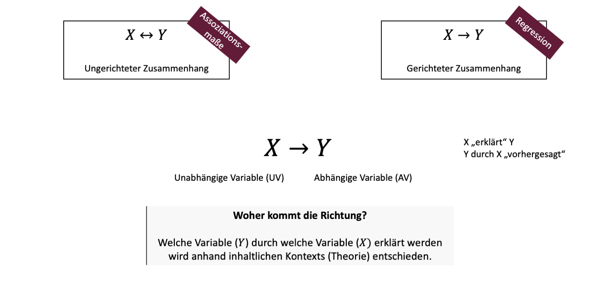

```{r setup, include=FALSE}
options(htmltools.dir.version = FALSE)

library(tidyverse)
library(kableExtra)
library(ggplot2)
library(plotly)
library(htmlwidgets)
library(plotly)
library(MASS)
library(ggpubr)
library(xaringanthemer)
library(xaringanExtra)

style_duo_accent(
  primary_color = "#621C37",
  secondary_color = "#EE0071",
  background_image = "blank.png"
)

xaringanExtra::use_xaringan_extra(c("tile_view"))

use_scribble(
  pen_color = "#EE0071",
  pen_size = 4
  )

knitr::opts_chunk$set(
  fig.retina = TRUE,
  warning = FALSE,
  message = FALSE
)

Xname = ""
Yname = ""
nudgnumber = 3
my_green = "#EE0071"
```

name: Title slide
class: middle, left
<br><br><br><br><br><br><br>
# Statistik II
***
### Einheit 3: Einfache lineare Regression (1)
##### `r format(as.Date(data.frame(readxl::read_excel("Modul Quantitative Methoden II_Termine.xlsx"))$Datum), "%d.%m.%Y")[3]` | Prof. Dr. Stephan Goerigk

---
class: top, left
### Einfache lineare Regression

#### Zusammenhänge - Korrelation vs. Regression

.center[
```{r eval = TRUE, echo = F, out.width = "950px"}

```
]

```{r message=FALSE, warning=FALSE, include=FALSE}
set.seed(13)

ex = data.frame(X = 1:100)
ex$Y = ex$X*3 + rnorm(100,0,25)

ggplot(data = ex, aes(X, Y)) +
  geom_point() +
  geom_smooth(method = "lm", se = F, colour = my_green) +
  theme_classic() +
  theme(axis.text = element_blank(), axis.ticks = element_blank())

ex2 = data.frame(X = 1:100)
ex2$Y = ex2$X + rnorm(100,0,10000000)

ggplot(data = ex2, aes(X, Y)) +
  geom_point() +
  geom_smooth(method = "lm", se = F, colour = my_green) +
  theme_classic() +
  theme(axis.text = element_blank(), axis.ticks = element_blank())
```

```{r include=FALSE}
sampledata = read.csv("sampledata.csv")
model = lm(Y ~ X, data = sampledata)
sampledata$pred = predict(model, newdata = sampledata)
sampledata_long = multilevel::make.univ(sampledata, sampledata[,3:4], outname = "Y")
sampledata_long = sampledata_long[,c(1,2, 4, 5,6)]
names(sampledata_long) = c("ID", "X", "pred", "Predicted", "Y")
sampledata_long$Predicted = factor(sampledata_long$Predicted, levels = 0:1, labels = c("yi Beobachtungswert", "ŷi geschätzter Wert"))
sampledata_long$ID[sampledata_long$Predicted ==  "ŷi geschätzter Wert"] = ""
```

---
class: top, left
### Einfache lineare Regression

#### Zusammenhänge - Korrelation vs. Regression

**Ungerichtete Zusammenhänge**

* Wir haben uns bereits mit ungerichteten Zusammenhängen zwischen 2 Variablen beschäftigt

* ungerichtet: es könnte $X$ auf $Y$ wirken, $Y$ aber auch auf $X$, oder die beiden könnten einfach parallel auftreten 

*  Um solche Zusammenhänge zu messen, gibt es sogenannte Assoziationsmaße z.B. Varianz oder Korrelation.

**Gerichtete Zusammenhänge**

* Jetzt wollen wir einen Schritt weiter gehen und unterstellen, dass der Zusammenhang eine Wirkrichtung hat

* D.h. $X$ wirkt auf $Y$ und eben nicht $Y$ wirkt auf $X$ 

* Wenn wir diese Richtung unterstellen, kann man die lineare Regression anwenden

---
class: top, left
### Einfache lineare Regression

#### Zusammenhänge - Korrelation vs. Regression

* Die Schreibweise $X \rightarrow Y$ soll also andeuten $X$ wirkt auf $Y$ (bzw. sagt $Y$ vorher) 

* Dabei ist $X$ die unabhängige Variable (UV) und $Y$ ist die abhängige Variable (AV)

Beispiel: 

* Die Intensität des Sports wirkt sich auf den Puls aus, aber nicht umgekehrt

* Wenn wir so einen gerichteten Zusammenhang untersuchen, dann stellt sich die Frage, wo die Richtung herkommt

$\rightarrow$ Typischerweise müssen wir die Richtung aus der Theorie oder aus Plausibilitätsüberlegungen herleiten 

---
class: top, left
### Einfache lineare Regression

#### Einfache lineare Regression, Beispiel

Gegeben: Lernaufwand X (Stunden) und Klausurerfolg Y (Punkte: 0-100) von n = 26 Studierenden (hier Zeilen 1-13).

.pull-left[
```{r echo = F, out.height = "420px"}
scatterplot = ggplot(data = sampledata, aes(x = X, y = Y, label = ID)) +
  geom_point() +
  geom_text(check_overlap = TRUE, vjust = 0, nudge_y = nudgnumber) +
   theme_classic() +
  labs(x = "Lernaufwand (X)", y = "Klausurerfolg (Y)") +
  theme(rect = element_rect(fill = "transparent")) +
   coord_cartesian(xlim = c(0,100), ylim = c(0,100))
ggplotly(scatterplot)
```
]
.pull-right[

```{r echo=FALSE}
knitr::kable((sampledata[1:13,1:3]),
             booktabs = T,
             longtable = F) %>%
  kable_classic(full_width = T,
                  font_size = 12,
                  html_font = "Times New Roman")
```
]

---
class: top, left
### Einfache lineare Regression

#### Lineare Regressionsfunktion

$X \rightarrow Y$ Regressionsfunktion und Beobachtungswerte

.pull-left[
```{r echo = F, out.height = "420px"}
scatterplot = ggplot(data = sampledata_long[sampledata_long$Predicted == "yi Beobachtungswert",], aes(x = X, y = Y, label = ID, colour = Predicted)) +
  geom_point() +
  #geom_text(check_overlap = TRUE, vjust = 0, nudge_y = nudgnumber) +
  scale_color_manual(values = c("yi Beobachtungswert" = "black",
                                  "ŷi geschätzter Wert" = my_green)) +
   theme_classic() +
 coord_cartesian(xlim = c(0,100), ylim = c(0,100)) +
   labs(colour = "", x = "Lernaufwand (X)", y = "Klausurerfolg (Y)") +
theme(rect = element_rect(fill = "transparent")) 
ggplotly(scatterplot) %>%
layout(legend = list(x = 100, y = 0.5))
```
]

.pull-right[
* Jeder Punkt repräsentiert eine Kombination aus $X$ und $Y$ Werten 

* Wir könnten also sagen, jeder Punkt ist eine Person aus unserem Beispiel 

* Es gilt, in der Regression eine Funktion zu finden, die diese Daten möglichst genau widerspiegelt 
]

---
class: top, left
### Einfache lineare Regression

#### Lineare Regressionsfunktion

$X \rightarrow Y$ Regressionsfunktion und Beobachtungswerte

.pull-left[
```{r echo = F, out.height = "420px"}
scatterplot = ggplot(data = sampledata_long[sampledata_long$Predicted == "yi Beobachtungswert",], aes(x = X, y = Y, label = ID, colour = Predicted)) +
  geom_point() +
  #geom_text(check_overlap = TRUE, vjust = 0, nudge_y = nudgnumber) +
  scale_color_manual(values = c("yi Beobachtungswert" = "black",
                                  "ŷi geschätzter Wert" = my_green)) +
  geom_abline(slope = coef(model)[["X"]], 
              intercept = coef(model)[["(Intercept)"]], colour = my_green) +
   theme_classic() +
 coord_cartesian(xlim = c(0,100), ylim = c(0,100)) +
  labs(colour = "", x = "Lernaufwand (X)", y = "Klausurerfolg (Y)") +
theme(rect = element_rect(fill = "transparent")) 
ggplotly(scatterplot) %>%
layout(legend = list(x = 100, y = 0.5))
```
]

.pull-right[
* Im Falle der *linearen* Regression wird unterstellt, dass diese Funktion linear, also eine Gerade ist
]

---
class: top, left
### Einfache lineare Regression

#### Lineare Regressionsfunktion

$X \rightarrow Y$ Regressionsfunktion und Beobachtungswerte

.pull-left[
```{r echo = F, out.height = "420px"}
scatterplot = ggplot(data = sampledata_long[sampledata_long$Predicted == "yi Beobachtungswert",], aes(x = X, y = Y, label = ID, colour = Predicted)) +
  geom_point() +
  #geom_text(check_overlap = TRUE, vjust = 0, nudge_y = nudgnumber) +
  scale_color_manual(values = c("yi Beobachtungswert" = "black",
                                  "ŷi geschätzter Wert" = my_green)) +
  geom_smooth(se = F, colour = my_green)+
   theme_classic() +
 coord_cartesian(xlim = c(0,100), ylim = c(0,100)) +
  labs(colour = "", x = "Lernaufwand (X)", y = "Klausurerfolg (Y)") +
theme(rect = element_rect(fill = "transparent")) 
ggplotly(scatterplot) %>%
layout(legend = list(x = 100, y = 0.5))
```
]

.pull-right[
* Theoretisch wären allerdings auch andere Funktionen denkbar.

* Diese beschreiben die vorliegenden Daten ggf. besser, sind aber nicht so leicht interpretierbar/generalisierbar.
]

---
class: top, left
### Einfache lineare Regression

#### Lineare Regressionsfunktion

$X \rightarrow Y$ Regressionsfunktion und Beobachtungswerte

.pull-left[
```{r echo = F, out.height = "420px"}
scatterplot = ggplot(data = sampledata_long[sampledata_long$Predicted == "yi Beobachtungswert",], aes(x = X, y = Y, label = ID, colour = Predicted)) +
  geom_segment(aes(x = 0, 
                   xend = 12,
                   y=23,
                   yend= 23), linetype = "dotted", colour = "grey") +
  geom_segment(aes(x = 12, 
                   xend = 12,
                   y=0,
                   yend= 23), linetype = "dotted", colour = "grey") +
  geom_point() +
 # geom_text(check_overlap = TRUE, vjust = 0, nudge_y = nudgnumber) +
  scale_color_manual(values = c("yi Beobachtungswert" = "black",
                                  "ŷi geschätzter Wert" = my_green)) +
  geom_abline(slope = coef(model)[["X"]], 
              intercept = coef(model)[["(Intercept)"]], colour = my_green) +
  annotate(geom = "Text",  label = "x<sub>i</sub>", x = 12/2, y = 23+nudgnumber+2) +
  annotate(geom = "Text",  label = "y<sub>i</sub>", x = 12+nudgnumber+2, y = 23/2) +
   theme_classic() +
  labs(colour = "", x = "Lernaufwand (X)", y = "Klausurerfolg (Y)") +
  theme(rect = element_rect(fill = "transparent")) +
 coord_cartesian(xlim = c(0,100), ylim = c(0,100))
ggplotly(scatterplot) %>%
layout(legend = list(x = 100, y = 0.5))
```
]

.pull-right[
* Jeder Beobachtungspunkt hat für den $X$ Wert einen entsprechenden $Y$ Wert.

* Er ist somit eindeutig für die beiden Variablen definiert.

ABER:

* Für jeden gegebenen $X$ Wert lässt sich ein Punkt auf der Geraden finden, der einen anderen $Y$ Wert hat
]
---
class: top, left
### Einfache lineare Regression

#### Lineare Regressionsfunktion

$X \rightarrow Y$ Regressionsfunktion und Beobachtungswerte

.pull-left[
```{r echo = F, out.height = "420px"}
scatterplot = ggplot(data = sampledata_long, aes(x = X, y = Y, label = ID, colour = Predicted)) +
   geom_segment(aes(x = 0, 
                   xend = 12,
                   y=23,
                   yend= 23), linetype = "dotted", colour = "grey") +
  geom_segment(aes(x = 12, 
                   xend = 12,
                   y=0,
                   yend= 23), linetype = "dotted", colour = "grey") +
  geom_segment(aes(x = 0,
                   xend = 12,
                   y=40.42,
                   yend= 40.42), linetype = "dotted", colour = "grey") +
  geom_segment(aes(x = 12,
                   xend = 12,
                   y=0,
                   yend= 40.42), linetype = "dotted", colour = "grey") +
  geom_point() +
 # geom_text(check_overlap = TRUE, vjust = 0, nudge_y = nudgnumber) +
  scale_color_manual(values = c("yi Beobachtungswert" = "black",
                                  "ŷi geschätzter Wert" = my_green)) +
  geom_abline(slope = coef(model)[["X"]], 
              intercept = coef(model)[["(Intercept)"]], colour = my_green) +
  annotate(geom = "Text",  label = "x<sub>i</sub>", x = 12/2, y = 23+nudgnumber+2) +
  annotate(geom = "Text",  label = "y<sub>i</sub>", x = 12+nudgnumber+2, y = 23/2) +
  annotate(geom = "Text",  label = "x<sub>i</sub>", x = 12/2, y = sampledata_long$Y[sampledata_long$X == 12 & sampledata_long$Predicted == "ŷi geschätzter Wert"]+nudgnumber+2) +
  annotate(geom = "Text",  label = "ŷ<sub>i</sub>", x = 12+nudgnumber+2, y = sampledata_long$Y[sampledata_long$X == 12 & sampledata_long$Predicted == "ŷi geschätzter Wert"]/1.333) +
   theme_classic() +
   labs(colour = "", x = "Lernaufwand (X)", y = "Klausurerfolg (Y)") +
  theme(rect = element_rect(fill = "transparent")) +
 coord_cartesian(xlim = c(0,100), ylim = c(0,100))
ggplotly(scatterplot) %>%
layout(legend = list(x = 100, y = 0.5))
```
]

.pull-right[
* Der pinke Punkt ist der gemäß der linearen Funktion geschätzte $Y$ Wert für den Punkt X 

* Es ist also der Wert, den man unter Annahme eines linearen Zusammenhangs **erwarten** würde

* Diese Punkte haben den $X$ Wert gemeinsam aber sind unterschiedlich im $Y$ Wert.
]

---
class: top, left
### Einfache lineare Regression

#### Lineare Regressionsfunktion

$X \rightarrow Y$ Regressionsfunktion und Beobachtungswerte

.pull-left[
```{r echo = F, out.height = "400px"}
scatterplot = ggplot(data = sampledata_long, aes(x = X, y = Y, label = ID, colour = Predicted)) +
   geom_segment(aes(x = 0, 
                   xend = 12,
                   y=23,
                   yend= 23), linetype = "dotted", colour = "grey") +
  geom_segment(aes(x = 12, 
                   xend = 12,
                   y=0,
                   yend= 23), linetype = "dotted", colour = "grey") +
  geom_segment(aes(x = 0, 
                   xend = 12,
                   y=40.43,
                   yend= 40.43), linetype = "dotted", colour = "grey") +
  geom_segment(aes(x = 12, 
                   xend = 12,
                   y=0,
                   yend= 40.43), linetype = "dotted", colour = "grey") +
  geom_segment(aes(x = 12, 
                   xend = 12,
                   y=23,
                   yend= 40.43), linetype = "dotted", colour = "red") +
  geom_point() +
  #geom_text(check_overlap = TRUE, vjust = 0, nudge_y = nudgnumber) +
  scale_color_manual(values = c("yi Beobachtungswert" = "black",
                                  "ŷi geschätzter Wert" = my_green)) +
  geom_abline(slope = coef(model)[["X"]], 
              intercept = coef(model)[["(Intercept)"]], colour = my_green) +
  annotate(geom = "Text",  label = "x<sub>i</sub>", x = 12/2, y = 23+nudgnumber+2) +
  annotate(geom = "Text",  label = "y<sub>i</sub>", x = 12+nudgnumber+2, y = 23/2) +
  annotate(geom = "Text",  label = "x<sub>i</sub>", x = 12/2, y = sampledata_long$Y[sampledata_long$X == 12 & sampledata_long$Predicted == "ŷi geschätzter Wert"]+nudgnumber+2) +
  annotate(geom = "Text",  label = "ŷ<sub>i</sub>", x = 12+nudgnumber+2, y = sampledata_long$Y[sampledata_long$X == 12 & sampledata_long$Predicted == "ŷi geschätzter Wert"]/1.333) +
   theme_classic() +
   labs(colour = "", x = "Lernaufwand (X)", y = "Klausurerfolg (Y)") +
  theme(rect = element_rect(fill = "transparent")) +
 coord_cartesian(xlim = c(0,100), ylim = c(0,100))
ggplotly(scatterplot) %>%
layout(legend = list(x = 100, y = 0.5))
```
]

.pull-right[
* Wie wir aber sehen, gibt es hier einen Unterschied in den beiden $Y$ Werten 

* Dieser Unterschied ist unser sogenannter Vorhersagefehler oder auch **Residuum** 
  * Differenz zwischen Beobachtungswert und vorhergesagtem Wert
  * Das Residuum wird mit $\varepsilon_i$ bezeichnet

Formel für das Residuum:

$$\varepsilon_i=\hat{y}_i - y_i$$
]


---
class: top, left
### Einfache lineare Regression

#### Lineare Regressionsfunktion

$X \rightarrow Y$ Regressionsfunktion und Beobachtungswerte

.pull-left[
```{r echo = F, out.height = "420px"}
scatterplot = ggplot(data = sampledata_long, aes(x = X, y = Y, label = ID, colour = Predicted)) +
  geom_segment(x = 0, xend = 10, y = coef(model)[["(Intercept)"]], yend = coef(model)[["(Intercept)"]], colour = "black") +
  geom_segment(x = 10, xend = 10, y = coef(model)[["(Intercept)"]], yend = predict(model, newdata = data.frame(X=10)), colour = "black") +
  geom_point(x = 0, y = coef(model)[["(Intercept)"]], colour = my_green) +
  geom_point() +
  geom_abline(slope = coef(model)[["X"]], 
              intercept = coef(model)[["(Intercept)"]], colour = my_green) +
   theme_classic()+
  scale_color_manual(values = c("yi Beobachtungswert" = "black",
                                  "ŷi geschätzter Wert" = my_green)) +
  theme(rect = element_rect(fill = "transparent")) +
  labs(colour = "", x = "Lernaufwand (X)", y = "Klausurerfolg (Y)") +
  annotate(geom = "Text",  label = "a", x = 0, y = coef(model)[["(Intercept)"]] + 5, colour =  "red") +
  annotate(geom = "Text",  label = "b", x = 12, y = predict(model, newdata = data.frame(X=10)) - (predict(model, newdata = data.frame(X=10)) - coef(model)[["(Intercept)"]])/2, colour =  "red") +
 coord_cartesian(xlim = c(0,100), ylim = c(0,100)) #+
#theme(axis.text = element_blank(), axis.ticks = element_blank(), axis.line = element_blank(), axis.title = element_blank())
ggplotly(scatterplot) %>%
layout(legend = list(x = 100, y = 0.5))
```
]

.pull-right[
$$\hat{y}_i=a+b \cdot x_i + \varepsilon_i$$
$a:$ Y-Achsenabschnitt <br>
$b:$ Steigungsparameter

**Interpretation:**

$a:$ Wert, den $Y$ hat, wenn $X=0$ ist <br>
$b:$ Veränderung von Y bei Zunahme von $X$ um 1 Einheit
]

---
class: top, left
### Einfache lineare Regression

#### Residuen und Zielfunktion

.pull-left[
```{r echo = F, out.height = "420px"}
scatterplot = ggplot(data = sampledata_long[sampledata_long$Predicted == "yi Beobachtungswert",], aes(x = X, y = Y, label = ID, colour = Predicted)) +
  geom_point() +
  geom_abline(slope = coef(model)[["X"]] - coef(model)[["X"]]*0.8, 
              intercept = coef(model)[["(Intercept)"]], colour = my_green, linetype = "dashed") +
  geom_abline(slope = coef(model)[["X"]]- coef(model)[["X"]]*0.5, 
              intercept = coef(model)[["(Intercept)"]], colour = my_green, linetype = "dashed") +
  geom_abline(slope = coef(model)[["X"]], 
              intercept = coef(model)[["(Intercept)"]], colour = my_green) +
  geom_abline(slope = coef(model)[["X"]]+ coef(model)[["X"]]*0.5, 
              intercept = coef(model)[["(Intercept)"]], colour = my_green, linetype = "dashed") +
  geom_abline(slope = coef(model)[["X"]] + coef(model)[["X"]]*0.8, 
              intercept = coef(model)[["(Intercept)"]], colour = my_green, linetype = "dashed") +
   theme_classic()+
   labs(colour = "", x = "Lernaufwand (X)", y = "Klausurerfolg (Y)") +
  scale_color_manual(values = c("yi Beobachtungswert" = "black",
                                  "ŷi geschätzter Wert" = my_green)) +
  theme(rect = element_rect(fill = "transparent")) +
 coord_cartesian(xlim = c(0,100), ylim = c(0,100))
ggplotly(scatterplot)%>%
layout(legend = list(x = 100, y = 0.5))
```
]

.pull-right[
$$\hat{y}_i=a+b \cdot x_i + \varepsilon_i$$
$a:$ Y-Achsenabschnitt <br>
$b:$ Steigungsparameter

* Theoretisch sind endlos viele Geraden denkbar, die die Punktewolke alle an unterschiedlichen Stellen durchschneiden

* Wir wollen aber genau die Gerade finden, welche die Daten am allerbesten beschreibt.
]

---
class: top, left
### Einfache lineare Regression

#### Residuen und Zielfunktion

.pull-left[
```{r echo = F, out.height = "420px"}
scatterplot = ggplot(data = sampledata_long, aes(x = X, y = Y, colour = Predicted)) +
  geom_segment(aes(xend = X, yend = pred), linetype = "dotted", colour = "red") +
  geom_point() +
  geom_abline(slope = coef(model)[["X"]], 
              intercept = coef(model)[["(Intercept)"]], colour = my_green) +
   theme_classic() +
  theme(rect = element_rect(fill = "transparent")) +
  scale_color_manual(values = c("yi Beobachtungswert" = "black",
                                  "ŷi geschätzter Wert" = my_green)) +
    labs(colour = "", x = "Lernaufwand (X)", y = "Klausurerfolg (Y)") +
 coord_cartesian(xlim = c(0,100), ylim = c(0,100))
ggplotly(scatterplot) %>%
layout(legend = list(x = 100, y = 0.5))
```
]

.pull-right[
**Ziel:**

* Y-Achsenabschnitt und Steigung so wählen, dass die lineare Funktion die Punkte möglichst gut widerspiegelt 

* gut widerspiegeln = Abstand zwischen dem Beobachtungswert und dem gemäß linearer Funktion geschätzten Wert möglichst klein halten

**Bildliche Vorstellung: **

Wenn ich die Residuen aller Beobachtungswerte zu einer Schnur aneinanderhänge, soll diese Schnur möglichst kurz sein
]


---
class: top, left
### Einfache lineare Regression

#### Residuen und Zielfunktion

.pull-left[
```{r echo = F, out.height = "420px"}
scatterplot = ggplot(data = sampledata_long, aes(x = X, y = Y, colour = Predicted)) +
  geom_segment(aes(xend = X, yend = pred), linetype = "dotted", colour = "red") +
  geom_point() +
  geom_abline(slope = coef(model)[["X"]], 
              intercept = coef(model)[["(Intercept)"]], colour = my_green) +
   theme_classic() +
  theme(rect = element_rect(fill = "transparent")) +
  scale_color_manual(values = c("yi Beobachtungswert" = "black",
                                  "ŷi geschätzter Wert" = my_green)) +
    labs(colour = "", x = "Lernaufwand (X)", y = "Klausurerfolg (Y)") +
 coord_cartesian(xlim = c(0,100), ylim = c(0,100))
ggplotly(scatterplot) %>%
layout(legend = list(x = 100, y = 0.5))
```
]

.pull-right[
Es liegt ein Optimierungsproblem vor:

* Die Summe der quadrierten Residuen wird über alle Beobachtungswerte minimiert 

* So werden die optimalen Werte für a und b gefunden

* Quadrierung verhindert, dass sich negative und positive Werte ausgleichen

$$\sum\limits _{i=1}^{n}\varepsilon^2_i=\varepsilon^2_1+\varepsilon^2_2...+\varepsilon^2_n \rightarrow \min_{a,b}$$
]

---
class: top, left
### Einfache lineare Regression

#### Bestimmung der zu schätzenden Parameter

* Schätzung von a und b $\rightarrow$ **Methode der kleinsten Quadrate**
 
* Ziel: Summe der quadrierten Residuen minimieren

.pull-left[

**Analytische Lösung des Optimierungsproblems:**

1. Y-Achsenabschnitt $(a)$

$$a=\bar{y} - b \cdot \bar{x}$$

2. Y-Steigungsparameter $(b)$

$$b=\frac{\sigma^2_{XY}}{\sigma^2_X} = r_{XY} \cdot \frac{\sigma_y}{\sigma_x}$$
]

---
class: top, left
### Einfache lineare Regression

#### Bestimmung der zu schätzenden Parameter

* Schätzung von a und b $\rightarrow$ **Methode der kleinsten Quadrate**
 
* Ziel: Summe der quadrierten Residuen minimieren

.pull-left[

**Analytische Lösung des Optimierungsproblems:**

1. Y-Achsenabschnitt $(a)$

$$a=\bar{y} - b \cdot \bar{x}$$

2. Y-Steigungsparameter $(b)$

$$b=\frac{\sigma^2_{XY}}{\sigma^2_X} = r_{XY} \cdot \frac{\sigma_y}{\sigma_x}$$
]
.pull-right[
**To Do - wir benötigen:**
* Mittelwert von $X: \bar{x}$ 
* Mittelwert von $Y: \bar{y}$ 
* Kovarianz von $XY: \sigma^2_{XY}$
* Varianz von $X: \sigma^2_X$

]

---
class: top, left
### Einfache lineare Regression

#### Bestimmung der zu schätzenden Parameter

```{r echo = F}
knitr::kable((t(sampledata[,2:3])),
             booktabs = T,
             longtable = F) %>%
  kable_classic(full_width = T,
                  font_size = 18,
                  html_font = "Times New Roman")
```

.pull-left[

<br>
<br>
Mittelwert von $X = \bar{x}=\frac{\sum\limits _{i=1}^{n}x_{i}}{n}$  
<br>
<br>
Mittelwert von $Y = \bar{y}=\frac{\sum\limits _{i=1}^{n}y_{i}}{n}$  

]

.pull-right[

<br>
<br>
Kovarianz von $XY = \sigma_{xy}^2=\frac{\displaystyle \sum_{i=1}^{n}(x_{i}-\bar{x})\cdot(y_{i}-\bar{y})}{n-1}$ 
<br>
<br>
Varianz von $X =  \sigma^2=\dfrac{\displaystyle\sum_{i=1}^{n}(x_{i}-\bar{x})^2}{n-1}$ 

]


---
class: top, left
### Einfache lineare Regression

#### Bestimmung der zu schätzenden Parameter

```{r echo = F}
knitr::kable((t(sampledata[,2:3])),
             booktabs = T,
             longtable = F) %>%
  kable_classic(full_width = T,
                  font_size = 18,
                  html_font = "Times New Roman")
```

.pull-left[

<br>
<br>
Mittelwert von $X = \bar{x}=\frac{\sum\limits _{i=1}^{n}x_{i}}{n}$  = `r round(mean(sampledata$X, na.rm = T),2)`
<br>
<br>
Mittelwert von $Y = \bar{y}=\frac{\sum\limits _{i=1}^{n}y_{i}}{n}$  =  `r round(mean(sampledata$Y, na.rm = T),2)`

]

.pull-right[

<br>
<br>
Kovarianz von $XY = \sigma_{xy}^2=\frac{\displaystyle \sum_{i=1}^{n}(x_{i}-\bar{x})\cdot(y_{i}-\bar{y})}{n-1}$ = `r round(cov(sampledata$X, sampledata$Y), 2)`
<br>
<br>
Varianz von $X =  \sigma^2=\dfrac{\displaystyle\sum_{i=1}^{n}(x_{i}-\bar{x})^2}{n-1}$ =  `r round(var(sampledata$X, na.rm = T),2)`

]

---
class: top, left
### Einfache lineare Regression

#### Bestimmung der zu schätzenden Parameter

```{r echo = F}
knitr::kable((t(sampledata[,2:3])),
             booktabs = T,
             longtable = F) %>%
  kable_classic(full_width = T,
                  font_size = 18,
                  html_font = "Times New Roman")
```


$$ b=\frac{\sigma_{xy}^2}{\sigma^2_x}=\frac{`r round(cov(sampledata$X, sampledata$Y), 2)`}{`r round(var(sampledata$X, na.rm = T),2)`} = `r round(cov(sampledata$X, sampledata$Y) / var(sampledata$X, na.rm = T), 2)`$$

<br>

$$ a = \bar{y} - b \cdot \bar{x} = `r round(mean(sampledata$Y, na.rm = T) - cov(sampledata$X, sampledata$Y) / var(sampledata$X, na.rm = T) * mean(sampledata$X, na.rm = T),2)`$$

<br>

$$ y=a + b\cdot x$$

<br>

<div class="red">
$$ y=`r round(mean(sampledata$Y, na.rm = T) - cov(sampledata$X, sampledata$Y) / var(sampledata$X, na.rm = T) * mean(sampledata$X, na.rm = T),2)` + `r round(cov(sampledata$X, sampledata$Y) / var(sampledata$X, na.rm = T), 2)`\cdot x$$
</div>

---
class: top, left
### Einfache lineare Regression

#### Lineare Regressionsfunktion

.pull-left[
```{r echo = F, out.height = "420px"}
scatterplot = ggplot(data = sampledata_long, aes(x = X, y = Y, label = ID, colour = Predicted)) +
  geom_segment(x = 0, xend = 10, y = coef(model)[["(Intercept)"]], yend = coef(model)[["(Intercept)"]], colour = "black") +
  geom_segment(x = 10, xend = 10, y = coef(model)[["(Intercept)"]], yend = predict(model, newdata = data.frame(X=10)), colour = "black") +
  geom_point(x = 0, y = coef(model)[["(Intercept)"]], colour = my_green) +
  geom_point() +
  geom_abline(slope = coef(model)[["X"]], 
              intercept = coef(model)[["(Intercept)"]], colour = my_green) +
   theme_classic()+
  scale_color_manual(values = c("yi Beobachtungswert" = "black",
                                  "ŷi geschätzter Wert" = my_green)) +
  theme(rect = element_rect(fill = "transparent")) +
  labs(colour = "", x = "Lernaufwand (X)", y = "Klausurerfolg (Y)") +
  annotate(geom = "Text",  label = "a", x = 0, y = coef(model)[["(Intercept)"]] + 5, colour =  "red") +
  annotate(geom = "Text",  label = "b", x = 12, y = predict(model, newdata = data.frame(X=10)) - (predict(model, newdata = data.frame(X=10)) - coef(model)[["(Intercept)"]])/2, colour =  "red") +
 coord_cartesian(xlim = c(0,100), ylim = c(0,100)) #+
#theme(axis.text = element_blank(), axis.ticks = element_blank(), axis.line = element_blank(), axis.title = element_blank())
ggplotly(scatterplot) %>%
layout(legend = list(x = 100, y = 0.5))
```
]

.pull-right[
$$ \hat{y}=`r round(mean(sampledata$Y, na.rm = T) - cov(sampledata$X, sampledata$Y) / var(sampledata$X, na.rm = T) * mean(sampledata$X, na.rm = T),2)` + `r round(cov(sampledata$X, sampledata$Y) / var(sampledata$X, na.rm = T), 2)`\cdot x$$

* Es ergibt sich also der geschätzte $Y$ Wert $(\hat{y})$ aus a plus b mal $x$

**Nochmal zurück zu unserer Interpretation:**
  
- a ist also der Wert wo $X=0$ ist. Also hat jemand mit 0 auf der UV einen AV Wert von 29.

- Wenn wir nun um 1 Einheit $X$ nach rechts gehen (in welcher Einheit die UV auch immmer gemessen wird), nimmt $\hat{y}$ um b zu.
]

---
class: top, left
### Einfache lineare Regression

#### Lineare Regressionsfunktion

.pull-left[
```{r echo = F, out.height = "420px"}
scatterplot = ggplot(data = sampledata_long, aes(x = X, y = Y, label = ID, colour = Predicted)) +
  geom_segment(x = 0, xend = 10, y = coef(model)[["(Intercept)"]], yend = coef(model)[["(Intercept)"]], colour = "black") +
  geom_segment(x = 10, xend = 10, y = coef(model)[["(Intercept)"]], yend = predict(model, newdata = data.frame(X=10)), colour = "black") +
  geom_point(x = 0, y = coef(model)[["(Intercept)"]], colour = my_green) +
  geom_point() +
  geom_abline(slope = coef(model)[["X"]], 
              intercept = coef(model)[["(Intercept)"]], colour = my_green) +
   theme_classic()+
  scale_color_manual(values = c("yi Beobachtungswert" = "black",
                                  "ŷi geschätzter Wert" = my_green)) +
  theme(rect = element_rect(fill = "transparent")) +
  labs(colour = "", x = "Lernaufwand (X)", y = "Klausurerfolg (Y)") +
  annotate(geom = "Text",  label = "a", x = 0, y = coef(model)[["(Intercept)"]] + 5, colour =  "red") +
  annotate(geom = "Text",  label = "b", x = 12, y = predict(model, newdata = data.frame(X=10)) - (predict(model, newdata = data.frame(X=10)) - coef(model)[["(Intercept)"]])/2, colour =  "red") +
 coord_cartesian(xlim = c(0,100), ylim = c(0,100)) #+
#theme(axis.text = element_blank(), axis.ticks = element_blank(), axis.line = element_blank(), axis.title = element_blank())
ggplotly(scatterplot) %>%
layout(legend = list(x = 100, y = 0.5))
```
]

.pull-right[
$$ \hat{y}=`r round(mean(sampledata$Y, na.rm = T) - cov(sampledata$X, sampledata$Y) / var(sampledata$X, na.rm = T) * mean(sampledata$X, na.rm = T),2)` + `r round(cov(sampledata$X, sampledata$Y) / var(sampledata$X, na.rm = T), 2)`\cdot x$$

* Wir könnten nun ausrechnen, welchen $Y$ Wert eine Person nach x Einheiten der UV hat.

* Welchen Wert erhalten wir z.B. für $X=10$?

]

---
class: top, left
### Einfache lineare Regression

#### Modellpassung

.pull-left[
```{r echo = F, out.height = "420px"}
scatterplot = ggplot(data = sampledata_long[sampledata_long$Predicted == "yi Beobachtungswert",], aes(x = X, y = Y, label = ID, colour = Predicted)) +
  geom_point() +
  #geom_text(check_overlap = TRUE, vjust = 0, nudge_y = nudgnumber) +
  scale_color_manual(values = c("yi Beobachtungswert" = "black",
                                  "ŷi geschätzter Wert" = my_green)) +
  geom_abline(slope = coef(model)[["X"]], 
              intercept = coef(model)[["(Intercept)"]], colour = my_green) +
   theme_classic() +
 coord_cartesian(xlim = c(0,100), ylim = c(0,100)) +
  labs(colour = "", x = "Lernaufwand (X)", y = "Klausurerfolg (Y)") +
theme(rect = element_rect(fill = "transparent")) 
ggplotly(scatterplot) %>%
layout(legend = list(x = 100, y = 0.5))
```
]


.pull-right[
Nach Aufstellen des Modells:

* Abstände zwischen Beobachtungswerten und Regressionsgerade unterschiedlich groß

**Frage:**

* Wie gut passt unser Modell auf die Beobachtungswerte?

* Maß zur Bestimmung der Passung:

$\rightarrow$ Das Bestimmheitsmaß $(R^2)$

]

---
class: top, left
### Einfache lineare Regression

#### Modellpassung

.pull-left[
```{r echo = F, out.height = "420px"}
scatterplot = ggplot(data = sampledata_long[sampledata_long$Predicted == "yi Beobachtungswert",], aes(x = X, y = Y, colour = Predicted)) +
  geom_hline(yintercept = mean(sampledata_long$Y[sampledata_long$Predicted == "yi Beobachtungswert"], na.rm=T)) +
  scale_y_continuous(breaks =  mean(sampledata_long$Y[sampledata_long$Predicted == "yi Beobachtungswert"], na.rm=T), labels = c("ȳ")) +
  geom_point() +
  scale_color_manual(values = c("yi Beobachtungswert" = "black",
                                  "ŷi geschätzter Wert" = my_green)) +
  # geom_abline(slope = coef(model)[["X"]], 
  #             intercept = coef(model)[["(Intercept)"]], colour = my_green) +
   theme_classic() +
 coord_cartesian(xlim = c(0,100), ylim = c(0,100)) +
   labs(colour = "", x = "Lernaufwand (X)", y = "Klausurerfolg (Y)") +
theme(rect = element_rect(fill = "transparent")) 
ggplotly(scatterplot) %>%
layout(legend = list(x = 100, y = 0.5))
```
]


.pull-right[
**Frage:**

* Wie gut passt unser Modell auf die Beobachtungswerte?

* horizontale Gerade = Mittelwert von $Y$ (um welchen Werte streuen)

$\rightarrow$ **Gesamtvarianz**

Regressionsgerade kann einen Anteil der Streuung um den Mittelwert erklären:

$\rightarrow$ **Aufgeklärte Varianz**

]

---
class: top, left
### Einfache lineare Regression

#### Modellpassung


```{r echo = F, out.height = "420px", out.width = "700px"}
scatterplot = ggplot(data = sampledata_long[sampledata_long$Predicted == "yi Beobachtungswert",], aes(x = X, y = Y, colour = Predicted)) +
  geom_hline(yintercept = mean(sampledata_long$Y[sampledata_long$Predicted == "yi Beobachtungswert"], na.rm=T)) +
  scale_y_continuous(breaks =  mean(sampledata_long$Y[sampledata_long$Predicted == "yi Beobachtungswert"], na.rm=T), labels = c("ȳ")) +
  geom_segment(aes(x = 12, 
                   xend = 12,
                   y=23,
                   yend= mean(sampledata_long$Y[sampledata_long$Predicted == "yi Beobachtungswert"], na.rm=T)), linetype = "dotted", colour = "red") +
  # geom_segment(aes(x = 12, 
  #                  xend = 12,
  #                  y=sampledata_long$Y[sampledata_long$X == 12 & sampledata_long$Predicted == "ŷi geschätzter Wert"],
  #                  yend= mean(sampledata_long$Y[sampledata_long$Predicted == "yi Beobachtungswert"], na.rm=T)), linetype = "dotted", colour = "green") +
  geom_point() +
  annotate(geom = "Text",  label = "Gesamt-\nvarianz", x = 12-nudgnumber - 5, y = mean(sampledata_long$Y[sampledata_long$Predicted == "yi Beobachtungswert"], na.rm=T) - sampledata_long$Y[sampledata_long$X == 12 & sampledata_long$Predicted == "ŷi geschätzter Wert"]/2, colour = "red") +
  scale_color_manual(values = c("yi Beobachtungswert" = "black",
                                  "ŷi geschätzter Wert" = my_green)) +
 # geom_abline(slope = coef(model)[["X"]], 
  #             intercept = coef(model)[["(Intercept)"]], colour = my_green) +
   theme_classic() +
 coord_cartesian(xlim = c(0,100), ylim = c(0,100)) +
   labs(colour = "", x = "Lernaufwand (X)", y = "Klausurerfolg (Y)") +
theme(rect = element_rect(fill = "transparent")) 
ggplotly(scatterplot) %>%
layout(legend = list(x = 100, y = 0.5))
```


---
class: top, left
### Einfache lineare Regression

#### Modellpassung

```{r echo = F, out.height = "420px", out.width = "700px"}
scatterplot = ggplot(data = sampledata_long, aes(x = X, y = Y, colour = Predicted)) +
  geom_hline(yintercept = mean(sampledata_long$Y[sampledata_long$Predicted == "yi Beobachtungswert"], na.rm=T)) +
  scale_y_continuous(breaks =  mean(sampledata_long$Y[sampledata_long$Predicted == "yi Beobachtungswert"], na.rm=T), labels = c("ȳ")) +
  geom_segment(aes(x = 12, 
                   xend = 12,
                   y=23,
                   yend= mean(sampledata_long$Y[sampledata_long$Predicted == "yi Beobachtungswert"], na.rm=T)), linetype = "dotted", colour = "red") +
  geom_segment(aes(x = 12, 
                   xend = 12,
                   y=sampledata_long$Y[sampledata_long$X == 12 & sampledata_long$Predicted == "ŷi geschätzter Wert"],
                   yend= mean(sampledata_long$Y[sampledata_long$Predicted == "yi Beobachtungswert"], na.rm=T)), linetype = "dotted", colour = "green") +
  geom_point() +
  annotate(geom = "Text",  label = "Aufgekl.\nVarianz", x = 12-nudgnumber - 5, y = sampledata_long$Y[sampledata_long$X == 12 & sampledata_long$Predicted == "ŷi geschätzter Wert"] + (mean(sampledata_long$Y[sampledata_long$Predicted == "yi Beobachtungswert"], na.rm=T) - sampledata_long$Y[sampledata_long$X == 12 & sampledata_long$Predicted == "ŷi geschätzter Wert"])/2, colour = "green") +
  #annotate(geom = "Text",  label = "Gesamt-\nvarianz", x = 12-nudgnumber-10, y = mean(sampledata_long$Y[sampledata_long$Predicted == "yi Beobachtungswert"], na.rm=T) - sampledata_long$Y[sampledata_long$X == 12 & sampledata_long$Predicted == "ŷi geschätzter Wert"]/2, colour = "red") +
  scale_color_manual(values = c("yi Beobachtungswert" = "black",
                                  "ŷi geschätzter Wert" = my_green)) +
  geom_abline(slope = coef(model)[["X"]], 
               intercept = coef(model)[["(Intercept)"]], colour = my_green) +
   theme_classic() +
 coord_cartesian(xlim = c(0,100), ylim = c(0,100)) +
  labs(colour = "", x = "Lernaufwand (X)", y = "Klausurerfolg (Y)") +
theme(rect = element_rect(fill = "transparent")) 
ggplotly(scatterplot) %>%
layout(legend = list(x = 100, y = 0.5))
```

---
class: top, left
### Einfache lineare Regression

#### Modellpassung

Das Verhältnis aufgeklärter zu gesamter Streuung nennt sich Bestimmtheitsmaß $(R^2)$

$$R^2=\frac{\text{erklärte Varianz}}{\text{gesamte Streuung}}=\frac{\sum\limits _{i=1}^{n}(\hat{y}_i-\bar{y}_i)^2}{\sum\limits _{i=1}^{n}(y_i-\bar{y}_i)^2}=(\frac{s_{XY}}{s_X \cdot s_Y})^2$$
<br>

.center[
[**LINK zu interaktivem Regressionsbeispiel**](https://daze02-stephan-goerigk.shinyapps.io/Regression/)
]

---
class: top, left
### Einfache lineare Regression

#### Modellpassung

* $0≤𝑅^2≤1$
* Je näher $R^2$ an 1, desto besser passt sich Modell an Beobachtungspunkte an


```{r echo = F}
knitr::kable((t(sampledata[,2:3])),
             booktabs = T,
             longtable = F) %>%
  kable_classic(full_width = T,
                  font_size = 18,
                  html_font = "Times New Roman")
```

<br>

$$ R^2=(\frac{s_{xy}}{s_x\cdot s_y})^2 $$

$$ R^2=(\frac{`r round(cov(sampledata$X, sampledata$Y), 2)`}{`r round(sd(sampledata$X), 2)`\cdot `r round(sd(sampledata$Y), 2)`})^2 = `r round(cov(sampledata$X, sampledata$Y) / (sd(sampledata$X) * sd(sampledata$Y)), 2)`$$

Es können `r round(cov(sampledata$X, sampledata$Y) / (sd(sampledata$X) * sd(sampledata$Y)), 2) * 100`% der Streuung um den Mittelwert von Y durch die Gerade erklärt werden.

---
class: top, left
### Einfache lineare Regression

#### Einsatz der Regression

Wozu können wir die Regression nutzen?

1. Als **Hypothesentest** für eine wissenschaftliche Hypothese (Inferenz):

	* Schritt 1: Mittels Regression Assoziation in der Stichprobe identifizieren
	* Schritt 2: Mittels Signifikanztest prüfen, ob Assoziation wahrscheinlich auch außerhalb Stichprobe vorliegt 

2. Als **Vorhersagemodell** für neue Datenpunkte (Prädiktion):
	
	* Schritt 1: Mittels Stichprobendaten Regressionsmodell anpassen (X und Y bekannt)
	* Schritt 2: Mittels Modell neue Werte vorhersagen (X bekannt, Y unbekannt).

---
class: top, left
### Einfache lineare Regression

#### Berechnen der Regression in R

.code80[
```{r}
model = lm(Y ~ X, data = sampledata) # Aufstellen des Modells

summary(model) # Anzeigen des Modelloutputs
```
]

---
class: top, left
### Einfache lineare Regression

#### Berechnen der Regression in R

.pull-left[
.code80[
```{r}
model = lm(Y ~ X, data = sampledata) # Aufstellen des Modells

summary(model) # Anzeigen des Modelloutputs
```
]
]

.pull-right[
* Regressionskoeffizienten (a und b) stehen in der Spalte "Estimate"

* Für jeden Koeffizienten wird ein spezieller t-Test (Wald-Test) gerechnet

  * $H_0$  a und b = 0
  * $H_1$  a und b $\neq$ 0
]
---
class: top, left
### Take-aways

.full-width[.content-box-gray[
* Zusammenhänge können neben Kovarianz/Korrelation auch mit der **Regression** quantifiziert werden.

* Regression ist sinnvoll, wenn aus den X-Werten auf die dazugehörigen Y-Werte **geschlossen** (diese vorhergesagt) werden soll.

* **Regressionsgerade** = graphische Veranschaulichung der Regressionsgleichung

* Regressionsgleichung ist definiert durch die **Regressionskoeffizienten** (Y-Achsenabschnitt und Steigung), welche aus Daten geschätzt werden müssen.

* **Y-Achsenabschnitt** ist der Startwert (wenn X = 0) und **Steigung** ist die Veränderung in der AV bei Zunahme der UV um 1 Einheit.

* Das **Bestimmtheitsmaß** $(R^2)$ gibt an, wie viel Prozent (%) der Gesamtvarianz der AV durch die UV (also durch die das Regressionsmodell) aufgeklärt werden.
]

]


