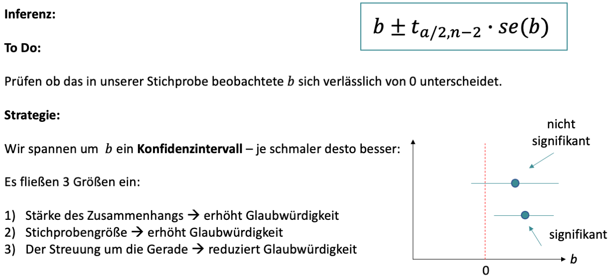
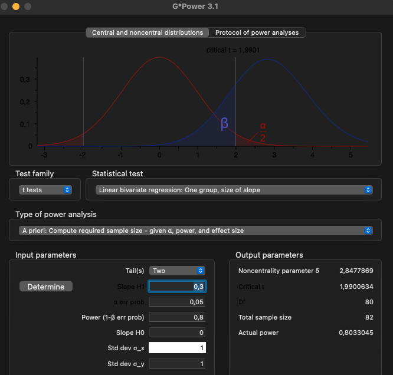

```{r setup, include=FALSE}
options(htmltools.dir.version = FALSE)

library(tidyverse)
library(kableExtra)
library(ggplot2)
library(plotly)
library(htmlwidgets)
library(plotly)
library(MASS)
library(ggpubr)
library(xaringanthemer)
library(xaringanExtra)
options(scipen = 999)

style_duo_accent(
  primary_color = "#621C37",
  secondary_color = "#EE0071",
  background_image = "blank.png"
)

xaringanExtra::use_xaringan_extra(c("tile_view"))

use_scribble(
  pen_color = "#EE0071",
  pen_size = 4
  )

knitr::opts_chunk$set(
  fig.retina = TRUE,
  warning = FALSE,
  message = FALSE
)

Xname = ""
Yname = ""
nudgnumber = 3
my_green = "#EE0071"
```

name: Title slide
class: middle, left
<br><br><br><br><br><br><br>
# Statistik II
***
### Einheit 4: Einfache lineare Regression (2)
##### `r format(as.Date(data.frame(readxl::read_excel("Modul Quantitative Methoden II_Termine.xlsx"))$Datum), "%d.%m.%Y")[4]` | Prof. Dr. Stephan Goerigk

---
class: top, left
### Einfache lineare Regression

#### Vorhergesagte Werte (predicted values)

```{r include=FALSE}
sampledata = read.csv("sampledata.csv")
model = lm(Y ~ X, data = sampledata)
sampledata$pred = predict(model, newdata = sampledata)
sampledata_long = multilevel::make.univ(sampledata, sampledata[,3:4], outname = "Y")
sampledata_long = sampledata_long[,c(1,2, 4, 5,6)]
names(sampledata_long) = c("ID", "X", "pred", "Predicted", "Y")
sampledata_long$Predicted = factor(sampledata_long$Predicted, levels = 0:1, labels = c("yi Beobachtungswert", "ŷi geschätzter Wert"))
sampledata_long$ID[sampledata_long$Predicted ==  "ŷi geschätzter Wert"] = ""
```

.pull-left[
```{r echo = F, out.height = "420px"}
scatterplot = ggplot(data = sampledata_long, aes(x = X, y = Y, label = ID, colour = Predicted)) +
   geom_segment(aes(x = 0, 
                   xend = 12,
                   y=23,
                   yend= 23), linetype = "dotted", colour = "grey") +
  geom_segment(aes(x = 12, 
                   xend = 12,
                   y=0,
                   yend= 23), linetype = "dotted", colour = "grey") +
  geom_segment(aes(x = 0,
                   xend = 12,
                   y=40.42,
                   yend= 40.42), linetype = "dotted", colour = "grey") +
  geom_segment(aes(x = 12,
                   xend = 12,
                   y=0,
                   yend= 40.42), linetype = "dotted", colour = "grey") +
  geom_point() +
 # geom_text(check_overlap = TRUE, vjust = 0, nudge_y = nudgnumber) +
  scale_color_manual(values = c("yi Beobachtungswert" = "black",
                                  "ŷi geschätzter Wert" = my_green)) +
  geom_abline(slope = coef(model)[["X"]], 
              intercept = coef(model)[["(Intercept)"]], colour = my_green) +
  annotate(geom = "Text",  label = "x<sub>i</sub>", x = 12/2, y = 23+nudgnumber+2) +
  annotate(geom = "Text",  label = "y<sub>i</sub>", x = 12+nudgnumber+2, y = 23/2) +
  annotate(geom = "Text",  label = "x<sub>i</sub>", x = 12/2, y = sampledata_long$Y[sampledata_long$X == 12 & sampledata_long$Predicted == "ŷi geschätzter Wert"]+nudgnumber+2) +
  annotate(geom = "Text",  label = "ŷ<sub>i</sub>", x = 12+nudgnumber+2, y = sampledata_long$Y[sampledata_long$X == 12 & sampledata_long$Predicted == "ŷi geschätzter Wert"]/1.333) +
   theme_classic() +
   labs(colour = "", x = "Lernaufwand (X)", y = "Klausurerfolg (Y)") +
  theme(rect = element_rect(fill = "transparent")) +
 coord_cartesian(xlim = c(0,100), ylim = c(0,100))
ggplotly(scatterplot) %>%
layout(legend = list(x = 100, y = 0.5))
```
]

.pull-right[
* Der Mittelwert der vorhergesagten Werten entspricht dem Mittelwert der empirischen Verteilung

* Die Regression soll die Abweichungen der tatsächlichen von den vorhergesagten Werten so gering wie möglich halten

* Dabei muss sie jedoch repräsentativ für die ganze Verteilung bleiben

* Der Mittelwert der vorhergesagten Werte darf sich folglich nicht verändern
]

---
class: top, left
### Einfache lineare Regression

#### Vorhergesagte Werte (predicted values)

```{r include=FALSE}
sampledata = read.csv("sampledata.csv")
model = lm(Y ~ X, data = sampledata)
sampledata$pred = predict(model, newdata = sampledata)
sampledata_long = multilevel::make.univ(sampledata, sampledata[,3:4], outname = "Y")
sampledata_long = sampledata_long[,c(1,2, 4, 5,6)]
names(sampledata_long) = c("ID", "X", "pred", "Predicted", "Y")
sampledata_long$Predicted = factor(sampledata_long$Predicted, levels = 0:1, labels = c("yi Beobachtungswert", "ŷi geschätzter Wert"))
sampledata_long$ID[sampledata_long$Predicted ==  "ŷi geschätzter Wert"] = ""
```

.pull-left[
```{r echo = F, out.height = "420px"}
scatterplot = ggplot(data = sampledata_long, aes(x = X, y = Y, label = ID, colour = Predicted)) +
   geom_segment(aes(x = 0, 
                   xend = 12,
                   y=23,
                   yend= 23), linetype = "dotted", colour = "grey") +
  geom_segment(aes(x = 12, 
                   xend = 12,
                   y=0,
                   yend= 23), linetype = "dotted", colour = "grey") +
  geom_segment(aes(x = 0,
                   xend = 12,
                   y=40.42,
                   yend= 40.42), linetype = "dotted", colour = "grey") +
  geom_segment(aes(x = 12,
                   xend = 12,
                   y=0,
                   yend= 40.42), linetype = "dotted", colour = "grey") +
  geom_point() +
 # geom_text(check_overlap = TRUE, vjust = 0, nudge_y = nudgnumber) +
  scale_color_manual(values = c("yi Beobachtungswert" = "black",
                                  "ŷi geschätzter Wert" = my_green)) +
  geom_abline(slope = coef(model)[["X"]], 
              intercept = coef(model)[["(Intercept)"]], colour = my_green) +
  annotate(geom = "Text",  label = "x<sub>i</sub>", x = 12/2, y = 23+nudgnumber+2) +
  annotate(geom = "Text",  label = "y<sub>i</sub>", x = 12+nudgnumber+2, y = 23/2) +
  annotate(geom = "Text",  label = "x<sub>i</sub>", x = 12/2, y = sampledata_long$Y[sampledata_long$X == 12 & sampledata_long$Predicted == "ŷi geschätzter Wert"]+nudgnumber+2) +
  annotate(geom = "Text",  label = "ŷ<sub>i</sub>", x = 12+nudgnumber+2, y = sampledata_long$Y[sampledata_long$X == 12 & sampledata_long$Predicted == "ŷi geschätzter Wert"]/1.333) +
   theme_classic() +
   labs(colour = "", x = "Lernaufwand (X)", y = "Klausurerfolg (Y)") +
  theme(rect = element_rect(fill = "transparent")) +
 coord_cartesian(xlim = c(0,100), ylim = c(0,100))
ggplotly(scatterplot) %>%
layout(legend = list(x = 100, y = 0.5))
```
]

.pull-right[
```{r echo = F, out.height = "420px"}
ggplotly(ggplot(data = sampledata, aes(x = Y, y = pred)) +
  geom_point() + 
   theme(rect = element_rect(fill = "transparent")) +
 coord_cartesian(xlim = c(0,100), ylim = c(0,100)) + 
  geom_abline(intercept = 0, slope = 1, colour = my_green) +
  labs(colour = "", x = "yi Beobachtungswert", y = "ŷi geschätzter Wert") +
  theme_classic())
```

]

---
class: top, left
### Einfache lineare Regression

#### Vorhergesagte Werte (predicted values)

```{r include=FALSE}
sampledata = read.csv("sampledata.csv")
model = lm(Y ~ X, data = sampledata)
sampledata$pred = predict(model, newdata = sampledata)
sampledata_long = multilevel::make.univ(sampledata, sampledata[,3:4], outname = "Y")
sampledata_long = sampledata_long[,c(1,2, 4, 5,6)]
names(sampledata_long) = c("ID", "X", "pred", "Predicted", "Y")
sampledata_long$Predicted = factor(sampledata_long$Predicted, levels = 0:1, labels = c("yi Beobachtungswert", "ŷi geschätzter Wert"))
sampledata_long$ID[sampledata_long$Predicted ==  "ŷi geschätzter Wert"] = ""
```

.pull-left[
* Je mehr die vorhergesagten Werte den tatsächlich beobachteten entsprechen, desto besser ist die Schätzung des Modells

* Häufig werden Modelle zusätzlich an neuen Daten **kreuzvalidiert**, um zu prüfen, wie sehr vorhergesagte Werte mit "neuen Daten" übereinnstimmen, die nicht in der ursprünglichen Stichprobe enthalten waren.
]

.pull-right[
```{r echo = F, out.height = "420px"}
ggplotly(ggplot(data = sampledata, aes(x = Y, y = pred)) +
  geom_point() + 
   theme(rect = element_rect(fill = "transparent")) +
 coord_cartesian(xlim = c(0,100), ylim = c(0,100)) + 
  geom_abline(intercept = 0, slope = 1, colour = my_green) +
  labs(colour = "", x = "yi Beobachtungswert", y = "ŷi geschätzter Wert") +
  theme_classic())
```

]

---
class: top, left
### Einfache lineare Regression

.pull-left[
#### Dichotom nominalskalierte Prädiktoren (UVs)

* Oft nutzen Psycholog:innen die einfache lineare Regression, um eine intervallskalierte AV $(Y)$ mit einer intervallskalierten UV $(X)$ vorherzusagen

* Es kann jedoch auch eine dichotom nominalskalierte Variable als UV verwendet werden 

**Mathematische Integration:**

* nominalskalierte UV lässt sich mathematisch integrieren, indem die beiden Kategorien mit 0 und 1 kodiert werden

* Man spricht dann von einer **Dummy-Kodierung**
]

.pull-right[
```{r echo=FALSE}
set.seed(123)
df = data.frame(Gruppe = c(rep("Gesund", 8),
                           rep("GAD", 8)),
                Codiert = c(rep("0", 8),
                            rep("1", 8)),
                Sorgen = round(c(rnorm(8, 4, 1),
                                 rnorm(8, 9, 1)),2))
names(df) = c("UV: Gruppe (nominal dichotom)",
              "UV: Gruppe (dummy-kodiert)",
              "AV: Sorgen (skaliert von 1-12)")
knitr::kable(df,
             booktabs = T,
             longtable = F) %>%
  kable_classic(full_width = T,
                  font_size = 12,
                  html_font = "Times New Roman")
```
]


---
class: top, left
### Einfache lineare Regression

.pull-left[
#### Dichotom nominalskalierte Prädiktoren (UVs)
<small>

$$\hat{y}_i=a+b \cdot x_i + \epsilon_i$$
$a:$ Y-Achsenabschnitt <br>
$b:$ Steigungsparameter

**Interpretation:**

$a:$ Wert, den $Y$ hat, wenn $X=0$ ist <br>
$b:$ Veränderung von Y bei Zunahme von $X$ um 1 Einheit

**Spezialfall dichotom nominalskalierte UV**

$a:$ Mittelwert der mit 0 kodierten Kategorie (Referenz) <br>
$b:$ Veränderung in AV, wenn man von Referenz zur mit 1 kodierten Kategorie "übergeht"<br><br>
$\rightarrow$ Steigung entspricht genau Mittelwertsdifferenz zwischen beiden Kategorien
]

.pull-right[
```{r echo=FALSE}
scatterplot = ggplot(data = df, aes(x = `UV: Gruppe (dummy-kodiert)`, y = `AV: Sorgen (skaliert von 1-12)`)) +
  geom_point() +
  stat_summary(geom = "line", colour = my_green, aes(group = 1)) +
   theme_classic() +
  theme(rect = element_rect(fill = "transparent")) 

ggplotly(scatterplot)

```
]

</small>

---
class: top, left
### Einfache lineare Regression

```{r echo=F}
df2 = df
names(df2) = c("UV: Gruppe (nominal dichotom)",
              "Gruppe",
              "Sorgen")
df2$Gruppe = as.numeric(as.character(df2$Gruppe))
```

.pull-left[
#### Dichotom nominalskalierte Prädiktoren (UVs)
<small>

**Mittelwerte beider Kategorien zum Vergleich:**

$$\bar{y}_{0}= `r round(mean(df2$Sorgen[df2$Gruppe == 0]),2)`$$
$$\bar{y}_{1}= `r round(mean(df2$Sorgen[df2$Gruppe == 1]),2)`$$

$$\bar{y}_{1} - \bar{y}_{0} = 5.04$$

**Bestimmung Regressionskoeffizienten:**

$$ b=\frac{\sigma_{yx}^2}{\sigma^2_x}=\frac{`r round(cov(df2$Gruppe, df2$Sorgen), 2)`}{`r round(var(df2$Gruppe, na.rm = T),2)`} = `r round(cov(df2$Gruppe, df2$Sorgen) / var(df2$Gruppe, na.rm = T), 2)`$$

$$ a = \bar{y} - b \cdot \bar{x} = `r round(mean(df2$Sorgen, na.rm = T) - cov(df2$Gruppe, df2$Sorgen) / var(df2$Gruppe, na.rm = T) * mean(df2$Gruppe, na.rm = T),2)`$$

$\rightarrow a:$ Mittelwert der mit 0 kodierten Kategorie (Referenz) <br>
$\rightarrow$ b entspricht genau Mittelwertsdifferenz zwischen beiden Kategorien

]

.pull-right[
```{r echo=FALSE}
scatterplot = ggplot(data = df, aes(x = `UV: Gruppe (dummy-kodiert)`, y = `AV: Sorgen (skaliert von 1-12)`)) +
  geom_point() +
  stat_summary(geom = "line", colour = my_green, aes(group = 1)) +
   theme_classic() +
  theme(rect = element_rect(fill = "transparent")) 

ggplotly(scatterplot)
```
]

---
class: top, left
### Einfache lineare Regression

#### Dichotom nominalskalierte Prädiktoren (UVs)

##### Regression vs. unabhängiger t-Test

* Steigung entspricht genau Mittelwertsdifferenz zwischen beiden Kategorien

* unabhängiger t-Test: Prüft Mittelwertsdifferenz zwischen 2 Gruppen

$\rightarrow$ Test der Steigung auf Signifikanz gelangt zu **identischem Ergebnis** wie der t-Test

* Grund: Gemeinsame mathematische Fundierung im Allgemeinen Linearen Modell

* Man könnte also auch lediglich mit der Regression Gruppenunterschiede berechnen

---
class: top, left
### Einfache lineare Regression

#### Dichotom nominalskalierte Prädiktoren (UVs)

##### Regression vs. unabhängiger t-Test in R

.pull-left[

.code60[
```{r}
summary(lm(Sorgen ~ Gruppe, data = df2))
```
]

]

.pull-right[
.code60[
```{r}
t.test(Sorgen ~ Gruppe, data = df2, var.equal = T)
```
]
]

$\rightarrow$ t-Wert und p-Wert von Regression und t-Test sind identisch!

---
class: top, left
### Einfache lineare Regression

#### Non-lineare Zusammenhänge

* Wie der Name bereits sagt, eignet sich die einfache lineare Regression in erster Linie für lineare Zusammenhänge.

* Ihre Anwendung ist also prinzipiell nur zur Modellierung solcher Zusammenhänge angemessen.

Beispiele für bivariate (zwischen 2 Variablen) non-lineare Zusammenhänge:

  * Exponentieller Zusammenhang
  
  * Quadratisches Polynom (parabolischer Zusammenhang)
  
  * Kubisches Polynom
  
  * logarithmischer Zusammenhang

---
class: top, left
### Einfache lineare Regression

.pull-left[

#### Non-lineare Zusammenhänge

* A: $y = a \cdot b \cdot ^{1/x}$

* B: $y = a + b_1 \cdot x + b_2 \cdot x^2$

* C: $y = a + b_1 \cdot x + b_2 \cdot x^2+ b_3 \cdot x^3$

* D: $y = a + b \cdot log(x)$

$\rightarrow$ Es gibt nach wie vor nur die Variablen $X$ und $Y$

$\rightarrow$ Lediglich die angenommene (modellierte) Beziehung ändert sich
]

.pull-right[
```{r echo = F, out.height = "500px"}
df = data.frame(Zeit = rep(1:17, 100),
                Informationsgehalt = rep(seq(1,4.2,.2), 100),
                Übungsstunden = rep(1:17, 100),
                Minuten = rep(seq(5,85,5), 100))

df$Gedächtnis = 24 * 4 ^ (1/df$Zeit) + rnorm(nrow(df),0,0.7)
df$Bewertung = 14.44 * df$Informationsgehalt -2.89 * df$Informationsgehalt^2 -9.56  + rnorm(nrow(df),0,0.7)
df$Fähigkeit = 15.9 * df$Übungsstunden -1.7 * df$Übungsstunden^2 + 0.1 * df$Übungsstunden^3 -4.2  + rnorm(nrow(df),0,3.7)
df$Assoziationen = 0.4 + 4 * log(df$Minuten)  + rnorm(nrow(df),0,0.7)

scatterplot1 = ggplot(data = df, aes(x = Zeit, y = Gedächtnis)) +
  geom_jitter() +
  geom_smooth(se = F, method = "lm", formula = y ~exp(1/x), colour = my_green) +
  theme_classic() +
  theme(rect = element_rect(fill = "transparent")) 
scatterplot2 = ggplot(data = df, aes(x = Informationsgehalt, y = Bewertung)) +
  geom_jitter() +
  geom_smooth(se = F, method = "lm", formula = y ~ x + I(x^2), colour = my_green) +
  theme_classic() +
  theme(rect = element_rect(fill = "transparent")) 
scatterplot3 = ggplot(data = df, aes(x = Übungsstunden, y = Fähigkeit)) +
  geom_jitter() +
    geom_smooth(se = F, method = "lm", formula = y ~ x + I(x^2) + I(x^3), colour = my_green) +
  theme_classic() +
  theme(rect = element_rect(fill = "transparent")) 
scatterplot4 = ggplot(data = df, aes(x = Minuten, y = Assoziationen)) +
  geom_jitter() +
  geom_smooth(method = "lm", formula =  y~log(x+1), colour = my_green) +
  theme_classic() +
  theme(rect = element_rect(fill = "transparent")) 

cowplot::plot_grid(scatterplot1 + ggtitle("Exponentieller Zusammenhang"),
                   scatterplot2 + ggtitle("Quadratischer Zusammenhang"),
                   scatterplot3 + ggtitle("Kubischer Zusammenhang"),
                   scatterplot4 + ggtitle("Logarithmischer Zusammenhang"), 
                   labels = c("A", "B", "C", "D"))
```
]

---
class: top, left
### Einfache lineare Regression

#### Regressionsgewichte

<small>
**Unstandardisierte Regressionsgewichte:**

* Steigungsparameter $(b_{yx})$ = Regressionsgewicht

* $X$-Wert wird "gewichtet", sodass entsprechendes $Y$ herauskommt (Verechnungsregel: z.B. mal 2 oder durch 3)

* Steigung $(b_{yx})$ gibt an, um wie viele Einheiten sich $Y$ in der Originalmetrik (Fragebogenpunkte, Reaktionszeit, Gewicht in mg/g/kg...) verändert, wenn $X$ um 1 Einheit zunimmt

* Steigung in Originalmetrik = unstandardisiertes Regressionsgewicht

$$b_{yx}=\frac{\text{Anzahl Einheiten auf Y}}{\text{pro 1 Einheit X}}$$

**Problem mit unstandardisierten Regressionsgewichten:**

* unstandardisierte Steigungsparameter für 2 Regressionen mit unterschiedlichen $Y$ können nicht hinsichtlich ihrer Größe (Skalierung) verglichen werden 

* Beispiel: 1 Einheit Reaktionszeit [in ms] $\neq$ 1 Einheit Fragebogenpunkte [z.B. 1-10]

---
class: top, left
### Einfache lineare Regression

#### Regressionsgewichte

Selbes Konstrukt (Gewicht) $\rightarrow$ unterschiedliche Originalmetrik von $Y$ $\rightarrow$ unterschiedliche Steigung

.pull-left[
```{r echo=F, out.height="420px"}
library(faux)
set.seed(123)
dat1 <- rnorm_multi(n = 110,
                  mu = c(20, 20),
                  sd = c(5, 5),
                  r = c(0.8),
                  varnames = c("X", "Y"),
                  empirical = FALSE)
dat2 <- dat1

ggplotly(ggplot(dat1, aes(x = X, y = Y*1000)) +
           geom_point() +
           ggtitle("Regression mit Y in g (b = 864.4)") +
           labs(y = "Gewicht gemessen in g") +
           theme_classic() +
           geom_smooth(method = "lm", se = F, colour = my_green))
```
]
.pull-right[
```{r echo=F, out.height="420px"}
 ggplotly(ggplot(dat2, aes(x = X, y = Y)) +
                    geom_point() +
                    theme_classic() +
            labs(y = "Gewicht in kg") +
            ggtitle("Regression mit Y gemessen in kg (b = 0.8644)") +
                    geom_smooth(method = "lm", se = F, colour = my_green))
```
]

---
class: top, left
### Einfache lineare Regression

#### Regressionsgewichte

<small>
**Standardisierte Regressionsgewichte:**

* Ziel: einheitliche Metrik für Vergleiche erhalten

* Standardisiertes Regressionsgewicht wird oft als $\beta$ bezeichnet ("beta-Gewicht")

* Vorgehen: Regressionsgewicht muss von Originalmetrik des untersuchten Merkmals $(Y)$ bereinigt werden

  * Zähler- und Nennereinheiten werden an der Streuung von $Y$ und $X$ relativiert

$$b_{yx}=\frac{\frac{\text{Anzahl Einheiten auf Y}}{\sigma_y}}{\frac{\text{pro 1 Einheit X}}{\sigma_x}}=b \cdot \frac{\frac{1}{\sigma_y}}{\frac{1}{\sigma_x}}= b \cdot \frac{\sigma_y}{\sigma_x}$$

**Interpretation:**

* Standardisiertes Regressionsgewicht $(\beta)$ ist unabhängig von Originalmetrik

* Es drückt aus, um wie viele Standardabweichungen sich $Y$ verändert, wenn $X$ um eine Standardabweichung zunimmt.

* Sonderfall einfache Regression (nur 1 UV): $\beta$ ist identisch mit Pearson-Korrelation $(r)$ $\rightarrow$ Wertbereich -1 bis +1

---
class: top, left
### Einfache lineare Regression

#### Signifikanztest für Regressionskoeffizienten

* Mit der Regression kann z.B. überprüft werden, ob überhaupt ein linearer Zusammenhang zwischen AV und UV besteht.

* In der Nullhypothese wird in diesem Fall die Aussage formuliert, dass der lineare Zusammenhang zwischen der UV und der AV gleich null ist.

* Die statistischen Hypothesen für diesen Fall lauten:
  * $𝐻_0 : 𝛽 = 0$
  * $𝐻_1 : 𝛽 \neq 0$

* Allgemeiner Fall:
  * $𝐻_0 : 𝛽 = 𝛽_0$
  * $𝐻_1 : 𝛽 ≠ 𝛽_0$
  
* mit $𝛽_0 = a$ (Y-Achsenabschnitt)

---
class: top, left
### Einfache lineare Regression

#### Signifikanztest für Regressionskoeffizienten

.pull-left[
```{r echo=F, out.height="420px"}
library(faux)
set.seed(123)
dat1 <- rnorm_multi(n = 110,
                  mu = c(20, 20),
                  sd = c(5, 5),
                  r = c(0.9),
                  varnames = c("X", "Y"),
                  empirical = FALSE)
dat2 <- rnorm_multi(n = 110,
                  mu = c(20, 20),
                  sd = c(5, 5),
                  r = c(0),
                  varnames = c("X", "Y"),
                  empirical = FALSE)

ggplotly(ggplot(dat1, aes(x = X, y = Y)) +
           geom_point() +
           ggtitle("Zusammenhang mit Steigung > 0") +
           theme_classic() +
           geom_smooth(method = "lm", se = F, colour = my_green))
```
]
.pull-right[
```{r echo=F, out.height="420px"}
 ggplotly(ggplot(dat2, aes(x = X, y = Y)) +
                    geom_point() +
                    theme_classic() +
            ggtitle("Zusammenhang mit Steigung = 0") +
                    geom_smooth(method = "lm", se = F, colour = my_green))
```
]

---
class: top, left
### Einfache lineare Regression

#### Signifikanztest für Regressionskoeffizienten

* Zur Beurteilung, ob $X$ (UV) $Y$ (AV) statistisch bedeutsam vorhersagt, rechnen wir einen Signifikanztest, der wie der t-Test funktioniert (Wald-Test)

* Prüfgröße ist t-verteilt mit $df=N-2$ Freiheitsgraden

* Sie wird gebildet, indem der unstandardisierte Regressionskoeffizient $b$ durch seinen Standardfehler geteilt wird (an diesem relativiert wird)

$$t=\frac{b}{s_b}$$

* Standardfehler $(s_b)$ schätzt Streuung des Regressionskoeffizienten um den Populationsmittelwert (wie beim t-Test)

---
class: top, left
### Einfache lineare Regression

.pull-left[
#### Signifikanztest für Regressionskoeffizienten

Beispiel: Vorhersage Leistung im Verkehrstest (AV) aus IQ (UV):

1. Regressionsgerade aufstellen

2. Standardschätzfehler ermitteln $(\hat{\sigma}_{(y|x)})$

3. Standardfehler der Steigung $(s_b)$ ermitteln

4. empirischen t-Wert $(t_{emp})$ berechnen

5. Entscheidungsregel: Vergleich empirischer t-Wert vs. kritischer t-Wert $(t_{krit})$ 
]

.pull-right[
.center[
```{r echo=F}
df = data.frame(ID = 1:20,
                IQ = c(110,
                       112,
                       100,
                       91,
                       125,
                       99,
                       107,
                       112,
                       103,
                       117,
                       114,
                       106,
                       129,
                       88,
                       94,
                       107,
                       108,
                       114,
                       115,
                       104),
                Testleistung = c(4,
                                 5,
                                 7,
                                 2,
                                 9,
                                 3,
                                 5,
                                 3,
                                 6,
                                 8,
                                 4,
                                 4,
                                 7,
                                 3,
                                 4,
                                 5,
                                 4,
                                 7,
                                 6,
                                 5))
names(df) = c("ID",
              "UV: IQ",
              "AV: Testleistung (skaliert von 1-10)")
knitr::kable(df,
             booktabs = T,
             longtable = F) %>%
  kable_classic(full_width = F,
                  font_size = 11,
                  html_font = "Times New Roman")
```
]
]

---
class: top, left
### Einfache lineare Regression

#### Signifikanztest für Regressionskoeffizienten

**Standardfehler der Steigung**

Für die Berechnung des Standardfehlers der Steigung $(b_{yx})$ ermitteln wir den Standardschätzfehler:

$$\hat{\sigma}_{(y|x)}=\sqrt{\frac{n \cdot s_y^2 - n \cdot b^2 \cdot s^2_x}{n-2}}$$

Mit Kenntnis des Standardschätzfehler, errechnet sich der Standardfehler der Steigung:

$$s_b=\frac{\hat{\sigma}_{(y|x)}}{s_x \cdot \sqrt{n}}$$
---
class: top, left
### Einfache lineare Regression

.pull-left[
#### Signifikanztest für Regressionskoeffizienten

```{r echo=F}
names(df) = c("ID",
              "IQ",
              "Testleistung")
```

<small>

Regressionsgerade aufstellen:

$$ b=\frac{\sigma_{yx}^2}{\sigma^2_x}=\frac{`r round(cov(df$IQ, df$Testleistung), 2)`}{`r round(var(df$IQ, na.rm = T),2)`} = `r round(cov(df$IQ, df$Testleistung) / var(df$IQ, na.rm = T), 2)`$$

$$ a = \bar{y} - b \cdot \bar{x} = `r round(mean(df$Testleistung, na.rm = T) - cov(df$IQ, df$Testleistung) / var(df$IQ, na.rm = T) * mean(df$IQ, na.rm = T),2)`$$

$$\hat{y}= a + b \cdot x = -7.8 + 0.12 \cdot x$$

VORSICHT: Y-Achsenabschnitt im Graph rechts nicht sichtbar, da definiert als $Y$ wenn $X=0$ (kein IQ von 0 gemessen)
]

.pull-right[
.center[
```{r echo=F}
ggplotly(
  ggplot(df, aes(x = IQ, y = Testleistung)) +
    geom_point() +
    geom_smooth(method = "lm", se = F, colour = my_green) +
    theme_classic()
)
```
]
]

---
class: top, left
### Einfache lineare Regression

.pull-left[
#### Signifikanztest für Regressionskoeffizienten

<small>
Standardschätzfehler ermitteln:

$$s^2_x =\frac{\sum\limits _{i=1}^{n}(x_{i}-\bar{x})^2}{n-1} = `r round(var(df$IQ),2)`$$

$$s^2_y =\frac{\sum\limits _{i=1}^{n}(y_{i}-\bar{y})^2}{n-1} = `r round(var(df$Testleistung),2)`$$

$$\hat{\sigma}_{(y|x)}=\sqrt{\frac{n \cdot s_y^2 - n \cdot b^2 \cdot s^2_x}{n-2}}$$

$$\hat{\sigma}_{(y|x)}=\sqrt{\frac{20 \cdot `r round(var(df$Testleistung),2)` - 20 \cdot 0.12^2 \cdot `r round(var(df$IQ),2)`}{18}}=1.44$$
]

.pull-right[
.center[
```{r echo=F}
ggplotly(
  ggplot(df, aes(x = IQ, y = Testleistung)) +
    geom_point() +
    geom_smooth(method = "lm", se = F, colour = my_green) +
    theme_classic()
)
```
]
]

---
class: top, left
### Einfache lineare Regression

.pull-left[
#### Signifikanztest für Regressionskoeffizienten

<small>
Standardfehler der Steigung ermitteln:

$$s_b=\frac{\hat{\sigma}_{(y|x)}}{s_x \cdot \sqrt{n}}$$

$$s_b=\frac{1.44}{`r round(sd(df$IQ),2)` \cdot \sqrt{20}}=0.03118$$

Empirischen t-Wert $(t_{emp})$ ermitteln:

$$t=\frac{b}{s_b}=\frac{0.12}{0.03118}=3.8$$

Vergleich empirischer vs. kritischer t-Wert:

* $t_{krit,df=18,\alpha=.05}=1.734 < 3.8$
* $t_{krit}< t_{emp} \rightarrow$ Test ist signifikant.
]

.pull-right[
.center[
```{r echo=F}
ggplotly(
  ggplot(df, aes(x = IQ, y = Testleistung)) +
    geom_point() +
    geom_smooth(method = "lm", se = F, colour = my_green) +
    theme_classic()
)
```
]
]

---
class: top, left
### Einfache lineare Regression

#### Signifikanztest für Regressionskoeffizienten in R

.pull-left[
.code60[
```{r}
model = lm(Testleistung ~ IQ, data = df)
summary(model)
```
]
]
.pull-right[
<small>

Berechnung empirischer t-Wert:

$$t=\frac{b}{s_b}=\frac{0.11951}{0.03118}=3.8$$

Berechnung Freiheitsgrade:

$$df=N-2=18$$

Entscheidungsregel:

* **Option 1:** Kritischen t-Wert ( $df = 18$ und $\alpha=.05$) in t-Tabelle nachsehen

$\rightarrow$ wenn $t_{emp} > t_{krit}$ ist Test signifikant.

* **Option 2:** p-Wert mit $\alpha=.05$ vergleichen

$\rightarrow$ wenn $p < .05$ ist Test signifikant.
]

---
class: top, left
### Einfache lineare Regression

#### Signifikanztest für Regressionskoeffizienten

**Konfidenzintervall (KI) für den Steigungsparameter**

.left[
```{r eval = TRUE, echo = F, out.width = "950px"}

```
]

---
class: top, left
### Einfache lineare Regression

#### Signifikanztest für Regressionskoeffizienten

**Konfidenzintervall (KI) für den Steigungsparameter**

Für die Berechnung des KI ermitteln wir den Standardschätzfehler:

$$\hat{\sigma}_{(y|x)}=\sqrt{\frac{n \cdot s_y^2 - n \cdot b^2 \cdot s^2_x}{n-2}}$$
Mit Kenntnis des Standardschätzfehler, des Signifikanzniveaus $\alpha = .05$ und der Freiheitsgrade $df = N-2$ lautet das KI für $\beta_{yx}$:

$$b_{yx} \pm t_{1-\frac{\alpha}{2}} \cdot \frac{\hat{\sigma}_{(y|x)}}{s_x \cdot \sqrt{n}}$$
---
class: top, left
### Einfache lineare Regression

.pull-left[
#### Signifikanztest für Regressionskoeffizienten

**Konfidenzintervall (KI) für den Steigungsparameter**

Beispiel: Vorhersage Leistung im Verkehrstest (AV) aus IQ (UV):

1. Regressionsgerade aufstellen

2. Standardschätzfehler ermitteln

3. KI für Steigungsparameter berechnen (Hypothesentest)

4. Entscheidungsregel: KI enthält die 0 nicht $(\beta \neq0)$
]

.pull-right[
.center[
```{r echo=F}
df = data.frame(ID = 1:20,
                IQ = c(110,
                       112,
                       100,
                       91,
                       125,
                       99,
                       107,
                       112,
                       103,
                       117,
                       114,
                       106,
                       129,
                       88,
                       94,
                       107,
                       108,
                       114,
                       115,
                       104),
                Testleistung = c(4,
                                 5,
                                 7,
                                 2,
                                 9,
                                 3,
                                 5,
                                 3,
                                 6,
                                 8,
                                 4,
                                 4,
                                 7,
                                 3,
                                 4,
                                 5,
                                 4,
                                 7,
                                 6,
                                 5))
names(df) = c("ID",
              "UV: IQ",
              "AV: Testleistung (skaliert von 1-10)")
knitr::kable(df,
             booktabs = T,
             longtable = F) %>%
  kable_classic(full_width = F,
                  font_size = 11,
                  html_font = "Times New Roman")
```
]
]

---
class: top, left
### Einfache lineare Regression

.pull-left[
#### Signifikanztest für Regressionskoeffizienten

**Konfidenzintervall (KI) für den Steigungsparameter**

<small>

Regressionsgerade aufstellen:

```{r echo=F}
names(df) = c("ID",
              "IQ",
              "Testleistung")
```

$$ b=\frac{\sigma_{yx}^2}{\sigma^2_x}=\frac{`r round(cov(df$IQ, df$Testleistung), 2)`}{`r round(var(df$IQ, na.rm = T),2)`} = `r round(cov(df$IQ, df$Testleistung) / var(df$IQ, na.rm = T), 2)`$$

$$ a = \bar{y} - b \cdot \bar{x} = `r round(mean(df$Testleistung, na.rm = T) - cov(df$IQ, df$Testleistung) / var(df$IQ, na.rm = T) * mean(df$IQ, na.rm = T),2)`$$

$$\hat{y}= a + b \cdot x = -7.8 + 0.12 \cdot x$$

VORSICHT: Y-Achsenabschnitt im Graph rechts nicht sichtbar, da definiert als $Y$ wenn $X=0$ (kein IQ von 0 gemessen)
]

.pull-right[
.center[
```{r echo=F}
ggplotly(
  ggplot(df, aes(x = IQ, y = Testleistung)) +
    geom_point() +
    geom_smooth(method = "lm", se = F, colour = my_green) +
    theme_classic()
)
```
]
]

---
class: top, left
### Einfache lineare Regression

.pull-left[
#### Signifikanztest für Regressionskoeffizienten

<small>
**Konfidenzintervall (KI) für den Steigungsparameter**

Standardschätzfehler ermitteln:

$$s^2_x =\frac{\sum\limits _{i=1}^{n}(x_{i}-\bar{x})^2}{n-1} = `r round(var(df$IQ),2)`$$

$$s^2_y =\frac{\sum\limits _{i=1}^{n}(y_{i}-\bar{y})^2}{n-1} = `r round(var(df$Testleistung),2)`$$

$$\hat{\sigma}_{(y|x)}=\sqrt{\frac{n \cdot s_y^2 - n \cdot b^2 \cdot s^2_x}{n-2}}$$

$$\hat{\sigma}_{(y|x)}=\sqrt{\frac{20 \cdot `r round(var(df$Testleistung),2)` - 20 \cdot 0.12^2 \cdot `r round(var(df$IQ),2)`}{18}}=1.44$$
]

.pull-right[
.center[
```{r echo=F}
ggplotly(
  ggplot(df, aes(x = IQ, y = Testleistung)) +
    geom_point() +
    geom_smooth(method = "lm", se = F, colour = my_green) +
    theme_classic()
)
```
]
]

---
class: top, left
### Einfache lineare Regression

.pull-left[
#### Signifikanztest für Regressionskoeffizienten

**Konfidenzintervall (KI) für den Steigungsparameter**

<small>
KI für Steigungsparameter berechnen $(\alpha=.05)$:

$$b \pm t_{1-\frac{\alpha}{2}} \cdot \frac{\hat{\sigma}_{(y|x)}}{s_x \cdot \sqrt{n}}$$

$$0.12 \pm 2.10 \cdot \frac{1.44}{`r round(sd(df$IQ),2)` \cdot \sqrt{20}}= 0.12 \pm 0.07$$
* untere Grenze: $0.12 - 0.07 = 0.05$
* obere Grenze: $0.12 + 0.07 = 0.19$

$\beta_{yx}=0.12,$ $KI_{95\%}[0.05 - 0.19]$

$\rightarrow$ Da das KI den Wert 0 nicht umschließt, ist $\beta_{yx}$ signifikant.

]

.pull-right[
.center[
```{r echo=F}
ggplotly(
  ggplot(df, aes(x = IQ, y = Testleistung)) +
    geom_point() +
    geom_smooth(method = "lm", se = F, colour = my_green) +
    theme_classic()
)
```
]
]


---
class: top, left
### Einfache lineare Regression

#### Signifikanztest für Regressionskoeffizienten

**Konfidenzintervall (KI) für den Steigungsparameter in R**

.pull-left[
.code60[
```{r}
model = lm(Testleistung ~ IQ, data = df)
summary(model)
```
]
]
.pull-right[
.code60[
```{r}
model = lm(Testleistung ~ IQ, data = df)
confint(model)
```
]

<small>

**Ergebnis:**

* KI wird automatisch für Y-Achsenabschnitt und Steigung berechnet

* KI umschließt die Regressionskoeffizienten (links bei Estimate angegeben)

* I.d.R. sind wir für den Hypothesentest (H1: "Es besteht ein Zusammenhang zwischen X und Y.") jedoch nur an der Signifikanz der Steigung interessiert
]

---
class: top, left
### Einfache lineare Regression

#### Signifikanztest für Regressionskoeffizienten

**Konfidenzintervall (KI) für einzelne $\hat{y}$ (vorhergesagte Werte)**

* Um die Genauigkeit für einzelne Personen vorhergesagte Werte anzugeben, lässt sich ebenfalls ein KI berechnen

* Hierfür werden jedoch keine zusätzlichen Informationen benötigt, lediglich die Formel sieht etwas anders aus:

Formel für das KI eines einzelnen vorhergesagten Werts:

$$\hat{y}_j= \pm t_{1-\frac{\alpha}{2}} \cdot \hat{\sigma}_{(y|x)} \cdot \sqrt{\frac{1}{n} + \frac{(x_j - \bar{x})^2}{n \cdot s^2_x}}$$
---
class: top, left
### Einfache lineare Regression

.pull-left[
#### Signifikanztest für Regressionskoeffizienten

**Konfidenzintervall (KI) für einzelne $\hat{y}$**

Formel für das KI eines einzelnen vorhergesagten Werts:

$$\hat{y}_j= \pm t_{1-\frac{\alpha}{2}} \cdot \hat{\sigma}_{(y|x)} \cdot \sqrt{\frac{1}{n} + \frac{(x_j - \bar{x})^2}{n \cdot s^2_x}}$$
* Für jeden auf der Gerade liegenden Vorhersagewert wird die obere und untere Grenze des KIs abgebildet
]

.pull-right[
.center[
```{r echo = F}
ggplotly(ggplot(dat1, aes(x = X, y = Y)) +
           geom_point() +
           ggtitle("Regressiongerade mit KI") +
           theme_classic() +
           geom_smooth(method = "lm", se = T, colour = my_green, fill = my_green, alpha = .2))
```
]
]
---
class: top, left
### Einfache lineare Regression

#### Voraussetzungen der einfachen linearen Regression

1. Das Kriterium (AV) muss intervallskaliert sein.

2. Der Prädiktor (UV) darf nominal, ordinal und intervallskaliert sein.

3. Die Werte der einzelnen Versuchspersonen müssen unabhängig voneinander sein

4. Der Zusammenhang muss theroretisch linear sein (sonst andere Regressionsmodelle nutzen).

5. Streuungen der zu einem x-Wert gehörenden y-werte müssen über ganzen Wertebereich von $X$ homogen sein (Homoskedastizität).

6. Die Residuen sollten normalverteilt sein.

---
class: top, left
### Einfache lineare Regression

#### Voraussetzungen der einfachen linearen Regression

**Normalverteilung der Residuen:**

.pull-left[
.center[
```{r out.height="300px"}
qqnorm(rstandard(model), cex = 1.5)
qqline(rstandard(model))
```
]
]

.pull-right[
```{r}
model = lm(Testleistung ~ IQ, data = df)
shapiro.test(rstandard(model))
```

Benchmarks:

* QQ-Plot: Punkte sollten möglichst auf der 45 Grad Diagonalen liegen
* Shapiro-Wilk Test: p-Wert sollte > als $\alpha=.05$ sein

]

---
class: top, left
### Einfache lineare Regression

#### Voraussetzungen der einfachen linearen Regression

**Homoskedastizität:**

.pull-left[
.center[
```{r out.height="300px"}
model = lm(Testleistung ~ IQ, data = df)
plot(model, 1, cex = 2)
```
]
]

.pull-right[
* Plot der standardisierten Residuen gegen die standardisierten vorhergesagten Werte

* Ideal ist eine Punktewolke ohne Systematik (Pattern)

* Die Linie sollte relativ horizontal verlaufen

$\rightarrow$ dann ist Homoskedastizitätsannahme gegeben
]
---
class: top, left
### Einfache lineare Regression

.pull-left[
#### Teststärkeanalyse und Stichprobenumfangsplanung

* Bei einfachen linearen Regressionen nutzt man als Effektstärke für die Stichprobenumfangsplanung oft 

  * das standardisierte Regressionsgewicht oder
  
  * das Bestimmtheitsmaß $(R^2)$
]
.pull-right[
.center[
```{r eval = TRUE, echo = F, out.width = "480px"}

```
]
]

  

---
class: top, left
### Take-aways

.full-width[.content-box-gray[
* Der Mittelwert der vorhergesagten Werte entspricht dem Mittelwert der empirischen Verteilung.

* Nominalskalierte UVs können in der Regression mittels Dummy-Kodierung verwendet werden.

* Das Ergebnis einer Regression mit dichotomer nominalskalierter UV ist äquivalent zum unabhängigen t-Test.

* Während unstandardisierte Regressionsgewichte $(b)$ in der Orginalmetrik der AV angegeben werden, werden standardisierte Regressionsgewichte $\beta$ in Standardabweichungen (-1 bis +1) angegeben und sind somit über unterschiedliche Modelle hinweg vergleichbar.

* Hypothesentests über Zusammenhänge zwischen $Y$ und $X$ können durchgeführt werden, indem geprüft wird, ob $b \neq 0$ signifikant ist.

* Hypothesen können mittels Wald-Test oder Konfidenzintervall des Steigungsparameters durchgeführt werden.
]

]


