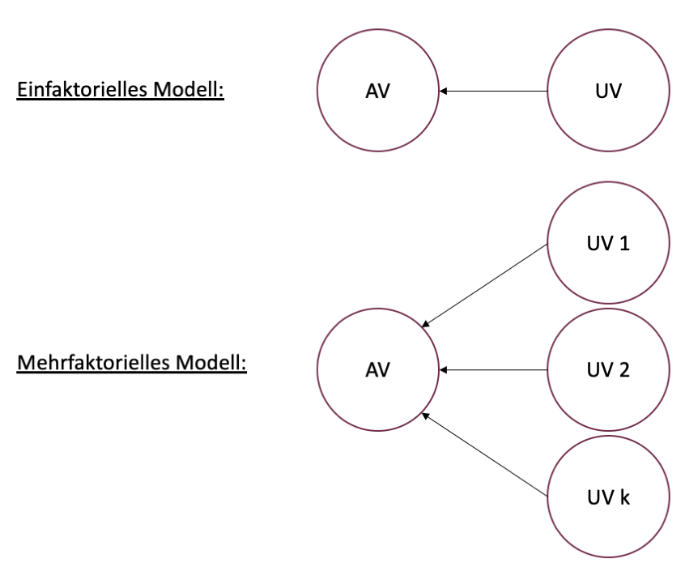

```{r setup, include=FALSE}
options(htmltools.dir.version = FALSE)

library(tidyverse)
library(kableExtra)
library(ggplot2)
library(plotly)
library(htmlwidgets)
library(plotly)
library(MASS)
library(ggpubr)
library(xaringanthemer)
library(xaringanExtra)
options(scipen = 999)

style_duo_accent(
  primary_color = "#621C37",
  secondary_color = "#EE0071",
  background_image = "blank.png"
)

xaringanExtra::use_xaringan_extra(c("tile_view"))

use_scribble(
  pen_color = "#EE0071",
  pen_size = 4
  )

knitr::opts_chunk$set(
  fig.retina = TRUE,
  warning = FALSE,
  message = FALSE
)

Xname = ""
Yname = ""
nudgnumber = 3
my_green = "#EE0071"
```

name: Title slide
class: middle, left
<br><br><br><br><br><br><br>
# Statistik II
***
### Einheit 5: Mehrfaktorielle ANOVA
##### `r format(as.Date(data.frame(readxl::read_excel("Modul Quantitative Methoden II_Termine.xlsx"))$Datum), "%d.%m.%Y")[5]` | Prof. Dr. Stephan Goerigk

```{r echo = F}
Medikament = rep(c("Verum", "Placebo"), each = 8)
Dosis = c(rep(c("niedrig", "hoch"), each = 4), rep(c("niedrig", "hoch"), each = 4))
Dosis = factor(Dosis, levels = c("niedrig", "hoch"))
ID = 1:length(Medikament)
df = data.frame(ID, Medikament, Dosis)

set.seed(123)
df$Verbesserung[df$Medikament == "Verum" & df$Dosis == "niedrig"] = rnorm(length(which(df$Medikament == "Verum" & df$Dosis == "niedrig")), 20, 4)
df$Verbesserung[df$Medikament == "Verum" & df$Dosis == "hoch"] = rnorm(length(which(df$Medikament == "Verum" & df$Dosis == "hoch")), 35, 4)
df$Verbesserung[df$Medikament == "Placebo" & df$Dosis == "niedrig"] = rnorm(length(which(df$Medikament == "Placebo" & df$Dosis == "niedrig")), 15, 4)
df$Verbesserung[df$Medikament == "Placebo" & df$Dosis == "hoch"] = rnorm(length(which(df$Medikament == "Placebo" & df$Dosis == "hoch")), 15, 4)
df$Verbesserung = round(df$Verbesserung)
```

---
class: top, left
### Mehrfaktorielle ANOVA

.pull-left[

#### Einfaktorielle vs. Mehrfaktorielle ANOVA

* Einfaktorielle ANOVA: Einfluss **einer** UV a.k.a Faktor (i.d.R. $\geq$ 3 Stufen) auf eine AV

* Mehrfaktorielle ANOVA: Einfluss **mehrerer** UVs (beide zumindest 2 Stufen) auf eine AV

**Psychologie:**

* Verhalten wird (fast) immer von mehr als einem Faktor bestimmt

* Deshalb interessiert oft die Wirkung von nicht einem, sondern mehreren Faktoren auf die AV

* Von besonderem Interesse: Zusammenwirken der Faktoren (Wechselwirkung, Interaktion)
]

.pull-right[
.center[
```{r eval = TRUE, echo = F, out.width = "520px"}

```
]
]

---
class: top, left
### Mehrfaktorielle ANOVA

#### Nomenklatur

* Abhängige Variable (AV) auch Kriterium genannt

* Unabhängige Variablen (UV) in ANOVA-Sprache auch Faktoren genannt

* Die Stufenanzahl der Faktoren wird durch Indizes angegeben

  * Faktor A hat p Stufen (Laufindex i)
  * Faktor B hat q Stufen (Laufindex j)
  
* Benennung des Tests als **p x q ANOVA**

  * Beispiel: IQ (AV) wird durch Geschlecht $[UV_1:$ 0=männlich, 1=weiblich] und Bildung $[UV_2:$ 0=Hauptschule, 1=Realschule, 2=Gymnasium] vorhergesagt
  
  * $UV_1$ = 2-stufig, $UV_2$ = 3-stufig
  
  * Man spricht dann von einer 2 x 3 ANOVA

---
class: top, left
### Mehrfaktorielle ANOVA

#### Vorgehen

* Mehrfaktorielle ANOVA ist in der Vorgehensweise analog zur Einfaktoriellen ANOVA

* Ziel: Prüfen von Mittelwertsunterschieden mit dem F-Test auf Signifikanz

* Jeder Faktor wird mit einem eigenen F-Test geprüft (Ergebnis: F-Wert mit $df_1$ und $df_2$ und p-Wert)

* Durch Hinzufügen des Interaktionseffekts gibt es bei 2 Faktoren 3 Arten von Mittelwertsunterschieden:

  * Haupteffekt $UV_1$
  
  * Haupteffekt $UV_2$
  
  * Interaktion $UV_1$ x $UV_2$

---
class: top, left
### Mehrfaktorielle ANOVA

#### Effektarten

##### Haupteffekt $UV_1$

* Haupteffekt $UV_1$ beschreibt den Einfluss der $UV_1$ auf die AV unabhängig von der $UV_2$

* Mittelwertsunterschiede in den Stufen des Faktors $UV_1$ gemittelt über die Stufen der $UV_2$

**Interpretation:**

* $UV_1$ ist 2-stufig $\rightarrow$ das Ergebnis von Haupteffekt $UV_1$ entspricht einem unabhängigen t-Test  

* $UV_1$ ist $\geq$ 3-stufig  $\rightarrow$ das Ergebnis von Haupteffekt $UV_1$ einer einfaktoriellen ANOVA. 

---
class: top, left
### Mehrfaktorielle ANOVA

#### Effektarten

##### Haupteffekt $UV_2$

* Haupteffekt $UV_2$ beschreibt den Einfluss der $UV_2$ auf die AV unabhängig von der $UV_1$

* Mittelwertsunterschiede in den Stufen des Faktors $UV_2$ gemittelt über die Stufen der $UV_1$

**Interpretation:**

* $UV_2$ ist 2-stufig $\rightarrow$ das Ergebnis von Haupteffekt $UV_2$ entspricht einem unabhängigen t-Test  

* $UV_2$ ist $\geq$ 3-stufig  $\rightarrow$ das Ergebnis von Haupteffekt $UV_2$ einer einfaktoriellen ANOVA. 

---
class: top, left
### Mehrfaktorielle ANOVA

#### Effektarten

##### Interaktion $UV_1$ x $UV_2$

* Wechselwirkung von $UV_1$ x $UV_2$ (Interaktion) beschreibt gemeinsamen Einfluss von $UV_1$ und $UV_2$ auf die AV

**Interpretation:**

* Interaktion erfasst das Zusammenwirken der Faktorstufen beider Faktoren

* Sie quantifiziert Einflüsse, die nur durch die gemeinsame, simultane Wirkung zweier Faktorstufen entstehen $\rightarrow$ nicht durch die Haupteffekte alleine

Formell:

* Es wird geprüft, ob die Wirkung der $UV_2$ auf allen Stufen der $UV_1$ identisch ist.

* Der Interaktionseffekt wird mit einem eigenen F-Test geprüft 

  $\rightarrow$ ANOVA mit 2 UVs enthält also 3 Signifikanztests
  
---
class: top, left
### Mehrfaktorielle ANOVA

#### Formelnotation

.center[
```{r eval = TRUE, echo = F, out.width = "900px"}

```
]

---
class: top, left
### Mehrfaktorielle ANOVA

.pull-left[
#### Beispiel: Klinische Studie mit 2 Gruppenfaktoren

* $N= `r length(df$Medikament)`$ Patient:innen

* Medikament: Behandlung mit Psychopharmakum vs. Placebo

* Dosis: hoch = 3x täglich, niedrig = 1x täglich

* Verbesserung: hohe Werte = viel Verbesserung
]

.pull-right[
.center[
```{r echo=FALSE}
names(df) = c("ID",
              "UV1: Medikament",
              "UV2: Dosis",
              "AV: Verbesserung")
knitr::kable(df,
             booktabs = T,
             longtable = F) %>%
  kable_classic(full_width = F,
                  font_size = 13,
                  html_font = "Times New Roman")
```
]
]

---
class: top, left
### Mehrfaktorielle ANOVA

#### Formelnotation - Beispiel

.center[
```{r eval = TRUE, echo = F, out.width = "900px"}

```
]

---
class: top, left
### Mehrfaktorielle ANOVA

#### Beispiel: Klinische Studie mit 2 Gruppenfaktoren

.pull-left[

##### Haupteffekt $UV_1:$ Medikament

<small>
$$Y = \color{red}{Medikament} + Dosis + Medikament \cdot Dosis + \epsilon$$
</small>

$$\downarrow$$

```{r echo=FALSE}
names(df) = c("ID",
              "Medikament",
              "Dosis",
              "Verbesserung")

df_med = plyr::ddply(df, c("Medikament"), plyr::summarise,
                                               N = length(Verbesserung),
                                               Mittelwert = round(mean(Verbesserung, na.rm = T), 2),
                                               SD = round(sd(Verbesserung, na.rm = T), 2))
knitr::kable(df_med,
             booktabs = T,
             longtable = F) %>%
  kable_classic(full_width = F,
                  font_size = 18,
                  html_font = "Times New Roman")
```
]

.pull-right[
.center[
```{r echo=FALSE, out.height="450px"}
ggplotly(ggplot(df, aes(x = Medikament, y = Verbesserung)) +
           #geom_segment(x = 1, xend = 2, y = mean(df$Verbesserung[df$Medikament == "Placebo"]), yend = mean(df$Verbesserung[df$Medikament == "Placebo"]), linetype = "dashed", colour = "#EE0071") +
           #geom_segment(x = 2, xend = 2, y = mean(df$Verbesserung[df$Medikament == "Placebo"]), yend = mean(df$Verbesserung[df$Medikament == "Verum"]), linetype = "dashed", colour = "#EE0071") +
           stat_summary(size = 3) +
           stat_summary(geom = "line", fun = "mean", aes(group = 1)) +
           coord_cartesian(ylim = c(0,40)) +
           theme_classic() +
           theme(text = element_text(size = 18)))
```
]
]

---
class: top, left
### Mehrfaktorielle ANOVA

#### Beispiel: Klinische Studie mit 2 Gruppenfaktoren

.pull-left[

##### Haupteffekt $UV_1:$ Medikament

<small>
$$Y = \color{red}{Medikament} + Dosis + Medikament \cdot Dosis + \epsilon$$
</small>

$$\downarrow$$

```{r echo=FALSE}
names(df) = c("ID",
              "Medikament",
              "Dosis",
              "Verbesserung")

df_med = plyr::ddply(df, c("Medikament"), plyr::summarise,
                                               N = length(Verbesserung),
                                               Mittelwert = round(mean(Verbesserung, na.rm = T), 2),
                                               SD = round(sd(Verbesserung, na.rm = T), 2))
knitr::kable(df_med,
             booktabs = T,
             longtable = F) %>%
  kable_classic(full_width = F,
                  font_size = 18,
                  html_font = "Times New Roman")
```

$\rightarrow$ Unterschied zwischen Verum und Placebo (ungeachtet der Dosis)
]

.pull-right[
.center[
```{r echo=FALSE, out.height="450px"}
ggplotly(ggplot(df, aes(x = Medikament, y = Verbesserung)) +
           geom_segment(x = 1, xend = 2, y = mean(df$Verbesserung[df$Medikament == "Placebo"]), yend = mean(df$Verbesserung[df$Medikament == "Placebo"]), linetype = "dashed", colour = "#EE0071") +
           geom_segment(x = 2, xend = 2, y = mean(df$Verbesserung[df$Medikament == "Placebo"]), yend = mean(df$Verbesserung[df$Medikament == "Verum"]), linetype = "dashed", colour = "#EE0071") +
           stat_summary(size = 3) +
           stat_summary(geom = "line", fun = "mean", aes(group = 1)) +
           coord_cartesian(ylim = c(0,40)) +
           theme_classic() +
           theme(text = element_text(size = 18)))
```
]
]


---
class: top, left
### Mehrfaktorielle ANOVA

#### Beispiel: Klinische Studie mit 2 Gruppenfaktoren

.pull-left[

##### Haupteffekt $UV_2:$ Dosis

<small>
$$Y = Medikament + \color{red}{Dosis} + Medikament \cdot Dosis + \epsilon$$
</small>

$$\downarrow$$

```{r echo=FALSE}
names(df) = c("ID",
              "Medikament",
              "Dosis",
              "Verbesserung")

df_med = plyr::ddply(df, c("Dosis"), plyr::summarise,
                                               N = length(Verbesserung),
                                               Mittelwert = round(mean(Verbesserung, na.rm = T), 2),
                                               SD = round(sd(Verbesserung, na.rm = T), 2))
knitr::kable(df_med,
             booktabs = T,
             longtable = F) %>%
  kable_classic(full_width = F,
                  font_size = 18,
                  html_font = "Times New Roman")
```
]

.pull-right[
.center[
```{r echo=FALSE, out.height="450px"}
ggplotly(ggplot(df, aes(x = Dosis, y = Verbesserung)) +
           stat_summary(size = 3) +
           stat_summary(geom = "line", fun = "mean", aes(group = 1)) +
  coord_cartesian(ylim = c(0,40)) +
           theme_classic() +
    theme(text = element_text(size = 18)))
```
]
]

---
class: top, left
### Mehrfaktorielle ANOVA

#### Beispiel: Klinische Studie mit 2 Gruppenfaktoren

.pull-left[

##### Haupteffekt $UV_2:$ Dosis

<small>
$$Y = Medikament + \color{red}{Dosis} + Medikament \cdot Dosis + \epsilon$$
</small>

$$\downarrow$$

```{r echo=FALSE}
names(df) = c("ID",
              "Medikament",
              "Dosis",
              "Verbesserung")

df_med = plyr::ddply(df, c("Dosis"), plyr::summarise,
                                               N = length(Verbesserung),
                                               Mittelwert = round(mean(Verbesserung, na.rm = T), 2),
                                               SD = round(sd(Verbesserung, na.rm = T), 2))
knitr::kable(df_med,
             booktabs = T,
             longtable = F) %>%
  kable_classic(full_width = F,
                  font_size = 18,
                  html_font = "Times New Roman")
```

$\rightarrow$ Unterschied zwischen niedriger und hoher Dosis (ungeachtet des Medikaments)
]

.pull-right[
.center[
```{r echo=FALSE, out.height="450px"}
ggplotly(ggplot(df, aes(x = Dosis, y = Verbesserung)) +
           geom_segment(x = 1, xend = 2, y = mean(df$Verbesserung[df$Dosis == "niedrig"]), yend = mean(df$Verbesserung[df$Dosis == "niedrig"]), linetype = "dashed", colour = "#EE0071") +
           geom_segment(x = 2, xend = 2, y = mean(df$Verbesserung[df$Dosis == "niedrig"]), yend = mean(df$Verbesserung[df$Dosis == "hoch"]), linetype = "dashed", colour = "#EE0071") +
           stat_summary(size = 3) +
           stat_summary(geom = "line", fun = "mean", aes(group = 1)) +
  coord_cartesian(ylim = c(0,40)) +
           theme_classic() +
    theme(text = element_text(size = 18)))
```
]
]

---
class: top, left
### Mehrfaktorielle ANOVA

#### Beispiel: Klinische Studie mit 2 Gruppenfaktoren

.pull-left[

##### Interaktion $UV_1$ x $UV_2:$ Medikament x Dosis

<small>
$$Y = Medikament + Dosis + \color{red}{Medikament \cdot Dosis} + \epsilon$$
</small>

$$\downarrow$$

```{r echo=FALSE}
names(df) = c("ID",
              "Medikament",
              "Dosis",
              "Verbesserung")

df_med = plyr::ddply(df, c("Medikament", "Dosis"), plyr::summarise,
                                               N = length(Verbesserung),
                                               Mittelwert = round(mean(Verbesserung, na.rm = T), 2),
                                               SD = round(sd(Verbesserung, na.rm = T), 2))
knitr::kable(df_med,
             booktabs = T,
             longtable = F) %>%
  kable_classic(full_width = F,
                  font_size = 18,
                  html_font = "Times New Roman")
```
]

.pull-right[
.center[
```{r echo=FALSE, out.height="450px"}
ggplotly(ggplot(df, aes(x = Medikament, y = Verbesserung, colour = Dosis)) +
           stat_summary(size = 3) +
           stat_summary(geom = "line", fun = "mean", aes(group = Dosis)) +
  coord_cartesian(ylim = c(0,40)) +
           theme_classic() +
    theme(text = element_text(size = 18)))
```
]
]

---
class: top, left
### Mehrfaktorielle ANOVA

#### Beispiel: Klinische Studie mit 2 Gruppenfaktoren

.pull-left[

##### Interaktion $UV_1$ x $UV_2:$ Medikament x Dosis

<small>
$$Y = Medikament + Dosis + \color{red}{Medikament \cdot Dosis} + \epsilon$$
</small>

$$\downarrow$$

```{r echo=FALSE}
names(df) = c("ID",
              "Medikament",
              "Dosis",
              "Verbesserung")

df_med = plyr::ddply(df, c("Medikament", "Dosis"), plyr::summarise,
                                               N = length(Verbesserung),
                                               Mittelwert = round(mean(Verbesserung, na.rm = T), 2),
                                               SD = round(sd(Verbesserung, na.rm = T), 2))
knitr::kable(df_med,
             booktabs = T,
             longtable = F) %>%
  kable_classic(full_width = F,
                  font_size = 18,
                  html_font = "Times New Roman")
```

$\rightarrow$ Unterschied des Effekts der Dosis in der Verum-Gruppe vs. des Effekts der Dosis in der Placebo-Gruppe

]

.pull-right[
.center[
```{r echo=FALSE, out.height="450px"}
ggplotly(ggplot(df, aes(x = Medikament, y = Verbesserung, colour = Dosis)) +
           geom_segment(x = 1, xend = 1, y = mean(df$Verbesserung[df$Dosis == "niedrig" & df$Medikament == "Placebo"]), yend = mean(df$Verbesserung[df$Dosis == "hoch" & df$Medikament == "Placebo"]), linetype = "dashed", colour = "#EE0071") +
           geom_segment(x = 2, xend = 2, y = mean(df$Verbesserung[df$Dosis == "niedrig" & df$Medikament == "Verum"]), yend = mean(df$Verbesserung[df$Dosis == "hoch" & df$Medikament == "Verum"]), linetype = "dashed", colour = "#EE0071") +
           geom_segment(x = 1, xend = 2, y = mean(df$Verbesserung[df$Dosis == "hoch" & df$Medikament == "Placebo"]), yend = mean(df$Verbesserung[df$Dosis == "hoch" & df$Medikament == "Verum"]), linetype = "dashed", colour = "black") +
           geom_segment(x = 1, xend = 2, y = mean(df$Verbesserung[df$Dosis == "niedrig" & df$Medikament == "Placebo"]), yend = mean(df$Verbesserung[df$Dosis == "niedrig" & df$Medikament == "Verum"]), linetype = "dashed", colour = "black") +
           stat_summary(size = 3, colour = "transparent") +
           stat_summary(geom = "line", fun = "mean", aes(group = Dosis), colour = "transparent") +
  coord_cartesian(ylim = c(0,40)) +
           theme_classic() +
    theme(text = element_text(size = 18)))
```
]
]

---
class: top, left
### Mehrfaktorielle ANOVA

#### Signifikanztest der Effekte

.pull-left[

##### Zerlegung der Gesamtvarianz

* Signifikanzprüfung erfordert Zerlegung der Gesamtvarianz

Parallele zur einfaktoriellen ANOVA:

* Gesamtvarianz = systematische Varianz + Residualvarianz

* Systematische Varianz besteht nun aus 3 Teilen

$$\sigma^2_{sys} = \sigma^2_{UV_1} + \sigma^2_{UV_2} + \sigma^2_{UV_1\text{x}UV_2}$$
]

.pull-right[
.center[
```{r eval = TRUE, echo = F, out.width = "600px"}

```
]
]

---
class: top, left
### Mehrfaktorielle ANOVA

#### Signifikanztest der Effekte

Signifikanztest der Effekte läuft nach (von der einfaktorielle ANOVA) bekanntem Prinzip der F-Bruchbildung ab:

$$F_{UV_1(df_{UV_1},df_{Res})}=\frac{\hat{\sigma}^2_{UV_1}}{\hat{\sigma}^2_{Res}}$$
$$\text{  mit } df_{UV_1}=p-1 \text{ (dabei ist p die Anzahl der Stufen in } UV_1)$$

$$F_{UV_2(df_{UV_2},df_{Res})}=\frac{\hat{\sigma}^2_{UV_2}}{\hat{\sigma}^2_{Res}}$$
$$\text{  mit } df_{UV_2}=q-1 \text{ (dabei ist q die Anzahl der Stufen in } UV_2)$$
$$F_{UV_1\text{x}UV_2(df_{UV_1\text{x}UV_2},df_{Res})}=\frac{\hat{\sigma}^2_{UV_1\text{x}UV_2}}{\hat{\sigma}^2_{Res}}$$
$$\text{  mit } df_{UV_1\text{x}UV_2}=(p-1) \cdot (q-1) $$

---
class: top, left
### Mehrfaktorielle ANOVA

#### Signifikanztest der Effekte

##### Berechnung der Residualvarianz

* Auch hier: Residualvarianz wird geschätzt durch "Varianz innerhalb"

* Quadrierte Abweichung der einzelnen Personen von ihrem Gruppenmittelwert

$\rightarrow$ Die Varianzen werden addiert und durch die Anzahl der Zellen geteilt

$$\hat{\sigma}^2_{Res}= \hat{\sigma}^2_{innerhalb}= \frac{\hat{\sigma}^2_{11} + \hat{\sigma}^2_{12} +...+\hat{\sigma}^2_{1q} + \hat{\sigma}^2_{21} + \hat{\sigma}^2_{22} +...+\hat{\sigma}^2_{pq}}{p \cdot q}$$

$$df_{Res}=p \cdot q \cdot (n-1)$$
$$\hat{\sigma}_{Res}^2 = =\frac{\sum\limits _{i=1}^{p}\sum\limits _{j=1}^{q}QS_{ij}}{p \cdot q \cdot (n-1)}=\frac{QS_{Res}}{df_{Res}}$$

---
class: top, left
### Mehrfaktorielle ANOVA

.pull-left[
#### Signifikanztest der Effekte

##### Berechnung der Residualvarianz

```{r echo = F}
df_med = plyr::ddply(df, c("Medikament", "Dosis"), plyr::summarise,
                                               N = length(Verbesserung),
                                               Mittelwert = round(mean(Verbesserung, na.rm = T), 2),
                                               SD = round(sd(Verbesserung, na.rm = T), 2))
knitr::kable(df_med,
             booktabs = T,
             longtable = F) %>%
  kable_classic(full_width = F,
                  font_size = 18,
                  html_font = "Times New Roman")
```

$$\hat{\sigma}_{Res}^2 = \frac{\sum\limits _{i=1}^{p}\sum\limits _{j=1}^{q}QS_{ij}}{p \cdot q \cdot (n-1)}=\frac{QS_{Res}}{df_{Res}}$$
]
.pull-right[
```{r echo = F}
knitr::kable(df,
             booktabs = T,
             longtable = F) %>%
  kable_classic(full_width = F,
                  font_size = 13,
                  html_font = "Times New Roman")
```
]

---
class: top, left
### Mehrfaktorielle ANOVA

.pull-left[
#### Signifikanztest der Effekte

##### Berechnung der Residualvarianz

```{r echo = F}
df_med = plyr::ddply(df, c("Medikament", "Dosis"), plyr::summarise,
                                               N = length(Verbesserung),
                                               Mittelwert = round(mean(Verbesserung, na.rm = T), 2),
                                               SD = round(sd(Verbesserung, na.rm = T), 2))
knitr::kable(df_med,
             booktabs = T,
             longtable = F) %>%
  kable_classic(full_width = F,
                  font_size = 18,
                  html_font = "Times New Roman")
```

<small>

$$\hat{\sigma}^2_{Res}= \frac{(18 - 20.75)^2+(19 - 20.75)^2+...+(22 - 16.75)^2}{2 \cdot 2 \cdot (4-1)}=16.25$$

$$df_{Res}=2 \cdot 2 \cdot (4-1)=12$$
]
.pull-right[
```{r echo = F}
knitr::kable(df,
             booktabs = T,
             longtable = F) %>%
  kable_classic(full_width = F,
                  font_size = 13,
                  html_font = "Times New Roman")
```
]

---
class: top, left
### Mehrfaktorielle ANOVA

#### Signifikanztest der Effekte

##### Signifikanztest Haupteffekt $UV_1:$

* Prüfung: Besteht ein systematischer Einfluss der $UV_1$ (Medikament) auf die AV (Verbesserung)?

* $H_0:$ Alle Populationsmittelwerte der Stufen des Faktors **Medikament** (gemittelt über die Stufen von Dosis) sind gleich.

* $H_1$ wie bei allen Varianzanalysen 2-seitig formuliert (Varianzen sind aufgrund der Quadrierung immer positiv)

.pull-left[

**Aufstellen des Hypothesenpaares (allgemein):**

  * $H_0:$ $\mu_1 = \mu_2 = ...= \mu_p$
  
  * $H_1:$ $\lnot H_0$ $(\lnot$ bedeutet Negation)
]

.pull-right[

**Aufstellen des Hypothesenpaares (hier):**

  * $H_0:$ $\mu_{Placebo} = \mu_{Verum}$
  
  * $H_1:$ $\lnot H_0$
]

---
class: top, left
### Mehrfaktorielle ANOVA

#### Signifikanztest der Effekte

##### Signifikanztest Haupteffekt $UV_1:$

$$F_{UV_1(df_{UV_1},df_{Res})}=\frac{\hat{\sigma}^2_{UV_1}}{\hat{\sigma}^2_{Res}}$$
* Trifft $H_0$ zu, sollte F-Wert den Wert 1 haben

  $\rightarrow$ Geschätzte Varianz des Haupteffekts der $UV_1$ bestünde nur aus Residualvarianz

* F-Verteilung (s.h. Einheit 1) gibt Auskunft, wie wahrscheinlich ein F-Wert unter Annahme der $H_0$ ist

* Ist er ausreichend unwahrscheinlich (p<.05) wird die $H_0$ verworfen

  $\rightarrow$ Der Haupteffekt der $UV_1$ ist signifikant (hat einen systematischen Einfluss auf die AV)
  
---
class: top, left
### Mehrfaktorielle ANOVA

#### Signifikanztest der Effekte

##### Signifikanztest Haupteffekt $UV_1:$

**Berechnung:**

$$F_{UV_1(df_{UV_1},df_{Res})}=\frac{\hat{\sigma}^2_{UV_1}}{\hat{\sigma}^2_{Res}}$$

$$\hat{\sigma}^2_{UV_1}= \frac{QS_{UV_1}}{df_{UV_1}}$$

Die Quadratsumme entspricht der quadrierten Abweichung der Mittelwerte $(\bar{UV_{1i}})$ vom Gesamtmittelwert $(\bar{G})$ multipliziert mit der Zellgröße $n$ und der Anzahl der Stufen der $UV_2:$

$$\hat{\sigma}^2_{UV_1}= \frac{\sum\limits _{i=1}^{p}n \cdot q \cdot (\bar{UV_{1i}} - \bar{G})^2}{p-1}$$
---
class: top, left
### Mehrfaktorielle ANOVA

#### Signifikanztest der Effekte

##### Signifikanztest Haupteffekt $UV_1:$

**Berechnung - Beispiel:**

.pull-left[

$$\hat{\sigma}^2_{UV_1}= \frac{\sum\limits _{i=1}^{p}n \cdot q \cdot (\bar{UV_{1i}} - \bar{G})^2}{p-1}$$
$$\bar{G}= `r round(mean(df$Verbesserung), 2)`$$
$$\hat{\sigma}^2_{UV_1}= \frac{4 \cdot 2 \cdot [(16 - 22.25)^2 + (28.5 - 22.25)^2]}{2-1}=625$$
$$F_{UV_1(1,12)}=\frac{\hat{\sigma}^2_{UV_1}}{\hat{\sigma}^2_{Res}}=\frac{625}{16.25}=38.46$$
]

.pull-right[
```{r echo = F}
df_med = plyr::ddply(df, c("Medikament"), plyr::summarise,
                                               N = length(Verbesserung),
                                               Mittelwert = round(mean(Verbesserung, na.rm = T), 2),
                                               SD = round(sd(Verbesserung, na.rm = T), 2))
knitr::kable(df_med,
             booktabs = T,
             longtable = F) %>%
  kable_classic(full_width = F,
                  font_size = 18,
                  html_font = "Times New Roman")
```

]

---
class: top, left
### Mehrfaktorielle ANOVA
.pull-left[
#### Signifikanztest der Effekte

##### Signifikanztest Haupteffekt $UV_1:$

**Berechnung - Beispiel:**

Entscheidungsregel:

* Vergleich von $F_{emp}=38.46$ mit $F_{krit}$ für $df_1=1, df_2=12$ und $\alpha = .05$

* Wenn $F_{emp} > F_{krit} \rightarrow$ Test ist signifikant

* $38.46 > 4.75$

$\rightarrow$ Es besteht ein signifikanter Unterschied zwischen den Mittelwerten der Verum vs. Placebo Gruppe
]
.pull-right[
.center[
```{r eval = TRUE, echo = F, out.width = "400px"}

```
]
]

---
class: top, left
### Mehrfaktorielle ANOVA

#### Signifikanztest der Effekte

##### Signifikanztest Haupteffekt $UV_2:$

* Prüfung: Besteht ein systematischer Einfluss der $UV_2$ (Dosis) auf die AV (Verbesserung)?

* $H_0:$ Alle Populationsmittelwerte der Stufen des Faktors **Dosis** (gemittelt über die Stufen von Medikament) sind gleich.

* $H_1$ wie bei allen Varianzanalysen 2-seitig formuliert (Varianzen sind aufgrund der Quadrierung immer positiv)

.pull-left[

**Aufstellen des Hypothesenpaares (allgemein):**

  * $H_0:$ $\mu_1 = \mu_2 = ...= \mu_p$
  
  * $H_1:$ $\lnot H_0$ $(\lnot$ bedeutet Negation)
]

.pull-right[

**Aufstellen des Hypothesenpaares (hier):**

  * $H_0:$ $\mu_{niedrig} = \mu_{hoch}$
  
  * $H_1:$ $\lnot H_0$
]

---
class: top, left
### Mehrfaktorielle ANOVA

#### Signifikanztest der Effekte

##### Signifikanztest Haupteffekt $UV_2:$

**Berechnung:**

$$F_{UV_2(df_{UV_2},df_{Res})}=\frac{\hat{\sigma}^2_{UV_2}}{\hat{\sigma}^2_{Res}}$$

$$\hat{\sigma}^2_{UV_2}= \frac{QS_{UV_2}}{df_{UV_2}}$$

Die Quadratsumme entspricht der quadrierten Abweichung der Mittelwerte $(\bar{UV_{2j}})$ vom Gesamtmittelwert $(\bar{G})$ multipliziert mit der Zellgröße $n$ und der Anzahl der Stufen der $UV_1:$

$$\hat{\sigma}^2_{UV_2}= \frac{\sum\limits _{i=j}^{q}n \cdot p \cdot (\bar{UV_{2j}} - \bar{G})^2}{q-1}$$
---
class: top, left
### Mehrfaktorielle ANOVA

#### Signifikanztest der Effekte

##### Signifikanztest Haupteffekt $UV_2:$

**Berechnung - Beispiel:**

.pull-left[

$$\hat{\sigma}^2_{UV_2}= \frac{\sum\limits _{j=1}^{q}n \cdot p \cdot (\bar{UV_{2j}} - \bar{G})^2}{q-1}$$
$$\bar{G}= `r round(mean(df$Verbesserung), 2)`$$
$$\hat{\sigma}^2_{UV_2}= \frac{4 \cdot 2 \cdot [(18 - 22.25)^2 + (26.5 - 22.25)^2]}{2-1}=289$$
$$F_{UV_2(1,12)}=\frac{\hat{\sigma}^2_{UV_2}}{\hat{\sigma}^2_{Res}}=\frac{289}{16.25}=17.79$$
]

.pull-right[
```{r echo = F}
df_med = plyr::ddply(df, c("Dosis"), plyr::summarise,
                                               N = length(Verbesserung),
                                               Mittelwert = round(mean(Verbesserung, na.rm = T), 2),
                                               SD = round(sd(Verbesserung, na.rm = T), 2))
knitr::kable(df_med,
             booktabs = T,
             longtable = F) %>%
  kable_classic(full_width = F,
                  font_size = 18,
                  html_font = "Times New Roman")
```

]

---
class: top, left
### Mehrfaktorielle ANOVA
.pull-left[
#### Signifikanztest der Effekte

##### Signifikanztest Haupteffekt $UV_2:$

**Berechnung - Beispiel:**

Entscheidungsregel:

* Vergleich von $F_{emp}=17.79$ mit $F_{krit}$ für $df_1=1, df_2=12$ und $\alpha = .05$

* Wenn $F_{emp} > F_{krit} \rightarrow$ Test ist signifikant

* $17.79 > 4.75$

$\rightarrow$ Es besteht ein signifikanter Unterschied zwischen den Mittelwerten der niedrigen vs. hohen Dosis Gruppe
]
.pull-right[
.center[
```{r eval = TRUE, echo = F, out.width = "400px"}

```
]
]


---
class: top, left
### Mehrfaktorielle ANOVA

#### Signifikanztest der Effekte

##### Signifikanztest Interaktionseffekt $UV_1$ x $UV_2$

<small>

* Interaktion beschreibt Variabilität der Zellmittelwerte, die nicht durch die 2 Haupteffekte erklärt werden kann

* Formell: Interaktion betrachtet Abweichungen, der beobachteten Zellmittelwerte von den aufgrund der Haupteffekte zu erwartenden Zellmittelwerte

Frage: Welche Werte sind aufgrund der Haupteffekte zu erwarten?

Einfluss Haupteffekt $UV_1$:

$$\hat{\alpha}_i = \bar{UV_1i} - \bar{G}$$
Einfluss Haupteffekt $UV_2$:

$$\hat{\beta}_j = \bar{UV_2j} - \bar{G}$$

Laut Haupteffekten erwartete Zellmittelwerte:

$$\bar{UV_1UV_2}_{ij; erwartet} = \bar{G} + \hat{\alpha}_i + \hat{\beta}_j = \bar{G} + (\bar{UV_1i} - \bar{G}) +   (\bar{UV_2j} - \bar{G}) = \bar{UV_1i} + \bar{UV_2j} - \bar{G}$$
---
class: top, left
### Mehrfaktorielle ANOVA

#### Signifikanztest der Effekte

##### Signifikanztest Interaktionseffekt $UV_1$ x $UV_2$

.pull-left[
.pull-left[
```{r echo=F}
df_med = plyr::ddply(df, c("Medikament"), plyr::summarise,
                                               N = length(Verbesserung),
                                               Mittelwert = round(mean(Verbesserung, na.rm = T), 2),
                                               SD = round(sd(Verbesserung, na.rm = T), 2))
knitr::kable(df_med,
             booktabs = T,
             longtable = F) %>%
  kable_classic(full_width = F,
                  font_size = 18,
                  html_font = "Times New Roman")
```
]
.pull-right[
```{r echo=F}
df_med = plyr::ddply(df, c("Dosis"), plyr::summarise,
                                               N = length(Verbesserung),
                                               Mittelwert = round(mean(Verbesserung, na.rm = T), 2),
                                               SD = round(sd(Verbesserung, na.rm = T), 2))
knitr::kable(df_med,
             booktabs = T,
             longtable = F) %>%
  kable_classic(full_width = F,
                  font_size = 18,
                  html_font = "Times New Roman")
```
]
<br><br>

```{r echo=F}
df_med = plyr::ddply(df, c("Medikament", "Dosis"), plyr::summarise,
                                               N = length(Verbesserung),
                                               Mittelwert = round(mean(Verbesserung, na.rm = T), 2),
                                               SD = round(sd(Verbesserung, na.rm = T), 2))
knitr::kable(df_med,
             booktabs = T,
             longtable = F) %>%
  kable_classic(full_width = F,
                  font_size = 18,
                  html_font = "Times New Roman")
```
]
.pull-right[
**Beispiel (nur für 2 der Zellen): **
<small>

* Erwarteter Wert für Mittelwert von Placebo mit niedriger Dosis:

$$\bar{UV_1UV_2}_{1,1; erwartet}= 16 + 18 - 22.25 = 11.75$$

* Beobachteter Wert für Mittelwert von Placebo mit niedriger Dosis = 15.25

* Erwarteter Wert für Mittelwert von Verum mit hoher Dosis:

$$\bar{UV_1UV_2}_{2,2; erwartet} = 28.5 + 26.5 - 22.25 = 32.75$$

* Beobachteter Wert für Mittelwert von Verum mit hoher Dosis = 36.25
]

---
class: top, left
### Mehrfaktorielle ANOVA

#### Signifikanztest der Effekte

##### Signifikanztest Interaktionseffekt $UV_1$ x $UV_2$

* Prüfung: Besteht ein systematischer Interaktionseinfluss der $UV_1$ (Medikament) und der $UV_2$ (Dosis) auf die AV (Verbesserung)?

* $H_0:$ Beobachtete Zellmittelwerte entsprechen den laut Haupteffekten erwartbaren Zellmittelwerten (keine Interaktion).

* $H_1$ Beobachtete Zellmittelwerte weichen systematisch von den laut Haupteffekten erwartbaren Zellmittelwerten ab (Interaktion)


**Aufstellen des Hypothesenpaares (allgemein):**

  * $H_0:$ $\mu_{ij(beobachtet)} = \mu_{ij(erwartet)}$
  
  * $H_1:$ $\lnot H_0$ 


---
class: top, left
### Mehrfaktorielle ANOVA

#### Signifikanztest der Effekte

##### Signifikanztest Interaktionseffekt $UV_1$ x $UV_2$

$$F_{UV_1\text{x}UV_2(df_{UV_1\text{x}UV_2},df_{Res})}=\frac{\hat{\sigma}^2_{UV_1\text{x}UV_2}}{\hat{\sigma}^2_{Res}}$$
* Trifft $H_0$ zu, sollte F-Wert den Wert 1 haben

  $\rightarrow$ Geschätzte Varianz des Interaktionseffekts bestünde nur aus Residualvarianz

* F-Verteilung (s.h. Einheit 1) gibt Auskunft, wie wahrscheinlich ein F-Wert unter Annahme der $H_0$ ist

* Ist er ausreichend unwahrscheinlich (p<.05) wird die $H_0$ verworfen

  $\rightarrow$ Der Interaktions ist signifikant (hat einen systematischen Einfluss auf die AV, der über reine Haupteffekte hinaus geht)
  
---
class: top, left
### Mehrfaktorielle ANOVA

#### Signifikanztest der Effekte

##### Signifikanztest Interaktionseffekt $UV_1$ x $UV_2$

**Berechnung:**

$$F_{UV_1\text{x}UV_2(df_{UV_1\text{x}UV_2},df_{Res})}=\frac{\hat{\sigma}^2_{UV_1\text{x}UV_2}}{\hat{\sigma}^2_{Res}}$$

$$\hat{\sigma}^2_{UV_1\text{x}UV_2}= \frac{QS_{UV_1\text{x}UV_2}}{df_{UV_1\text{x}UV_2}}$$

Die Quadratsumme entspricht der Differenz der beobachteten Zellmittelwerte und der erwarteten Zellmittelwerte

$$\hat{\sigma}^2_{UV_1\text{x}UV_2}= \frac{\sum\limits _{i=1}^{p}\sum\limits _{j=1}^{q}n \cdot [\bar{UV_{1}UV_{2}}_{ij} - (\bar{UV_{1i}} + \bar{UV_{2j}}- \bar{G})]^2}{(p-1) \cdot (q-1)}$$
---
class: top, left
### Mehrfaktorielle ANOVA

#### Signifikanztest der Effekte

.pull-left[

##### Signifikanztest Interaktionseffekt $UV_1$ x $UV_2$

**Berechnung - Beispiel:**


$$\hat{\sigma}^2_{UV_1\text{x}UV_2}= \frac{\sum\limits _{i=1}^{p}\sum\limits _{j=1}^{1}n \cdot [\bar{UV_{1}UV_{2}}_{ij} - (\bar{UV_{1i}} + \bar{UV_{2j}}- \bar{G})]^2}{(p-1) \cdot (q-1)}$$
$$\bar{G}= `r round(mean(df$Verbesserung), 2)`$$
$$\hat{\sigma}^2_{UV_1\text{x}UV_2}= \frac{4 \cdot [15.25  - (16 + 18 - 22.25)]^2 + ... + [36.25  - (28.5 + 26.5 - 22.25)]^2}{(2-1) \cdot (2-1)}=196$$
$$F_{UV_1(1,12)}=\frac{\hat{\sigma}^2_{UV_1\text{x}UV_2}}{\hat{\sigma}^2_{Res}}=\frac{196}{16.25}=12.06$$
]

.pull-right[
```{r echo = F}
df_med = plyr::ddply(df, c("Medikament"), plyr::summarise,
                                               N = length(Verbesserung),
                                               Mittelwert = round(mean(Verbesserung, na.rm = T), 2),
                                               SD = round(sd(Verbesserung, na.rm = T), 2))
knitr::kable(df_med,
             booktabs = T,
             longtable = F) %>%
  kable_classic(full_width = F,
                  font_size = 18,
                  html_font = "Times New Roman")
```

<br>

```{r echo = F}
df_med = plyr::ddply(df, c("Dosis"), plyr::summarise,
                                               N = length(Verbesserung),
                                               Mittelwert = round(mean(Verbesserung, na.rm = T), 2),
                                               SD = round(sd(Verbesserung, na.rm = T), 2))
knitr::kable(df_med,
             booktabs = T,
             longtable = F) %>%
  kable_classic(full_width = F,
                  font_size = 18,
                  html_font = "Times New Roman")
```
]

---
class: top, left
### Mehrfaktorielle ANOVA
.pull-left[
#### Signifikanztest der Effekte

##### Signifikanztest Interaktionseffekt $UV_1$ x $UV_2$

**Berechnung - Beispiel:**

Entscheidungsregel:

* Vergleich von $F_{emp}=12.06$ mit $F_{krit}$ für $df_1=1, df_2=12$ und $\alpha = .05$

* Wenn $F_{emp} > F_{krit} \rightarrow$ Test ist signifikant

* $12.06 > 4.75$

$\rightarrow$ Der Effekt der Dosis in der Verum Gruppe unterscheidet sich vom Effekt der Dosis in der Placebo Gruppe
]
.pull-right[
.center[
```{r eval = TRUE, echo = F, out.width = "400px"}

```
]
]


---
class: top, left
### Mehrfaktorielle ANOVA

#### Berechnung in R

```{r}
model = lm(Verbesserung ~ Medikament * Dosis, data = df)

anova(model)
```

---
class: top, left
### Mehrfaktorielle ANOVA

#### Effektstärke partielles $\omega^2$ in R
.code60[
.pull-left[
```{r}
ES = effectsize::omega_squared(model)

ES
```
]
.pull-right[
```{r}
# Automatisches Anzeigen der Interpretation

effectsize::interpret_omega_squared(ES)
```
]
]

---
class: top, left
### Mehrfaktorielle ANOVA

#### Effektstärke partielles $\eta^2$ in R
.code60[
.pull-left[
```{r}
ES = effectsize::eta_squared(model)

ES
```
]
.pull-right[
```{r}
# Automatisches Anzeigen der Interpretation

effectsize::interpret_eta_squared(ES)
```
]
]


---
class: top, left
### Take-aways

.full-width[.content-box-gray[
* Mit der mehrfaktoriellen ANOVA können Haupteffekte und Interaktionseffekte geprüft werden.

* Haupteffekte beschreiben Einfluss einer UV, ungeachtet des Einflusses der anderen UVs.

* Interaktionseffekte prüfen die Wechselwirkung der UVs auf die AV.

* Jeder Effekt hat einen eigenen Signifikanztest. Dieser wird mittels F-Bruch geprüft, in dem die Zwischenvarianzen an der geschätzten Residualvarianz geprüft werden.

* Der Hypothesentest der Interaktion nimmt an, dass die beobachteten von den erwarteten Zellmittelwerten abweichen.

* Als Effektstärken bieten sich die partiellen Maße von $\omega^2$ und $\eta^2:$ $\omega^2_p$ und $\eta^2_p$ an.
]

]


