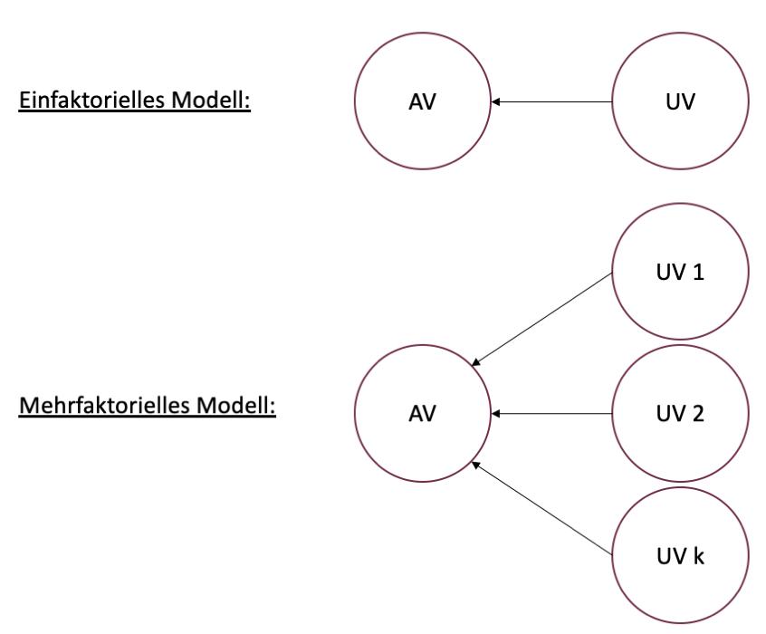
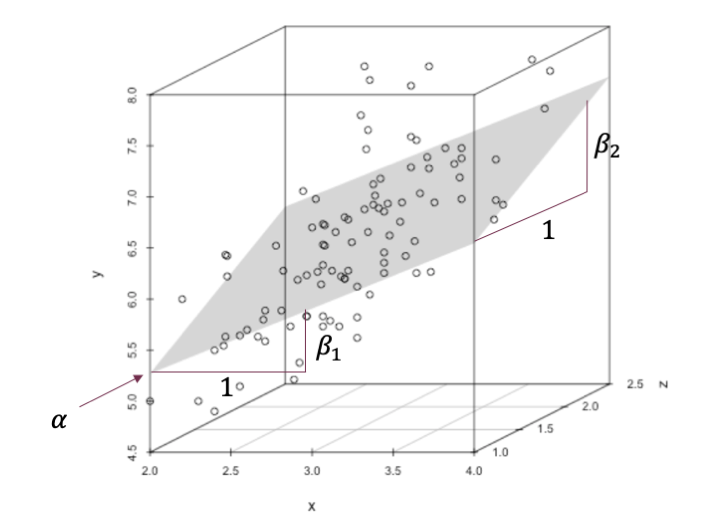

```{r setup, include=FALSE}
options(htmltools.dir.version = FALSE)

library(tidyverse)
library(kableExtra)
library(ggplot2)
library(plotly)
library(htmlwidgets)
library(plotly)
library(MASS)
library(ggpubr)
library(xaringanthemer)
library(xaringanExtra)
options(scipen = 999)

style_duo_accent(
  primary_color = "#621C37",
  secondary_color = "#EE0071",
  background_image = "blank.png"
)

xaringanExtra::use_xaringan_extra(c("tile_view"))

use_scribble(
  pen_color = "#EE0071",
  pen_size = 4
  )

knitr::opts_chunk$set(
  fig.retina = TRUE,
  warning = FALSE,
  message = FALSE
)

Xname = ""
Yname = ""
nudgnumber = 3
my_green = "#EE0071"
```

name: Title slide
class: middle, left
<br><br><br><br><br><br><br>
# Statistik II
***
### Einheit 6: Multiple Regression
##### `r format(as.Date(data.frame(readxl::read_excel("Modul Quantitative Methoden II_Termine.xlsx"))$Datum), "%d.%m.%Y")[6]` | Prof. Dr. Stephan Goerigk

---
class: top, left
### Multiple Regression

.pull-left[

#### Vorbemerkungen

* multiple Regression: das Regressionsmodell enthält mehr als eine UV (Prädiktor)

* Ziel: Durch Hinzunahme weiterer Prädiktoren Vorhersagen bezogen auf die AV zu verbessern

**Abgrenzung zur mehrfaktoriellen ANOVA:**

* Bei der ANOVA sind UVs immer kategorial (Mittelwertesvergleiche zw. Gruppen/Kategorien)

* Im Regressionsmodell können kategoriale und stetige UVs verwendet und auch kombiniert werden

]

.pull-right[
.center[
```{r eval = TRUE, echo = F, out.width = "520px"}

```
]
]

---
class: top, left
### Multiple Regression

.pull-left[

#### Weitere relevante Fragen

* Wie viel % der Gesamtvarianz der AV können die Prädiktoren **gemeinsam** erklären?

* Welcher Prädiktor hat den **größten** Vorhersagebeitrag?

* **Verändert** sich die Stärke, Richtung (und Interpretation) des Effekts eines Prädiktors, wenn weitere Prädiktoren berücksichtigt werden? (z.B. Überdeckungseffekte)
]

.pull-right[
.center[
```{r eval = TRUE, echo = F, out.width = "520px"}

```
]
]

---
class: top, left
### Multiple Regression

#### Szenario in der Vorlesung

Wir beschränken uns heute zunächst auf die einfachste Form der multiplen Regression: 

* Die Beschreibung des AV-Werts $Y_i$ durch 2 stetige Prädiktoren und die Fehlervariable. 

* Hat man den Fall mit zwei Prädiktoren verstanden, ist die Generalisierung auf weitere Prädiktoren einfach.

Dies lässt sich durch die folgende **Erweiterung der Regressionsgleichung** darstellen:

$$Y_i=a + \beta_1 \cdot X_{i1} + \beta_2 \cdot X_{i2} + \epsilon_i$$

wobei: 

$$\epsilon_i ~ N(0,\sigma^2)$$

(Fehler normalverteilt mit Erwartungswert 0)

---
class: top, left
### Multiple Regression

#### Elemente der multiplen Regressionsgleichung

$$Y_i=a + \beta_1 \cdot X_{i1} + \beta_2 \cdot X_{i2} + \epsilon_i$$

* $X_1$ und $X_2$ sind Zufallsvariablen. Ihre Realisationen sind jeweils die Werte der zufällig gezogenen Person $i$ bezüglich der $UV_1$ und der $UV_2$

* $a, \beta_1, \beta_2$ und $\sigma^2$ sind die zu schätzenden Modellparameter

  * $a$ = Y-Achsenabschnitt

  * $\beta_1$ = Steigungsparameter der $UV_1$

  * $\beta_2$ = Steigungsparameter der $UV_2$

  * $\sigma^2$ = Varianz des Fehlerterms (für Hypothesen meist inhaltlich nicht relevant)

---
class: top, left
### Multiple Regression

#### Graphische Darstellung

.pull-left[
```{r echo = F}
wh <- iris$Species != "setosa"
x  <- iris$Sepal.Width[wh]
y  <- iris$Sepal.Length[wh]
z  <- iris$Petal.Width[wh]
df <- data.frame(x, y, z)

LM <- lm(y ~ x + z, df)
library(scatterplot3d)
G  <- scatterplot3d(x, z, y, highlight.3d = FALSE, type = "p")
G$plane3d(LM, draw_polygon = F, draw_lines = FALSE)
```
]

.pull-right[

* Einfache lineare Regression: 2-dimensionales Koordinatensystem mit X-Achse und Y-Achse

* Mutiple Regression (2 UVs): 3-dimensionales Koordinatensystem mit X-Achse, Y-Achse und Z-Achse

$\rightarrow$ Es wird ein 3D-Streudiagramm dargestellt

  * Punkt = Beobachtungswert einer Person 
  
  * Kombination aus $AV$ (Y-Achse), $UV_1$ (X-Achse) und $UV_2$ (Z-Achse) Wert
]

---
class: top, left
### Multiple Regression

#### Graphische Darstellung 

.pull-left[
```{r echo = F}
wh <- iris$Species != "setosa"
x  <- iris$Sepal.Width[wh]
y  <- iris$Sepal.Length[wh]
z  <- iris$Petal.Width[wh]
df <- data.frame(x, y, z)


LM <- lm(y ~ x + z, df)
library(scatterplot3d)
G  <- scatterplot3d(x, z, y, highlight.3d = FALSE, type = "p")
G$plane3d(LM, draw_polygon = T, draw_lines = FALSE)
```
]

.pull-right[

* Einfache lineare Regression: Modellfunktion dargestellt durch Regressionsgerade

  * Gerade definiert durch 1 Y-Achsenabschnitt + 1 Steigungsparameter

* Mutiple Regression (2 UVs): Modellfunktion dargestellt durch Regressionsebene

  * Ebene definiert durch 1 Y-Achsenabschnitt + 2 Steigungsparameter

* Auf der Ebene liegen alle durch das Modell erwarteten Werte
]

---
class: top, left
### Multiple Regression

#### Graphische Darstellung 

$$Y_i=a + \beta_1 \cdot X_{i1} + \beta_2 \cdot X_{i2} + \epsilon_i$$

.pull-left[
.center[
```{r eval = TRUE, echo = F, out.width = "500px"}

```
]
]

.pull-right[
<small>

* $a$ gibt den Y-Achsenabschnitt an

  * $a$ ist der Wert der AV, wenn $UV_1$ und $UV_2$ gleich 0 sind
  
  * $a=a + \beta_1 \cdot 0 + \beta_2 \cdot 0$
  
  * Ob $a$ sinnvoll interpretiert werden kann, hängt davon ab, ob $UV_1=0$ und $UV_2=0$ inhaltlich sinnvolle Werte darstellen

* $\beta_1$ gibt an, wie stark die Regressionsebene auf der $xy$-Gerade steigt bzw. fällt, wenn $UV_1$ um 1 Einheit zunimmt.

* $\beta_2$ gibt an, wie stark die Regressionsebene auf der $zy$-Gerade steigt bzw. fällt, wenn $UV_2$ um 1 Einheit zunimmt.

</small>
]

---
class: top, left
### Multiple Regression

#### Parameterschätzung


.pull-left[
```{r echo = F}
s3d <- scatterplot3d(x, z, y, pch = 19, type = "p", color = "darkgrey",
                     grid = TRUE, box = T, angle = 55)

# compute locations of segments
orig     <- s3d$xyz.convert(x, z, y)
plane    <- s3d$xyz.convert(x, z, fitted(LM))
i.negpos <- 1 + (resid(LM) > 0) # which residuals are above the plane?

# draw residual distances to regression plane
segments(orig$x, orig$y, plane$x, plane$y, col = "red", lty = c(2, 1)[i.negpos], 
         lwd = 1.5)

# draw the regression plane
s3d$plane3d(LM, draw_polygon = TRUE, draw_lines = F, 
            polygon_args = list(col = rgb(0.8, 0.8, 0.8, 0.8)))

# redraw positive residuals and segments above the plane
wh <- resid(LM) > 0
segments(orig$x[wh], orig$y[wh], plane$x[wh], plane$y[wh], col = "red", lty = 1, lwd = 1.5)
s3d$points3d(x[wh], z[wh], y[wh], pch = 19)
```
]

.pull-right[
* Die unbekannten Modellparameter $a, \beta_1$ und $\beta_2$ können mit der **Methode der kleinsten Quadrate** bestimmt werden (wie bei einfacher Regression)

* Die Ebene wird so definiert, dass die Residuen minimiert werden

* Die Formeln sind aufwendig, weswegen wir uns hier auf die Berechnung in R beschränken
]


---
class: top, left
### Multiple Regression

#### Standardfehler der Modellparameter

* Während wir die Schätzung der Modellparameter R überlassen, schauen wir uns einmal die Berechnung der Standardfehler für $\beta_1$ und $\beta_2$ an.

* Diese brauchen wir, um Hypothesentests/Konfidenzintervalle für diese Parameter zu berechnen

$$SE(B_1) = \sqrt{Var(B_1)} = \sqrt{\frac{1}{1-r^2_{x1x2}}\cdot\frac{\sigma^2}{\sum\limits _{i=1}^{n}(x_{i1}-\bar{x}_1)^2}}$$
$$SE(B_2) = \sqrt{Var(B_2)} = \sqrt{\frac{1}{1-r^2_{x1x2}}\cdot\frac{\sigma^2}{\sum\limits _{i=1}^{n}(x_{i2}-\bar{x}_2)^2}}$$

* $r^2_{x1x2}$ stellt die quadrierte Korrelation zwischen den beiden Prädiktoren dar

* $\sigma^2$ wird durch die Stichprobenvarianz $s^2$ geschätzt.

---
class: top, left
### Multiple Regression

#### Konfidenzintervalle der Modellparameter

Die Konfidenzintervalle für $\beta_1$ und $\beta_2$ lassen sich wie folgt berechnen:

$$\beta \pm t_{1-\frac{\alpha}{2} \cdot SE(B_j)}$$

* Die Freiheitsgerade für den t-Wert errechnen sich als $df=n-3$

---
class: top, left
### Multiple Regression

.pull-left[
#### Beispiel: Risikofaktoren für Aggression bei Kindern

* Wissenschaftler:innen haben Daten erhoben $(N=50)$, um Risikofaktoren für Aggression bei Kindern zu identifizieren.

* Folgende Variablen wurden gemessen

  * Aggression (AV, 1-100 Punkte)
  * TV (UV, in Stunden/Tag)
  * Emotionsregulation (UV, 1-100 Punkte)
  * Ausgrenzungserfahrung (UV, 1-100 Punkte)
  
* Die ersten 15 Fälle sind in der Tabelle rechts dargestellt.
]


.pull-right[
```{r echo = F}
set.seed(123)
df = data.frame(Aggression = round(rnorm(50, 60, 13)))
df$TV = round(faux::rnorm_pre(df$Aggression, mu = 5, sd = 2, r = 0.15, empirical = T))
df$Emotionsregulation = round(faux::rnorm_pre(df$Aggression, mu = 50, sd = 14, r = -0.62, empirical = T))
df$Ausgrenzung = round(faux::rnorm_pre(df$Aggression, mu = 50, sd = 16, r = 0.52, empirical = T))
```

```{r echo = F}
knitr::kable(df[1:15,],
             booktabs = T,
             longtable = F) %>%
  kable_classic(full_width = F,
                  font_size = 16)
```

]

---
class: top, left
### Multiple Regression

.pull-left[
#### Beispiel: Risikofaktoren für Aggression bei Kindern

* Um einen 1. Eindruck zu gewinnen, lohnt es sich, die Daten zu visualisieren

* Wir schauen uns dafür die bivariaten Streudiagramme an:
]

.pull-right[

```{r echo = F}
cowplot::plot_grid(
  ggplot(df, aes(x = TV, y = Aggression)) +
    geom_point() +
    geom_smooth(method = "lm") +
    theme_classic(),
  ggplot(df, aes(x = Emotionsregulation, y = Aggression)) +
    geom_point() +
    geom_smooth(method = "lm") +
    theme_classic(),
   ggplot(df, aes(x = Ausgrenzung, y = Aggression)) +
    geom_point() +
    geom_smooth(method = "lm") +
    theme_classic()
)
```
]

---
class: top, left
### Multiple Regression

#### Modellschätzung in R

.pull-left[
.code60[
```{r}
model = lm(Aggression ~ TV + Emotionsregulation, data = df)
summary(model)
```
]
]

.pull-right[
Die Schätzwerte für $a, \beta_1$ und $\beta_2$ können in der Spalte `Estimate` abgelesen werden

**Interpretation:**

* Der durchschnittliche Aggressionswert eines Kindes, das 0h TV sieht und einen Emotionsregulationsscore von 0 hat ist $a=86.24$

* Mit jeder zusätzlichen Stunde TV nimmt der Aggressionswert um $\beta_1= 0.11$ Punkte zu.

* Mit jedem zusätzlichen Punkt auf der Emotionsregulationsskale nimmt der Aggressionswert um $\beta_2= -0.53$ Punkte ab.
]

---
class: top, left
### Multiple Regression

#### Schätzung der unbekannten Fehlervarianz $\sigma^2$

Die Schätzfunktion für die unbekannte Fehlervarianz lässt sich darstellen als

$$\hat{\sigma}^2 = \frac{1}{n-3}\sum\limits _{i=1}^{n}(Y_i-(A + B_1 \cdot X_{i2}))^2$$

* Nach Umstellen und ziehen der Wurzel erhält man den Standardschätzfehler (wie in der einfachen Regression):

$$s=\sqrt{\frac{\sum\limits _{i=1}^{n}e^2_i}{n-3}}$$

$\rightarrow$ Dies entspricht der Wurzel aus der Summe der quadrierten Residuen geteilt durch $n-3$

---
class: top, left
### Multiple Regression

#### Schätzung der unbekannten Fehlervarianz $\sigma^2$

.pull-left[
.code60[
```{r}
model = lm(Aggression ~ TV + Emotionsregulation, data = df)
summary(model)
```
]
]
.pull-right[
Dieser Wert findet sich im unteren Bereich des R Outputs:

$$s=\sqrt{\frac{\sum\limits _{i=1}^{n}e^2_i}{n-3}}=9.60$$
]

---
class: top, left
### Multiple Regression

#### Aufstellen der Modellgleichung

.pull-left[
.code60[
```{r}
model = lm(Aggression ~ TV + Emotionsregulation, data = df)
summary(model)
```
]
]

.pull-right[
Allgemeine Form:

$$Y_i=a + \beta_1 \cdot X_{i1} + \beta_2 \cdot X_{i2} + \epsilon_i$$
mit $\epsilon_i ~ N(0,\sigma^2)$

In unserem Fall ergibt sich die Modellgleichung:

$$Y_i= 86.24 + 0.11 \cdot X_{i1} + -0.53 \cdot X_{i2} + \epsilon_i$$
mit $\epsilon_i ~N(0,9.60^2)$

$\rightarrow$ Damit ließe sich ein konkreter Wert $Y_i$ der AV schätzen.
]

---
class: top, left
### Multiple Regression

#### Hypothesentests

Je nach konkreter Fragestellung muss entschieden werden, welche Parameter geschätzt werden sollen bzw. welche Hypothesen getestet werden sollen.

Wir besprechen (zunächst) zwei Arten von Hypothesentests für die multiple Regression:

1. Hypothesentests für einzelne Modellparameter (z.B. eine Steigung)

  * $H_0: \beta_j=0$
  * Geeignet für Zusammenhangshypothesen 
  * keine Steigung = kein Zusammenhang (UV kann AV nicht systematisch vorhersagen)

2. Omnibus Tests

  * basieren auf Vergleich der Varianzaufklärung (wie ANOVA)
  * prüfen Signifikanz des Gesamtmodells $(H_0:$ alle Steigungen sind $0)$
  * erlauben Vergleich von Teilmodellen (z.B. Modell mit weiterem Prädiktor vs. Modell ohne weiteren Prädiktor)

---
class: top, left
### Multiple Regression

#### Hypothesentests für einzelne Modellparameter

.pull-left[
.code60[
```{r}
model = lm(Aggression ~ TV + Emotionsregulation, data = df)
summary(model)
```
]
]

.pull-right[
1. Hypothesentest Y-Achsenabschnitt:

  * $H_0: a=0$
  * $H_1: a\neq0$

2. Hypothesentest Steigung (TV):
  * $H_0: \beta_1=0$
  * $H_1: \beta_1\neq0$

3. Hypothesentest Steigung (Emotionsregulation):
  * $H_0: \beta_2=0$
  * $H_1: \beta_2\neq0$
]

**Unser Beispiel:** Es soll überprüft werden, ob TV-Sehen bzw. Emotionsregulation linear mit Aggression zusammenhängt, wenn der jeweils andere Prädiktor konstant gehalten wird.

---
class: top, left
### Multiple Regression

#### Hypothesentests für einzelne Modellparameter

.pull-left[
.code60[
```{r}
model = lm(Aggression ~ TV + Emotionsregulation, data = df)
summary(model)
```
]
]

.pull-right[
$t_a = \frac{a}{SE(a)} = \frac{86.24}{6.70}=12.86$ 

$t_{\beta_1} = \frac{\beta_1}{SE(\beta_1)}= \frac{0.11}{0.69} = 0.16$ 

$t_{\beta_2} = \frac{\beta_2}{SE(\beta_2)}= \frac{-0.53}{0.10} = -5.30$ 

* Unter der Geltung der $H_0$ folgen diese Teststatistiken jeweils einer t-Verteilung mit $df=n-3$

* Der kritische Bereich ist jeweils beidseitig.

* $p$-Werte $<.05$ zeigen signifikantes Ergebnis an (Koeffizient $\neq0$)
]

---
class: top, left
### Multiple Regression

#### Hypothesentests für einzelne Modellparameter - Konfidenzintervalle

.pull-left[
.code60[
```{r}
model = lm(Aggression ~ TV + Emotionsregulation, data = df)
summary(model)
```
]
]

.pull-right[
.code60[
```{r}
confint(model)
```
]

* KI zeigt Bereich an, in welchem der Parameter mit 95% Sicherheit liegt.

* Umschließt KI die 0 nicht (Koeffizient ungleich 0), kommt dies einem signifikanten Testergebnis gleich
]

---
class: top, left
### Multiple Regression

#### Omnibus-Test

Omnibustest des Gesamtmodells kann folgende Hypothese prüfen:

* $H_0: \beta_1 = \beta_2 = 0$
* $H_1: \beta_j \neq 0$

$\rightarrow$ Mithilfe des Omnibus-Tests kann überprüft werden, ob bei zumindest einer der UVs der lineare Zusammenhang mit der AV ungleich 0 ist (bei Konstanthaltung der jeweils anderen UV).

**Anders gesagt:**

* Prüfung, ob Modell mit Prädiktoren signifikant mehr Varianz der AV erklärt als ohne.
* Es werden Varianzen verwendet $\rightarrow$ Teststatistik ist wieder der von der ANOVA bekannte F-Wert

---
class: top, left
### Multiple Regression

#### Omnibus-Test

Die Teststatistik des Omnibus-Tests ist wie folgt definiert:

$$F = \frac{\frac{1}{2}\sum\limits _{i=1}^{n}(\hat{Y}_i - \bar{Y})^2}{\frac{1}{n-3}\sum\limits _{i=1}^{n}(Y_i - \hat{Y}_i)^2} = \frac{\frac{1}{2}\sum\limits _{i=1}^{n}(\hat{Y}_i - \bar{Y})^2}{s^2}$$

* Unter der Geltung der Nullhypothese folgt diese Teststatistik einer F-Verteilung.

* Der kritische Bereich liegt auf der rechten Seite.

---
class: top, left
### Multiple Regression

#### Omnibus-Test

.pull-left[
.code60[
```{r}
model = lm(Aggression ~ TV + Emotionsregulation, data = df)
summary(model)
```
]
]

.pull-right[
Dieser Wert findet sich im unteren Bereich des R Outputs:

$$F = \frac{\frac{1}{2}\sum\limits _{i=1}^{n}(\hat{Y}_i - \bar{Y})^2}{s^2}= 14.73$$

mit $df_{Zähler}=2$ und $df_{Nenner}=47$

* $p=0.00001083<.05$

* Das Gesamtmodell mit den Prädiktoren erklärt signifikant mehr Varianz, als das Modell ohne Prädiktoren.
]

---
class: top, left
### Multiple Regression

#### Omnibus-Test - Modellvergleiche

* Der Omnibus-Test ermöglicht uns auch den Vergleich von 2 Modellen miteinander

* Voraussetzung ist, dass das eine Modell (komplex) das andere Modell (einfach) enhält (geschachtelte Modelle; engl.: "*nested models*").

* Dies z.B. der Fall, wenn wir zu einem bestehenden Modell einen Prädiktor hinzunehmen

* Wir probieren dies in unserem Beispiel, indem wir zu unserem Modell den Prädiktor "Ausgrenzungserfahrung" hinzunehmen

  * **Szenario 1:** Ausgrenzungserfahrung ist kein relevanter Prädiktor - Modell ohne Ausgrenzungserfahrung erklärt Daten zumindest gleich gut
  * **Szenario 2:** Modell mit Ausgrenzungserfahrung hat signifikant bessere Modellpassung (kann AV besser vorhersagen)

---
class: top, left
### Multiple Regression

#### Omnibus-Test - Modellvergleiche

.pull-left[
.code60[
```{r}
# Aufstellen einfaches Modell:

model1 = lm(Aggression ~ TV + Emotionsregulation, data = df)

# Aufstellen komplexes Modell:

model2 = lm(Aggression ~ TV + Emotionsregulation + Ausgrenzung, data = df)

# Das einfache Modell ist in das komplexe Modell "geschachtelt"
```
]
]

.pull-right[
.code60[
```{r}
# Omnibus-Test zum Vergleich "geschachtelter" Modelle

anova(model1, model2)
```
]
]

Das komplexe Modell (inklusive Prädiktor Ausgrenzung) kann AV signifikant besser vorhersagen als das einfache Modell $(p=0.001909<.05)$

---
class: top, left
### Multiple Regression

#### Hinzunahme weiterer Prädiktoren

.pull-left[
.code60[
```{r}
# Aufstellen einfaches Modell:

model1 = lm(Aggression ~ TV + Emotionsregulation, data = df)
summary(model1)
```
]
]

.pull-right[
.code60[
```{r}
# Aufstellen komplexes Modell:

model2 = lm(Aggression ~ TV + Emotionsregulation + Ausgrenzung, data = df)
summary(model2)
```
]
]

---
class: top, left
### Multiple Regression

#### Hinzunahme weiterer Prädiktoren

.pull-left[
Was passiert?

* Weiterer Prädiktor wird an Modell "drangehängt"

* Er erhält ebenfalls einen Steigungsparameter, dieser erhält einen Signifikanztest
  * Mit weiterem Punkt Ausgrenzungserfahrung nimmt Aggression um $\beta_3=0.27$ Punkte zu
  * Ausgrenzungserfahrung kann Aggression signifikant vorhersagen $(p=0.00191)$

* Y-Achsenabschnitt ist nun der Wert der AV, wenn alle 3 Prädiktoren = 0 sind.
]

.pull-right[
.code60[
```{r}
# Aufstellen komplexes Modell:

model2 = lm(Aggression ~ TV + Emotionsregulation + Ausgrenzung, data = df)
summary(model2)
```
]
]

---
class: top, left
### Multiple Regression

#### Modellpassung

* Auch für die multiple Regression lässt sich die Güte des Modells über $R^2$ schätzen

* Zur Erinnerung: 
  * Verhältnis aufgeklärter zu gesamter Streuung
  * $0≤𝑅^2≤1$
  * Je näher $R^2$ an 1, desto besser passt sich Modell an Beobachtungspunkte an
  
* Die Hinzunahme weiterer Prädiktoren erhöht i.d.R. die Modellpassung

---
class: top, left
### Multiple Regression

#### Modellpassung

.pull-left[
.code60[
```{r echo = F}
# Aufstellen einfaches Modell:

model1 = lm(Aggression ~ TV + Emotionsregulation, data = df)
summary(model1)
```
]
]

.pull-right[
.code60[
```{r echo = F}
# Aufstellen komplexes Modell:

model2 = lm(Aggression ~ TV + Emotionsregulation + Ausgrenzung, data = df)
summary(model2)
```
]
]

* Einfaches Modell (links): $R^2=.39 \rightarrow$ Es können 39% der AV (Aggression) durch TV und Emotionsregulation erklärt werden.
* Komplexes Modell (rechts): $R^2=.50 \rightarrow$ Es können weitere 11% der AV durch Ausgrenzung erklärt werden.

---
class: top, left
### Multiple Regression

.pull-left[
#### Vorhersagewerte - Anwendung des Modells

$$Y_i= 86.24 + 0.11 \cdot X_{i1} + -0.53 \cdot X_{i2} + \epsilon_i$$

* Mit der aufgestellten Modellgleichung, können wir Werte vorhersagen.

**Beispiel** für Person $i=1$:

$$\hat{Y}_i= 86.24294 + 0.11254 \cdot 5 + -0.52752 \cdot 50 = 60.43$$

* Laut unserem Modell mit 2 Prädiktoren, sollte Person 1 einen Aggressionswert von 60.29 Punkten haben.

* Da der tatsächlich beobachtete Wert 53 ist, beträgt der Modellfehler $60.29-53=7.29$ Punkte.

]


.pull-right[

```{r echo = F}
knitr::kable(df[1:15,],
             booktabs = T,
             longtable = F) %>%
  kable_classic(full_width = F,
                  font_size = 16)
```

]

---
class: top, left
### Multiple Regression

.pull-left[
#### Vorhersagewerte - Anwendung des Modells

Wir können mit R automatisch die Wert für unsere Modelle schätzen:

Für das Modell mit TV und Emotionsregulation:

.code80[
```{r}
df$pred_model1 = round(predict(model1, newdata = df), 2)
```

Für das Modell mit TV, Emotionsregulation und Ausgrenzung:
```{r}
df$pred_model2 = round(predict(model2, newdata = df), 2)
```
]
]

.pull-right[

```{r echo = F}
knitr::kable(df[1:15,],
             booktabs = T,
             longtable = F) %>%
  kable_classic(full_width = F,
                  font_size = 16)
```

]

---
class: top, left
### Multiple Regression

.pull-left[
#### Vorhersagewerte - Anwendung des Modells

* Je besser das Modell passt, desto stärker der Zusammenhang zwischen beobachteten und vorhergesagten Werten:
]

.pull-right[

```{r echo = F}
cowplot::plot_grid(
  ggplot(df, aes(x = Aggression, y = pred_model1)) +
    geom_point() +
    geom_smooth(method = "lm") +
    labs(y = "Vorhergesagte Aggr.") +
    theme_classic() +
    theme(text = element_text(size = 20)),
  ggplot(df, aes(x = Aggression, y = pred_model2)) +
    geom_point() +
    geom_smooth(method = "lm") +
    theme_classic() +
    labs(y = "Vorhergesagte Aggr.") +
    theme(text = element_text(size = 20)), nrow = 2
)
```
]

---
class: top, left
### Multiple Regression

#### Voraussetzungen der multiplen Regression

**Wie bei einfacher Regression:**

1) Das Kriterium (AV) muss intervallskaliert und normalverteilt sein.

2) Die Prädiktoren (UV) können entweder intervallskaliert und normalverteilt oder dichotom nominalskaliert sein.

3) Die Werte der einzelnen Versuchspersonen müssen unabhängig voneinander sein

4) Die Zusammenhänge müssen theroretisch linear sein (sonst andere Regressionsmodelle nutzen).

5) Streuungen der Wertepaare müssen über ganzen Wertebereich von $X$ und $Z$ homogen sein (Homoskedastizität).

**Nur bei multipler Regression:**

6) Multikollinearität: Prädiktoren sollten nicht zu stark miteinander korrelieren

---
class: top, left
### Multiple Regression

#### Voraussetzungen der multiplen Regression

**Normalverteilung der Residuen:**

.code60[
.pull-left[
.center[
```{r out.height="300px"}
qqnorm(rstandard(model1), cex = 1.5)
qqline(rstandard(model1))
```
]
]

.pull-right[
```{r}
model1 = lm(Aggression ~ TV + Emotionsregulation, data = df)
shapiro.test(rstandard(model1))
```

Benchmarks:

* QQ-Plot: Punkte sollten möglichst auf der 45 Grad Diagonalen liegen
* Shapiro-Wilk Test: p-Wert sollte > als $\alpha=.05$ sein

]
]


---
class: top, left
### Multiple Regression

#### Voraussetzungen der multiplen Regression

**Homoskedastizität:**

.pull-left[
.center[
```{r out.height="300px"}
model1 = lm(Aggression ~ TV + Emotionsregulation, data = df)
plot(model1, 1, cex = 2)
```
]
]

.pull-right[
* Plot der standardisierten Residuen gegen die standardisierten vorhergesagten Werte

* Ideal ist eine Punktewolke ohne Systematik (Pattern)

* Die Linie sollte relativ horizontal verlaufen

$\rightarrow$ dann ist Homoskedastizitätsannahme gegeben
]

---
class: top, left
### Multiple Regression

#### Voraussetzungen der multiplen Regression

**Multikollinearität:**

Drei Methoden zur Prüfung von Multikollinearität:

* Korrelationsmatrix für hohe Korrelationen scannen

* Variance inflation factor (VIF) 

* Toleranz-Statistik (1/VIF)

Benchmarks für potentielle Multikolliniaritätsproblematik:

* Korrelationen mit $r>.9$ können Probleme bereiten
* größter VIF größer als 10 (Bowerman & O‘Connel, 1990)
* Durchschnittlicher VIF substanziell größer als 1 
* Toleranz niedriger als 0.1 (ernstes Problem)
* Toleranz niedriger als 0.2 (potentielles Problem)


---
class: top, left
### Multiple Regression

#### Voraussetzungen der multiplen Regression

**Multikollinearität:**

Korrelationsmatrix für hohe Korrelationen scannen:
```{r}
cor(df[, c("Aggression", "TV", "Emotionsregulation")])
```

$\rightarrow$ Keine der bivariaten Korrelationen zwischen den Prädiktoren ist $r>.9$


---
class: top, left
### Multiple Regression

#### Voraussetzungen der multiplen Regression

**Multikollinearität:**

VIF und Toleranz berechnen:

```{r}
library(olsrr)

ols_vif_tol(model1)
```

* Kein VIF größer als 10
* Durchschnittlicher VIF nicht substanziell größer als 1 
* Toleranz nicht niedriger als 0.2

$\rightarrow$ Es scheint kein Multikollinearitätsproblem vorzuliegen.

---
class: top, left
### Take-aways

.full-width[.content-box-gray[
* Die Multiple Regression ermöglicht die Erweiterung des Regressionsmodells um **weitere Prädiktoren**.

* Im Gegensatz zur mehrfaktoriellen ANOVA, dürfen **auch stetige UVs** verwendet werden.

* Damit kann die **Modellpassung** und somit die **Vorhersagegüte** erhöht werden.

* Darstellung bei 2 Prädiktoren entspricht einer **Ebene** im 3D Raum.

* Es können **Hypothesentests** für die einzelnen Koeffizienten (Prädiktoren) und für das Gesamtmodell (Omnibustest) geprüft werden.

* Je mehr systematisch prädiktive UVs das Modell enthält, desto eher werden **vorhergesagte Werte** den tatsächlich beobachteten entsprechen.

* Als zusätzliche Modellvoraussetzung muss die **Multikollinearität** geprüft werden
]
]


