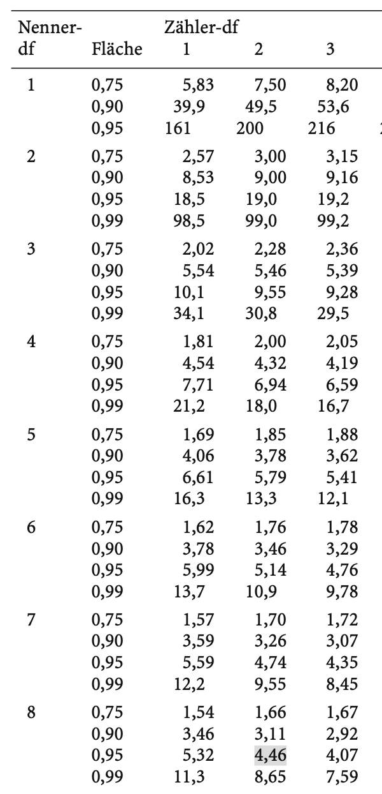

```{r setup, include=FALSE}
options(htmltools.dir.version = FALSE)

library(tidyverse)
library(kableExtra)
library(ggplot2)
library(plotly)
library(htmlwidgets)
library(plotly)
library(MASS)
library(ggpubr)
library(xaringanthemer)
library(xaringanExtra)
library(sjPlot)
library(sjmisc)
options(scipen = 999)

style_duo_accent(
  primary_color = "#621C37",
  secondary_color = "#EE0071",
  background_image = "blank.png"
)

xaringanExtra::use_xaringan_extra(c("tile_view"))

use_scribble(
  pen_color = "#EE0071",
  pen_size = 4
  )

knitr::opts_chunk$set(
  fig.retina = TRUE,
  warning = FALSE,
  message = FALSE
)

Xname = ""
Yname = ""
nudgnumber = 3
my_green = "#EE0071"
```

name: Title slide
class: middle, left
<br><br><br><br><br><br><br>
# Statistik II
***
### Einheit 8: ANOVA mit Messwiederholung
##### `r format(as.Date(data.frame(readxl::read_excel("Modul Quantitative Methoden II_Termine.xlsx"))$Datum), "%d.%m.%Y")[8]` | Prof. Dr. Stephan Goerigk

---
class: top, left
### ANOVA mit Messwiederholung

.pull-left[
#### Kurzvorstellung
<small>
* Viele wiss. Untersuchungen verwenden Messwiederholungen

* Gründe:
  * Untersuchung zeitlicher Veränderung eines Merkmals (z.B. Lernen, Gesundung)
  * Statistische Vorteile beim Studiendesign (z.B. mehr Teststärke)

* Wichtig: **Dieselben** Personen werden **mehrfach** erfasst

* Daten sind **abhängig** voneinander (Verletzung Unabhängigkeitsvoraussetzung bei ANOVA)

* Graphische Darstellung i.d.R. mittels Line-Graph 
  * Punkte = Mittelwert zu Zeitpunkt $t_i$ (wie Balkendiagramm)
  * Linie symbolisiert Messwiederholungen
]
.pull-right[
```{r echo = F, out.width="430px"}
set.seed(123)
t0 = round(rnorm(15, 10, 2))
t1 = round(t0 + rnorm(15, 6, 2))
t2 = round(t1 + rnorm(15, 2, 2))
id = 1:15
df = data.frame(id, t0, t1, t2)

Time = rep(c("t0", "t1", "t2"), each = 15)
df_long = data.frame(id = rep(id,3), Time, Score = c(t0, t1, t2))

ggpubr::ggarrange(ggplot(df_long[df_long$Time != "t2",], aes(x = Time, y = Score)) +
   stat_summary() +
     stat_summary(geom = "line", aes(group = 1)) +
    ggtitle("abh. t-Test") +
    labs(x = "Zeit", y = "AV") +
  theme_classic() +
  theme(text = element_text(size = 25), axis.text.y = element_blank(), axis.ticks.y = element_blank()),
  ggplot(df_long[,], aes(x = Time, y = Score)) +
   stat_summary() +
     stat_summary(geom = "line", aes(group = 1)) +
    ggtitle("abh. t-Test") +
    labs(x = "Zeit", y = "AV") +
    ggtitle("ANOVA mit Messwiederholung") +
  theme_classic() +
  theme(text = element_text(size = 25), axis.text.y = element_blank(), axis.ticks.y = element_blank()), nrow = 2)
```
]

---
class: top, left
### ANOVA mit Messwiederholung

#### Logik ANOVA mit Messwiederholung

* Prüft, ob sich die Ausprägung eines Merkmals zu $\geq$ 2 Messzeitpunkten unterscheidet

* Erweiterung des abhängigen t-Tests

* Simultaner Vergleich beliebig vieler Zeitpunkte mittels Omnibustest

  * Vermeidung von $\alpha$-Fehlerkumulierung
  * Vermeidung von verringerter Teststärke

* Prinzip wie bei einfaktorieller ANOVA ohne Messwiederholung, jedoch mit leicht abgewandelten Formeln, um Abhängigkeit der Messungen zu entsprechen

---
class: top, left
### ANOVA mit Messwiederholung

#### Hypothesen bei Messwiederholungsdesigns

**Vorteil der ANOVA mit Messwiederholung:**

* Logik des **Omnibustests** bei messwiederholten Daten

* Es werden die Mittelwerte aller Zeitpunkte auf einmal miteinander verglichen.

* $H_0$ abh. t-Tests:
  * $\mu_{t1} = \mu_{t2}$
  * $\mu_{t1} = \mu_{t3}$
  * $\mu_{t2} = \mu_{t3}$

* $H_0$ ANOVA mit Messwiederholung:
  * $\mu_{t1} = \mu_{t2} = \mu_{t3}$
  
---
class: top, left
### ANOVA mit Messwiederholung

#### Prinzip der Varianzanalyse mit Messwiederholung

**Zerlegung der Gesamtvarianz:**

Wir müssen uns wiederum fragen, weshalb Messungen unterschiedlich (mit Varianz) ausfallen

Nach wie vor gibt es 2 denkbare Ursachen für die Gesamtvarianz:
1. systematische Einflüsse (experimentelle Manipulation)
2. unsystematische Einflüsse (nicht erklärbare Restvarianz aka. Residualvarianz)

Spezialfall Messwiederholung:

* Aufgrund der wiederholten Messungen beziehen sich beide Varianzquellen auf Unterschiede **innerhalb der Personen**
* Zusätzliche Varianzquelle: Unterschiede **zwischen den Personen** (Personenvarianz $\sigma^2_{Vpn}$ - z.B. Persönlichkeit, Motivation)

$$\sigma_{gesamt}^2= \sigma_{Vpn}^2 + \sigma_{Zeit}^2 +  \sigma_{Res}^2$$  

---
class: top, left
### ANOVA mit Messwiederholung

#### Prinzip der Varianzanalyse mit Messwiederholung

**Zerlegung der Gesamtvarianz:**

.center[
```{r eval = TRUE, echo = F, out.width = "550px"}

```
]

---
class: top, left
### ANOVA mit Messwiederholung

#### Prinzip der Varianzanalyse mit Messwiederholung

**Bestandteile der Residualvarianz:**

* Residualvarianz besteht im Falle von Messwiederholungen aus 2 Komponenten:

  * Wechselwirkung aus Personenfaktor und den Stufen des Messwiederholungsfaktors (Zeit)
  * restliche unsystematische Einflüsse

* Beide Komponenten auf Stichprobenebene nicht voneinander abgrenzbar

$\rightarrow$ Personenfaktor kann nicht systematisch von Forscher:innen variiert werden (hätten dann wieder Zwischengruppendesign statt reine Messwiederholung)

---
class: top, left
### ANOVA mit Messwiederholung

#### Anwendungsbespiel händisch (kleiner Datensatz)

.pull-left[
* Datensatz für $N=5$ Patient:innen nach Schlaganfall

* **Forschungsfrage:** Kann kognitives Training Merkfähigkeit verbessern?

* Es wurden folgende Variablen gemessen:
  
  * Gedächtnisleistung (AV; 0-50 Punkte) 
  $\rightarrow$ nach jeder Trainingseinheit gemessen

* "Indirekte" Variable im Datensatz

  * Zeitpunkt (UV, 3 Messungen)
  
$\rightarrow$ Numerische Frage: Anstieg mit zunehmenden Trainingseinheiten?
]


.pull-right[
```{r echo=F}
set.seed(123)
t0 = round(rnorm(15, 10, 2))[1:5]
t1 = round(t0 + rnorm(15, 6, 2))[1:5]
t2 = round(t1 + rnorm(15, 2, 2))[1:5]
id = 1:5
df = data.frame(id = id, t0 = t0, t1 = t1, t2 = t2)
df[["P(m)"]] = round(rowMeans(df[,2:4]), 2)
df = rbind(df, c("A(i)", colMeans(df[,2:5])))

df[6,5] = mean(c(t0, t1, t2))

df %>%
  kbl() %>%
  kable_classic(full_width = T, position = "left", font_size = 15)
```

* $A_{i}$ Mittelwert pro Zeitpunkt
* $P_{m}$ Mittelwert der Person über Zeitpunkte hinweg
]

---
class: top, left
### ANOVA mit Messwiederholung

#### Prinzip der Varianzanalyse mit Messwiederholung

**Varianzschätzungen:**

* Die Varianzschätzungen der ANOVA mit Messwiederholung gehen von einer Interaktion der Messwiederholung mit unspezifischen Personencharakteristika aus

* Die Formeln ähneln daher eher denen der mehrfaktoriellen ANOVA mit Interaktionseffekt

* Auch hier wird von "erwarteten Werten" ausgegangen

---
class: top, left
### ANOVA mit Messwiederholung

#### Prinzip der Varianzanalyse mit Messwiederholung

**Schätzung der Residualvarianz:**

* Erfolgt über die Abweichung der gemessenen Werte von den, allein auf Grund von
  1. den Mittelwerten zu jedem Zeitpunkt
  2. den aufgrund der Personenmittelwerte zu **erwartenden** Werten $(x_{im(erwartet)})$

* Entspricht Vorgehen für Varianz der Interaktion zwischen 2 Faktoren

* Erwartete Werte setzen sich zusammen aus: 

  * Gesamtmittelwert $(\bar{G})$
  * Einfluss des Messwiederholungsfaktors $(\bar{A_i})$
  * Einfluss des Personenfaktors $(\bar{P_m})$

$$x_{im(erwartet)} = \bar{G} + (\bar{A_i} - \bar{G}) + (\bar{P_m} - \bar{G})= \bar{A_i} + \bar{P_m} - \bar{G}$$

$x_{im(erwartet)}=$ Erwarteter Wert der Person $m$ in der Messwiedeholung $i$ des Messwiederholungsfaktors $A$.

---
class: top, left
### ANOVA mit Messwiederholung

#### Prinzip der Varianzanalyse mit Messwiederholung

**Schätzung der Residualvarianz:**

* Die geschätzte Residualvarianz $(\hat{\sigma}^2_{Res})$ berechnet sich aus den quadrierten Abweichungen $(QS_{A\text{ x }Vpn})$ der beobachteten von den erwarteten Messwerten 

* Sie wird somit aus der Varianz der Wechselwirkung zwischen Messwiederholungsfaktor und Personenfaktor geschätzt

$$\hat{\sigma}^2_{A\text{ x }Vpn} = \frac{QS_{A\text{ x }Vpn}}{df_{A\text{ x }Vpn}} = \frac{\sum\limits _{i=1}^{p}\sum\limits _{m=1}^{N} [x_{im} - (\bar{A_{i}} + \bar{P_{m}}- \bar{G})]^2}{(p-1) \cdot (n-1)}$$
mit:

* $p$ = Gesamtzahl der Stufen des Messwiederholungsfaktors (Laufindex $i$)
* $n$ = Gesamtzahl der Personen (Laufindex $m$)

---
class: top, left
### ANOVA mit Messwiederholung

#### Prinzip der Varianzanalyse mit Messwiederholung

**Schätzung der Residualvarianz:**

Berechnung der Residualvarianz im Beispiel:

```{r echo=F}
qs = list()

for(i in 1:5){
  for(j in 2:4){
    qs[[paste(i,j)]] = (as.numeric(df[i,j]) - (as.numeric(df[6,j]) + as.numeric(df[i,5]) - as.numeric(df[6,5]))) ^ 2
  }
}
```

$$\hat{\sigma}^2_{A\text{ x }Vpn}  = \frac{[9 - (10.4 + 16.67 - 15.6)]^2 + ..[19 - (19.8 + 14.67 - 15.6)]^2}{(3-1) \cdot (5-1)} = \frac{23.6}{8}=2.95$$

mit
* $df_{A\text{ x }Vpn}=(3-1) \cdot (5-1)=8$

---
class: top, left
### ANOVA mit Messwiederholung

#### Prinzip der Varianzanalyse mit Messwiederholung

**Schätzung der Personenvarianz:**

* Erfolgt über die sogenannte Varianz zwischen Versuchspersonen

* Besteht aus den Unterschieden zwischen den über alle Zeitpunkte gemittelten Werten $P_m$

* Exakter Wert für Berechnung der Varianzanalyse mit Messwiederholung irrelevant 

$\rightarrow$ Wir verzichten an dieser Stelle auf die Formel

---
class: top, left
### ANOVA mit Messwiederholung

#### Prinzip der Varianzanalyse mit Messwiederholung

**Systematische Varianz:**

* Setzt sich aus den Unterschieden zwischen Mittelwerten der Messzeitpunkten zusammen (Zeiteffekt)

* Lässt sich nicht isoliert, sondern nur in Kombination mit Residualvarianz schätzen (wie bei ANOVA ohne Messwiederholung)

Geschätzt wird die Varianz des Haupteffekts $A:$

$$\hat{\sigma}^2_{A} = \frac{QS_{A}}{df_{A}} = \frac{n \cdot \sum\limits _{i=1}^{p}(\bar{A}_i - \bar{G})^2}{p-1}$$
---
class: top, left
### ANOVA mit Messwiederholung

#### Prinzip der Varianzanalyse mit Messwiederholung

**Systematische Varianz:**

Berechnung der systematischen Varianz im Beispiel:

$$\hat{\sigma}^2_{A} = \frac{5 \cdot [(10.4 - 15.6)^2 + (16.6 - 15.6)^2 + (19.8 - 15.6)^2]}{3-1} = \frac{228.4}{2}= 114.2$$
mit
* $df_A=3-1=2$

---
class: top, left
### ANOVA mit Messwiederholung

#### Prinzip der Varianzanalyse mit Messwiederholung

**Signifikanzprüfung:**

* Püfung, ob sich die Messzeitpunkte signifikant unterscheiden

* F-Bruch (emp. F-Wert) wird gebildet aus geschätzter systematischer Varianz für Messwiederholungsfaktor (A) und der geschätzten Residualvarianz 

$$F_{A(df_{A}, df_{Res})}=\frac{\hat{\sigma}^2_{A}}{\hat{\sigma}^2_{Res}} = \frac{\hat{\sigma}^2_{A}}{\hat{\sigma}^2_{A\text{ x }Vpn}}$$

mit
* $df_A=p-1$
* $df_{A\text{ x }Vpn}=(p-1) \cdot (n-1)$

---
class: top, left
### ANOVA mit Messwiederholung

.pull-left[
#### Prinzip der Varianzanalyse mit Messwiederholung

**Signifikanzprüfung:**

Berechnung des F-Bruchs im Beispiel:

$$F_{A(2,8)} = \frac{114.2}{2.95}=38.71$$

$F_{krit(2,8)}=4.46$ (F-Tabelle)

$F_{A(2,8)} > F_{krit(2,8)}$ $\rightarrow$ Der Test ist signifikant.

$\rightarrow$ Es besteht ein signifikanter Unterschied zwischen den Mittelwerten der wiederholten Messungen.

$\rightarrow$ Anders gesagt: Es erfolgt eine signifikante Veränderung über die Zeit.

]
.pull-right[
.center[
```{r eval = TRUE, echo = F, out.width = "230px"}

```
]
]

---
class: top, left
### ANOVA mit Messwiederholung

.pull-left[
#### Anwendungsbespiel R (größerer Datensatz)

* Datensatz für $N=15$ Patient:innen nach Schlaganfall

* **Forschungsfrage:** Kann kognitives Training Merkfähigkeit verbessern?

* Es wurden folgende Variablen gemessen:
  
  * Gedächtnisleistung (AV; 0-50 Punkte) 
  $\rightarrow$ nach jeder Trainingseinheit gemessen

* "Indirekte" Variable im Datensatz

  * Zeitpunkt (UV, 3 Messungen)
  
$\rightarrow$ Numerische Frage: Anstieg mit zunehmenden Trainingseinheiten?
]

.pull-right[
```{r echo=F}
set.seed(123)
t0 = round(rnorm(15, 10, 2))
t1 = round(t0 + rnorm(15, 6, 2))
t2 = round(t1 + rnorm(15, 2, 2))
id = 1:15
df = data.frame(id = id, t0 = t0, t1 = t1, t2 = t2)

df %>%
  kbl() %>%
  kable_classic(full_width = T, position = "left", font_size = 15)
```
]

---
class: top, left
### ANOVA mit Messwiederholung

.pull-left[
#### Anwendungsbespiel R (größerer Datensatz)

**Wide vs. Long-Format:**

<small>
* Datensätze können entweder im Wide- oder Long-Format vorliegen, wobei jede Formatierung ihre eigenen Vor- und Nachteile aufweist.

Wide-Format:

* Daten in einer breiten Tabelle dargestellt
* Jede Variable hat eine eigene Spalte 
* Übersichtliche Sicht auf die Daten, insbesondere wenn es viele Variablen gibt

Wichtig: Jede Person hat eine Zeile. Gibt es Messwiederholungen (hier t1, t2 und t3 der Gedächtnisleistung), erhält jede Messung seine eigene Spalte.
]

.pull-right[
```{r echo=F}
df %>%
  kbl() %>%
  kable_classic(full_width = T, position = "left", font_size = 15)
```
]

---
class: top, left
### ANOVA mit Messwiederholung

.pull-left[
#### Anwendungsbespiel R (größerer Datensatz)

**Wide vs. Long-Format:**

<small>

Long-Format (aus Platzgründen nur für Personen 1-5 dargestellt):

* Daten sind in einer schmaleren Tabelle darzustellen, in der mehrere Variablen in einer Spalte zusammengefasst werden
* Jede Beobachtung erstreckt sich über mehrere Zeilen, wodurch eine längere Tabelle entsteht
* Long-Format eignet sich besonders für Messwiederholungen

Wichtig:

* Jede Zeile muss mittels einer ID Variable eindeutig den Personen zugeordnet werden
* Eine weitere Variable (bei Messwiederholungen z.B. Zeit) muss angegeben werden, weshalb es mehrere Werte pro Fall gibt
]

.pull-right[
```{r echo=F}
df_long[df_long$id <6,] %>%
  kbl(row.names = F) %>%
  kable_classic(full_width = T, position = "left", font_size = 15)
```
]

---
class: top, left
### ANOVA mit Messwiederholung

#### Anwendungsbespiel R (größerer Datensatz)

Wide und  Long-Format lassen sich automatisch ineinander überführen:

.code60[
```{r echo=FALSE}
df_wide = df
```

.pull-left[
```{r}
df_wide
```
]

.pull-right[
```{r}
df_wide_to_long = as.data.frame(pivot_longer(data = df_wide, 
                               cols = c("t0", "t1", "t2"), 
                               names_to = "Time", 
                               values_to = "Score"))

head(df_wide_to_long, 15)
```
]
]
---
class: top, left
### ANOVA mit Messwiederholung

#### Anwendungsbespiel R (größerer Datensatz)

.code60[
```{r message=FALSE, warning=FALSE}
library(afex)
model = aov_ez(dv = "Score", within = c("Time"), id = "id", data = df_long)
summary(model)
```
]

---
class: top, left
### ANOVA mit Messwiederholung

#### Anwendungsbespiel R (größerer Datensatz)

```{r message=FALSE, warning=FALSE}
library(emmeans)

model = aov_ez(dv = "Score", within = c("Time"), id = "id", data = df_long)
emmeans(model, pairwise ~ Time)
```

---
class: top, left
### ANOVA mit Messwiederholung

#### Voraussetzungen der ANOVA mit Messwiederholung

**Es gelten folgende Voraussetzungen:**

1. Die abhängige Variable ist intervallskaliert
  * messtheoretisch abgesichert (muss man wissen)

2. Das untersuchte Merkmal ist in der Population normalverteilt

3. Varianzhomogenität (Varianzen sind innerhalb der verglichenen Gruppen ungefähr gleich)

4. NEU: Annahme homogener Korrelationen, bzw. Zirkularität (aka Sphärizität)

**Folgende Voraussetzung gilt nicht:**

(4.) Messwerte in allen Bedingungen sind unabhängig voneinander
  
---
class: top, left
### ANOVA mit Messwiederholung

#### Voraussetzungen der ANOVA mit Messwiederholung

.pull-left[

**Annahme homogener Korrelationen:**

* Zur Erinnerung: Daten sind explizit nicht unabhängig

* Voraussetzung über die Art der Abhängigkeit der Daten

* Alle Korrelationen zwischen den Stufen des Messwiederholungsfaktors $(A)$ müssen homogen sein 

ACHTUNG: Muss erst ab >2 Messzeitpunkten getestet werden! (nur 1 Korrelation)
]

.pull-right[
```{r}
cor(df[, c("t0", "t1", "t2")])
```

* Korrelationen können mittels Korrelationsmatrix abgelesen werden

* Auf den ersten Blick scheint es Unterschiede zu geben... $(r=0.29$ vs. $r=0.78)$
]

---
class: top, left
### ANOVA mit Messwiederholung

#### Voraussetzungen der ANOVA mit Messwiederholung

**Annahme homogener Korrelationen:**

Verletzung der Annahme:

* Bei Verletzung, kann der Zeiteffekt überschätzt werden

* Es würden ggf. signifikante Ergebnisse gefunden, wo kein Effekt existiert

ABER:

* Annahme homogener Korrelationen sehr strenge Voraussetzung

* Studien zeigen, dass auch etwas liberalere Annahme ausreicht: Homogenität der Varianzen zwischen den Faktorstufen **(Sphärizität)**

* Sphärizität wird stattdessen geprüft

---
class: top, left
### ANOVA mit Messwiederholung

#### Voraussetzungen der ANOVA mit Messwiederholung

**Überprüfung der Sphärizität - Mauchly-Test:**

* Annahme: Homogenität der Varianzen zwischen den Faktorstufen

* Signifikanter Mauchly-Test $\rightarrow$ Varianzen inhomogen $\rightarrow$ keine Sphärizität

**Durchführung des Mauchly-Tests in R:**

```{r}
library(performance)

check_sphericity(model)
```

---
class: top, left
### ANOVA mit Messwiederholung

#### Voraussetzungen der ANOVA mit Messwiederholung

**Verletzung der Sphärizität - Korrekturverfahren**

* Es gibt Korrekturverfahren, die den F-Test für die Sphärizitätsverletzung korrigieren

  * Greenhouse-Geisser Korrektur
  * Huynh-Feldt Korrektur

* Die Auswahl des Korrekturverfahrens richtet sich nach dem Wert $\varepsilon$ (Epsilon)

* Untergrenze für  Epsilon ist $\varepsilon=\frac{1}{p-1}$

* Kleineres Epsilon $\rightarrow$ stärkere Verletzung der Sphärizitätsannahme

Entscheidungsregel nach Box:

* $\varepsilon<0.75$ $\rightarrow$ Greenhouse-Geisser Korrektur (strenger)

* $\varepsilon\geq0.75$ $\rightarrow$ Huynh-Feldt Korrektur (liberaler)

---
class: top, left
### ANOVA mit Messwiederholung

**Verletzung der Sphärizität - Korrekturverfahren**

.pull-left[

.code60[
```{r message=FALSE, warning=FALSE}
model = aov_ez(dv = "Score", within = c("Time"), id = "id", data = df_long)
summary(model)
```
]
]

.pull-right[
* Beide Korrekturen können aus Output abgelesen werden

* Entscheidend für Auswahl des Korrekturverfahrens ist das GG $\varepsilon$
]

---
class: top, left
### ANOVA mit Messwiederholung

#### Effektstärke

$$f^2_{s(abhängig)}=\frac{F\cdot df_{A}}{df_{A\text{ x }Vpn}}$$

$$f^2_{s(abhängig)}=\frac{F\cdot df_{A}}{df_{A\text{ x }Vpn}}$$

$$\eta^2_p=\frac{QS_{A}}{QS_{A} + QS_{A\text{ x }Vpn}}=\frac{f^2_{s}}{1+ f^2_{s}}$$
* $\eta^2_p$ gibt Anteil der Varianz an, der durch Messwiederholung auf Stichprobenebene aufgeklärt wird

* Der Vergleich von Effektstärke über Studien hinweg kann problematisch sein, wenn Korrelationen zwischen Messungen variieren.

---
class: top, left
### ANOVA mit Messwiederholung

#### Stichprobenumfangsplanung

.center[
```{r eval = TRUE, echo = F, out.width = "470px"}

```
]

---
class: top, left
### Take-aways

.full-width[.content-box-gray[
* ANOVA mit Messwiederholung erlaubt Vergleich **abhängiger Daten** mit $\geq2$ Messungen.

* Es wird geprüft, ob eine **Veränderung über die Zeit** (Zeiteffekt) vorliegt.

* Wird ebenfalls über Varianzzerlegung und Prüfung mittels **F-Test** durchgeführt.

* ANOVA mit Messwiederholung kann zusätzlich zur **Effektvarianz** auch **Personenvarianz** aufklären (höhere Teststärke).

* Als zusätzliche Voraussetzung wird die **Spärizität** geprüft.

* Bei Verletzungen der Spärizitätsannahme können **Korrekturverfahren** angewendet werden, die Überschätzung des Effekts verhindern.

* Wenn Spärizität erfüllt ist, können Post-Hoc Vergleiche mittels **Tukey-Test** geprüft werden.
]
]


