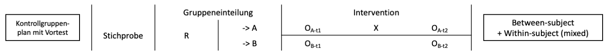
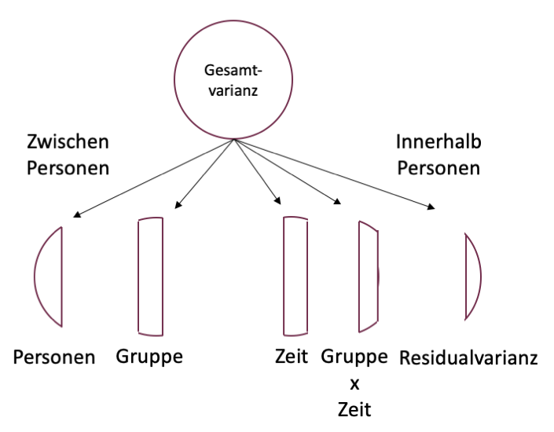
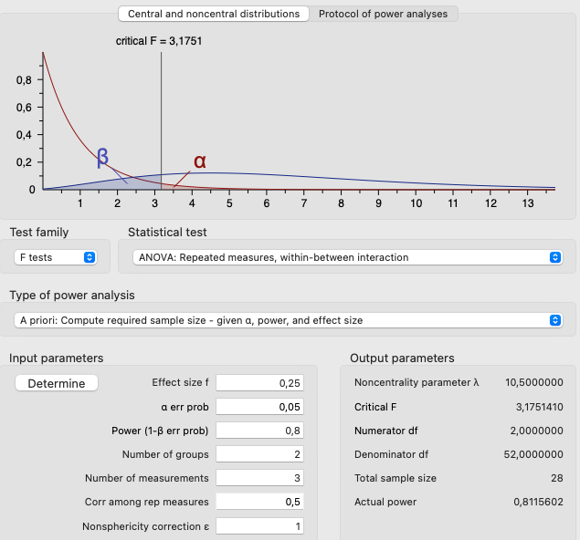

```{r setup, include=FALSE}
options(htmltools.dir.version = FALSE)

library(tidyverse)
library(kableExtra)
library(ggplot2)
library(plotly)
library(htmlwidgets)
library(plotly)
library(MASS)
library(ggpubr)
library(xaringanthemer)
library(xaringanExtra)
library(sjPlot)
library(sjmisc)
options(scipen = 999)

style_duo_accent(
  primary_color = "#621C37",
  secondary_color = "#EE0071",
  background_image = "blank.png"
)

xaringanExtra::use_xaringan_extra(c("tile_view"))

use_scribble(
  pen_color = "#EE0071",
  pen_size = 4
  )

knitr::opts_chunk$set(
  fig.retina = TRUE,
  warning = FALSE,
  message = FALSE
)

Xname = ""
Yname = ""
nudgnumber = 3
my_green = "#EE0071"
```

name: Title slide
class: middle, left
<br><br><br><br><br><br><br>
# Statistik II
***
### Einheit 9: Mixed Designs
##### `r format(as.Date(data.frame(readxl::read_excel("Modul Quantitative Methoden II_Termine.xlsx"))$Datum), "%d.%m.%Y")[9]` | Prof. Dr. Stephan Goerigk

---
class: top, left
### Mixed Designs

#### Kurzvorstellung

**Mixed Designs:**

* Mixed = Mischung aus Messwiederholung und Gruppenvergleich
* Within-Person + Between-Person Faktoren im selben Modell
* Zeit + Gruppenzugehörigkeit (und deren Interaktion) als unabhängige Variablen (UVs)
  
**Verwendung:**
* Klassischer Experimentaufbau in der Psychologie 
* Zeit: Prä vs. Post; Gruppe: Experimentalgruppe vs. Kontrollgruppe 
* Klinische Studien: Randomisiert-kontrolliertes Trial (RCT)

Wir kennen diesen Aufbau von den Studiendesigns:
.center[
```{r eval = TRUE, echo = F, out.width = "1000px"}

```
]

---
class: top, left
### Mixed Designs

.pull-left[
#### Kurzvorstellung
<small>

* Design: 
  * Jede Person wird zu mehreren Zeitpunkten erfasst (Zeit)
  * Einige Personen sind einer Gruppe zugeordnet, andere einer anderen Gruppe
  
* Gründe:
  * Unterschiedliche Entwicklung über Zeit in unterschiedlichen Gruppen
  * Durch Vorher-Nachher Vergleich kann Veränderung abgebildet werden 

* Messwiederholte Daten sind **abhängig** voneinander 

* Gruppenvergleiche sind  **unabhängig** voneinander

]
.pull-right[
```{r echo = F, out.width="430px"}
set.seed(123)
t0 = round(rnorm(8, 10, 2))
t1 = round(t0 + rnorm(8, 4, 2))
t2 = round(t1 + rnorm(8, 2, 2))
id = 1:8
df = data.frame(id, t0, t1, t2)

Time = rep(c("t0", "t1", "t2"), each = 8)
df_long1 = data.frame(id = rep(id,3), Time, Score = c(t0, t1, t2))
df_long1$Gruppe = "Gruppe1"

t0 = round(rnorm(8, 9.5, 2))
t1 = round(t0 + rnorm(8, 6, 2))
t2 = round(t1 + rnorm(8, 4, 2))
id = 9:16
df = data.frame(id, t0, t1, t2)

Time = rep(c("t0", "t1", "t2"), each = 8)
df_long2 = data.frame(id = rep(id,3), Time, Score = c(t0, t1, t2))
df_long2$Gruppe = "Gruppe2"

df_long = rbind(df_long1, df_long2)

ggplot(df_long, aes(x = Time, y = Score, colour = Gruppe)) +
   stat_summary(size = 1.5) +
     stat_summary(geom = "line", aes(group = Gruppe)) +
    labs(x = "Zeit", y = "AV") +
    ggtitle("Mixed Design") +
  theme_classic() +
  theme(text = element_text(size = 25), axis.text.y = element_blank(), axis.ticks.y = element_blank())
```
]

---
class: top, left
### Mixed Designs

.pull-left[
#### Kurzvorstellung
<small>
* Graphische Darstellung i.d.R. mittels gruppenspezifischem Line-Graph 
  * AV auf Y-Achse, Zeit auf X-Achse (UV1), Gruppenzugehörigkeit z.B. als Farben (UV2) 
  * Punkte = Mittelwert der Gruppe $G_j$ zu Zeitpunkt $t_i$ 
  * Eine Linie pro Gruppe
  
* Interpretation:
  * parallele Linien $\rightarrow$ gleiche Veränderung der Gruppen über Zeit
  * nicht parallele Linien $\rightarrow$ Gruppen verändern sich unterschiedlich
]
.pull-right[
```{r echo = F, out.width="430px"}
set.seed(123)
t0 = round(rnorm(8, 10, 2))
t1 = round(t0 + rnorm(8, 6, 2))
t2 = round(t1 + rnorm(8, 2, 2))
id = 1:8
df = data.frame(id, t0, t1, t2)

Time = rep(c("t0", "t1", "t2"), each = 8)
df_long1 = data.frame(id = rep(id,3), Time, Score = c(t0, t1, t2))
df_long1$Gruppe = "Gruppe1"

t0 = round(rnorm(8, 7.5, 2))
t1 = round(t0 + rnorm(8, 6, 2))
t2 = round(t1 + rnorm(8, 2, 2))
id = 1:8
df = data.frame(id, t0, t1, t2)

Time = rep(c("t0", "t1", "t2"), each = 8)
df_long2 = data.frame(id = rep(id,3), Time, Score = c(t0, t1, t2))
df_long2$Gruppe = "Gruppe2"

df_long = rbind(df_long1, df_long2)

p2 = ggplot(df_long, aes(x = Time, y = Score, colour = Gruppe)) +
   stat_summary(size = 1.5) +
     stat_summary(geom = "line", aes(group = Gruppe)) +
    labs(x = "Zeit", y = "AV") +
    ggtitle("Mixed Design") +
  theme_classic() +
  theme(text = element_text(size = 25), axis.text.y = element_blank(), axis.ticks.y = element_blank())

set.seed(123)
t0 = round(rnorm(8, 10, 2))
t1 = round(t0 + rnorm(8, 4, 2))
t2 = round(t1 + rnorm(8, 2, 2))
id = 1:8
df = data.frame(id, t0, t1, t2)

Time = rep(c("t0", "t1", "t2"), each = 8)
df_long1 = data.frame(id = rep(id,3), Time, Score = c(t0, t1, t2))
df_long1$Gruppe = "Gruppe1"

t0 = round(rnorm(8, 9.5, 2))
t1 = round(t0 + rnorm(8, 6, 2))
t2 = round(t1 + rnorm(8, 4, 2))
id = 9:16
df = data.frame(id, t0, t1, t2)

Time = rep(c("t0", "t1", "t2"), each = 8)
df_long2 = data.frame(id = rep(id,3), Time, Score = c(t0, t1, t2))
df_long2$Gruppe = "Gruppe2"

df_long = rbind(df_long1, df_long2)

p1 = ggplot(df_long, aes(x = Time, y = Score, colour = Gruppe)) +
   stat_summary(size = 1.5) +
     stat_summary(geom = "line", aes(group = Gruppe)) +
    labs(x = "Zeit", y = "AV") +
    ggtitle("Mixed Design") +
  theme_classic() +
  theme(text = element_text(size = 25), axis.text.y = element_blank(), axis.ticks.y = element_blank())


ggpubr::ggarrange(p1,
  p2, nrow = 2)
```
]

---
class: top, left
### Mixed Designs

#### Statistische Auswertung von Mixed Designs

In der angewandten Statistik sind 2 Arten von Modellen zur Auswertung von Mixed Designs gängig:

**1. Mixed ANOVA**

  * Basiert auf Prinzip der mehrfaktoriellen ANOVA
  * Messwiederholung: alle Zeitpunkte stehen gleichberechtigt nebeneinander (jede Messung wird mit jeder verglichen)
  * Statistisches Konzept: stationäre Mittelwertsvergleiche der Gruppen zu jedem Zeitpunkt
  * Dieses Semester

**2. Linear mixed model (Multilevel-Modell)**
  * Basiert auf Prinzip der Regression
  * Messwiederholung: Zeitpunkte können in lineare Reihenfolge gebracht werden (Wachstumskurve $\rightarrow$ Veränderung = lineare Steigung)
  * Statistisches Konzept: Vergleich der Steigungen einzelner Gruppen
  * Erstes Semester Masterstudium
  
---
class: top, left
### Mixed Designs

#### Anwendungsbespiel 

```{r echo=F}
set.seed(123)
t0 = round(rnorm(5, 10, 2))
t1 = round(t0 + rnorm(5, 1, 2))
t2 = round(t1 + rnorm(5, 1, 2))
id = 1:5
df = data.frame(id, t0, t1, t2)

Time = rep(c("t0", "t1", "t2"), each = 5)
df_long1 = data.frame(id = rep(id,3), Time, Score = c(t0, t1, t2))
df_long1$Gruppe = "Gruppe1"

t0 = round(rnorm(5, 9.5, 2))
t1 = round(t0 + rnorm(5, 6, 2))
t2 = round(t1 + rnorm(5, 4, 2))
id = 6:10
df = data.frame(id, t0, t1, t2)

Time = rep(c("t0", "t1", "t2"), each = 5)
df_long2 = data.frame(id = rep(id,3), Time, Score = c(t0, t1, t2))
df_long2$Gruppe = "Gruppe2"

df_long = rbind(df_long1, df_long2)
```

.pull-left[
<small>

* Datensatz für $N=10$ Patient:innen nach Schlaganfall
* 2 Gruppen mit $n=5$: G1 lediglich Zuwendung, G2 erhält Training

* **Forschungsfrage:** Kann kognitives Training Merkfähigkeit stärker verbessern, als reine Zuwendung?

* Es wurden folgende Variablen gemessen:
  
  * Gedächtnisleistung (AV; 0-50 Punkte) 
  $\rightarrow$ nach jeder Trainingseinheit gemessen

* Variable im Datensatz

  * Zeitpunkt (UV, 3 Messungen)
  * Gruppe (UV, 2 Stufen)
  
$\rightarrow$ Numerische Frage: Unterschiedlicher Anstieg in Gruppen?
]


.pull-right[
```{r echo=F}
df_long[df_long$id <3 | df_long$id == 6 | df_long$id == 7,] %>%
  kbl() %>%
  kable_classic(full_width = T, position = "left", font_size = 15)
```

Tabellarische Darstellung je für $n=2$ Personen in jeder Gruppe (Platzgründe)
]


---
class: top, left
### Mixed Designs

#### Formalisierung

* "Mixed"-Modelle sind Spezialformen mehrfaktorieller Modelle mit Interaktion

* Besonderheit: eine der beiden UVs ist Zeit 

$$Y = Zeit + Gruppe + Zeit \cdot Gruppe + \varepsilon$$
Entsprechend können wir wieder **3 Arten von Effekten** unterscheiden:

* Haupteffekt Zeit

* Haupteffekt Gruppe

* Interaktion Zeit x Gruppe

---
class: top, left
### Mixed Designs

#### Effektarten und prüfbare Hypothesen

**Haupteffekt Zeit:** 

<small>
$$Y = \color{red}{Zeit} + Gruppe + Zeit \cdot Gruppe + \varepsilon$$
</small>

$$\downarrow$$
.pull-left[
```{r echo=FALSE}
df_med = plyr::ddply(df_long, c("Time"), plyr::summarise,
                                               Mittelwert = round(mean(Score, na.rm = T), 2),
                                               SD = round(sd(Score, na.rm = T), 2))
knitr::kable(df_med,
             booktabs = T,
             longtable = F) %>%
  kable_classic(full_width = F,
                  font_size = 18,
                  html_font = "Times New Roman")
```

* $H_1:$ Unterschied zwischen $t_0$, $t_1$ und $t_2$ (ungeachtet der Gruppenzugehörigkeit)

]

.pull-right[
.center[
```{r echo = F, out.width="300px"}
ggplot(df_long, aes(x = Time, y = Score)) +
   stat_summary(size = 1.5) +
     stat_summary(geom = "line", aes(group = 1)) +
    labs(x = "Zeit", y = "AV") +
  ggtitle("Haupteffekt Zeit") +
  theme_classic() +
  coord_cartesian(ylim = c(6,22)) +
  theme(text = element_text(size = 28))
```
]
]

---
class: top, left
### Mixed Designs

#### Effektarten und prüfbare Hypothesen

**Haupteffekt Gruppe:** 

<small>
$$Y = Zeit + \color{red}{Gruppe} + Zeit \cdot Gruppe + \varepsilon$$
</small>

$$\downarrow$$
.pull-left[
```{r echo=FALSE}
df_med = plyr::ddply(df_long, c("Gruppe"), plyr::summarise,
                                               Mittelwert = round(mean(Score, na.rm = T), 2),
                                               SD = round(sd(Score, na.rm = T), 2))
knitr::kable(df_med,
             booktabs = T,
             longtable = F) %>%
  kable_classic(full_width = F,
                  font_size = 18,
                  html_font = "Times New Roman")
```

* $H_1:$ Unterschied zwischen $\text{Gruppe}_1$ und $\text{Gruppe}_2$ (ungeachtet des Messzeitpunkts)

]

.pull-right[
.center[
```{r echo = F, out.width="300px"}
ggplot(df_long, aes(x = Gruppe, y = Score)) +
   stat_summary(size = 1.5) +
    labs(x = "Gruppe", y = "AV") +
  ggtitle("Haupteffekt Gruppe") +
  theme_classic() +
  coord_cartesian(ylim = c(6,22)) +
  theme(text = element_text(size = 28))
```
]
]

---
class: top, left
### Mixed Designs

#### Effektarten und prüfbare Hypothesen

**Interaktionseffekt Zeit x Gruppe:** 

<small>
$$Y = Zeit + Gruppe + \color{red}{Zeit \cdot Gruppe} + \varepsilon$$
</small>

$$\downarrow$$
.pull-left[
```{r echo=FALSE}
df_med = plyr::ddply(df_long, c("Time", "Gruppe"), plyr::summarise,
                                               Mittelwert = round(mean(Score, na.rm = T), 2),
                                               SD = round(sd(Score, na.rm = T), 2))
knitr::kable(df_med,
             booktabs = T,
             longtable = F) %>%
  kable_classic(full_width = F,
                  font_size = 18,
                  html_font = "Times New Roman")
```

* $H_1:$ $\text{Gruppe}_1$ und $\text{Gruppe}_2$ unterscheiden sich im zeitlichen Verlauf.
]

.pull-right[
.center[
```{r echo = F, out.width="300px"}
ggplot(df_long, aes(x = Time, y = Score, colour = Gruppe)) +
   stat_summary(size = 1.5) +
  stat_summary(geom = "line", aes(group = Gruppe)) +
    labs(x = "Gruppe", y = "AV") +
  ggtitle("Interaktion Zeit x Gruppe") +
  theme_classic() +
  coord_cartesian(ylim = c(6,22)) +
  theme(text = element_text(size = 28))
```
]
]

---
class: top, left
### Mixed Designs

#### Prinzip der Mixed ANOVA

.pull-left[
**Zerlegung der Gesamtvarianz:**

* *Personen* = individuelle Unterschiede

* *Gruppe* = durchschnittlicher Gruppenunterschied

* *Zeit* = durchschnittlicher Unterschied über Zeit

* *Zeit x Gruppe* = unterschiedliche Veränderung über Zeit zwischen Gruppen

* *Residuum* = individuelle nicht erklärte Unterschiede über Zeit
]

.pull-right[
.center[
```{r eval = TRUE, echo = F, out.width = "550px"}

```
]
]

---
class: top, left
### Mixed Designs

#### Prinzip der Mixed ANOVA

**Zerlegung der Gesamtvarianz:**

Wir müssen uns wiederum fragen, weshalb Messungen der AV unterschiedlich (mit Varianz) ausfallen:

Variation zwischen Personen:
* Eigenschaften der Person selbst (Personenvarianz)
* Eigenschaften/Effekt der Gruppe (Gruppenzugehörigkeit)

Variation Messwiederholung:
* aufgrund in der Zwischenzeit erfolgter Intervention (oder einfach augrund des Vergehens von Zeit)
* unterschiedliche Reaktion auf in der Zwischenzeit erfolgter Intervention (oder einfach Vergehen von Zeit) innerhalb der Gruppen

Variation der Messwerte:

$$\sigma_{gesamt}^2= \sigma_{Vpn}^2 + \sigma_{Zeit}^2 + \sigma_{Gruppe}^2 + \sigma_{Zeit \text{ x } Gruppe}^2 +  \sigma_{Res}^2$$  
---
class: top, left
### Mixed Designs

#### Prinzip der Mixed ANOVA

**Systematische Varianzen (Zeit, Gruppe, Zeit x Gruppe):**

Die zu schätzenden, systematischen Varianzkomponenten sind:

* $\hat{\sigma}^2_{Gruppe}$

* $\hat{\sigma}^2_{Zeit}$

* $\hat{\sigma}^2_{Zeit \text{ x }Gruppe}$

Formeln nutzen folgende Parameter:
* $p =$ Stufen der Gruppenvariable $(i$ Stufen)
* $q =$ Stufen der Zeitvariable $(j$ Messzeitpunkte)
* $n =$ Anzahl der Versuchspersonen

---
class: top, left
### Mixed Designs

#### Prinzip der Mixed ANOVA

**Systematische Varianzen (Zeit, Gruppe, Zeit x Gruppe):**

* Schätzung erfolgt analog zur 2-faktoriellen ANOVA ohne Messwiederholung. 

* Der Unterschied: Erwartungswerte der Schätzer unterscheiden sich:

* Erwartungswert von $\hat{\sigma}^2_{Gruppe}$ beinhaltet Effektvarianz, Varianz des Personenfaktors und Fehlervarianz 

$$E(\hat{\sigma}^2_{Gruppe})= n \cdot q \cdot \sigma^2_{Gruppe} + q \cdot \sigma^2_{Vpn} + \sigma_{Res}^2$$
* Erwartungswerte von $\hat{\sigma}^2_{Zeit}$ und $\hat{\sigma}^2_{Zeit \text{ x } Gruppe}$ beinhalten zusätzlich Wechselwirkung zwischen Personenfaktor und Zeit

$$E(\hat{\sigma}^2_{Zeit})= n \cdot p \cdot \sigma^2_{Zeit} + q \cdot \sigma^2_{Zeit \text{ x } Vpn} + \sigma_{Res}^2$$

$$E(\hat{\sigma}^2_{Zeit \text{ x } Gruppe})= n \cdot \sigma^2_{Zeit \text{ x } Gruppe} + \sigma^2_{Zeit \text{ x } Vpn} + \sigma_{Res}^2$$


---
class: top, left
### Mixed Designs

#### Prinzip der Mixed ANOVA

**Systematische Varianzen (Gruppe):**

Berechnung:

$$\hat{\sigma}^2_{Gruppe}= \frac{QS_{Gruppe}}{df_{Gruppe}}$$

Die Quadratsumme $(QS)$ entspricht der quadrierten Abweichung der Mittelwerte $(\bar{Gruppe_{i}})$ vom Gesamtmittelwert $(\bar{G})$ multipliziert mit der Zellgröße $n$ und der Anzahl der Stufen der Zeitvariable (Anzahl der Messwiederholungen):

$$\hat{\sigma}^2_{Gruppe}= \frac{\sum\limits _{i=1}^{p}n \cdot q \cdot (\bar{Gruppe_{i}} - \bar{G})^2}{p-1}$$

---
class: top, left
### Mixed Designs

#### Prinzip der Mixed ANOVA

**Systematische Varianzen (Zeit):**

Berechnung:

$$\hat{\sigma}^2_{Zeit}= \frac{QS_{Zeit}}{df_{Zeit}}$$

Die Quadratsumme $(QS)$ entspricht der quadrierten Abweichung der Mittelwerte $(\bar{Zeit_{j}})$ vom Gesamtmittelwert $(\bar{G})$ multipliziert mit der Zellgröße $n$ und der Anzahl der Stufen der Gruppennvariable:

$$\hat{\sigma}^2_{Zeit}= \frac{\sum\limits _{j=1}^{q}n \cdot p \cdot (\bar{Zeit_{j}} - \bar{G})^2}{q-1}$$

---
class: top, left
### Mixed Designs

#### Prinzip der Mixed ANOVA

**Systematische Varianzen (Zeit x Gruppe):**

Berechnung:

$$\hat{\sigma}^2_{Zeit \text{ x } Gruppe}= \frac{QS_{Zeit \text{ x } Gruppe}}{df_{Zeit \text{ x } Gruppe}}$$

Die Quadratsumme entspricht der Differenz der beobachteten Zellmittelwerte und der erwarteten Zellmittelwerte

$$\hat{\sigma}^2_{Zeit \text{ x } Gruppe}= \frac{\sum\limits _{i=1}^{p}\sum\limits _{j=1}^{q}n \cdot [\bar{GruppeZeit}_{ij} - (\bar{Gruppe_{i}} + \bar{Zeit_{j}}+ \bar{G})]^2}{(p-1) \cdot (q-1)}$$

Laut Haupteffekten von Gruppe und Zeit erwartete Zellmittelwerte:

$$\bar{GruppeZeit}_{ij} = \bar{Gruppe_i} + \bar{Zeit_j} - \bar{G}$$
---
class: top, left
### Mixed Designs

#### Prinzip der Mixed ANOVA

**Prüfvarianzen:**
<small>
* Logik F-Bruch: Teilen der Effektvarianz durch die nicht erklärte Varianz

$$F_{(df_1,df_{2})}=\frac{\hat{\sigma}^2_{Effekt}}{\hat{\sigma}^2_{Prüf}}$$

$\rightarrow$ Zähler und Nenner unterscheiden sich nur durch interessierenden Effekt (je stärker desto größer der Bruch, desto signifikanter der Test)

* Bislang konnte für Haupt- und Interaktionseffekte dieselbe Prüfvarianz im Nenner verwendet werden $(\hat{\sigma}^2_{Res})$

* Problem im mixed Desgin: 

  * Erwartungswerte für Faktoren ohne Messwiederholung enthalten $\sigma^2_{Vpn}$
  * Erwartungswerte für Faktoren mit Messwiederholung enthalten $\sigma^2_{Zeit \text{ x } Vpn}$
  
$\rightarrow$ Für Faktoren mit vs. ohne Messwiederholung müssen unterschiedliche Prüfvarianzen für den Nenner des F-Bruchs gebildet werden

---
class: top, left
### Mixed Designs

#### Prinzip der Mixed ANOVA

**Prüfvarianz für Faktoren ohne Messwiederholung:**

* Prüfvarianz für $(Zeit)$ spielt hier keine Rolle

* Ziel: Abbilden der Variabilität der Personen in der Stichprobe (zwischen Personen)

Vorgehen:

* Für jede Vpn über alle Messzeitpunkte einen Durchschnitt bilden $(\bar{GruppeVpn}_{im})$
* Dann den Gesamtmittelwert der Einzelgruppen von den gemittelten Werten über alle Zeitpunkte abziehen (unerklärte Varianz der Vpn)

$$\hat{\sigma}^2_{Prüf(Gruppe)}=\hat{\sigma}^2_{Vpn}=\frac{QS_{Vpn}}{df_{Vpn}}= \frac{\sum\limits _{i=1}^{p}\sum\limits _{m=1}^{n}q \cdot [\bar{GruppeVpn}_{im} - \bar{Gruppe_{i}})^2}{p \cdot (n-1)}$$
---
class: top, left
### Mixed Designs

#### Prinzip der Mixed ANOVA

**Prüfvarianz für Faktoren mit Messwiederholung:**

* Messwiederholung Zeit und Zeit x Gruppe Interaktion identisch

* Ziel: Abbilden der Variabilität in der Veränderung der Personen (Variabilität innerhalb der Vpn)

* Unterschiede zwischen Vpn müssen auch mitberücksichtigt werden $\rightarrow$ auch $\bar{GruppeVpn}_{im}$ und $(\bar{Gruppe}_{i})$ gehen mit ein

<small>

$$\hat{\sigma}^2_{Prüf(Zeit\text{ x }Gruppe)}=\hat{\sigma}^2_{Zeit \text{ x } Vpn}=\frac{QS_{Zeit \text{ x } Vpn}}{df_{Zeit \text{ x } Vpn}}= \frac{\sum\limits _{i=1}^{p}\sum\limits _{j=1}^{q}\sum\limits _{m=1}^{n}[x_{ijm} - [\bar{GruppeZeit}_{ij} + \bar{GruppeVpn}_{im} - \bar{Gruppe_{i}})]^2}{p \cdot (q-1)\cdot (n-1)}$$
---
class: top, left
### Mixed Designs

#### Prinzip der Mixed ANOVA

**Signifikanztests der Haupteffekte:**

Haupteffekt Gruppe:

$$F_{Gruppe(df_{Gruppe},df_{Vpn})} = \frac{\hat{\sigma}^2_{Gruppe}}{\hat{\sigma}^2_{Prüf(Gruppe)}} = \frac{\hat{\sigma}^2_{Gruppe}}{\hat{\sigma}^2_{Vpn}}$$
mit $df_{Gruppe}=p-1$ und $df_{Vpn}=p \cdot (n-1)$

Haupteffekt Zeit:

$$F_{Zeit(df_{Zeit},df_{Zeit \text{ x }Vpn})} = \frac{\hat{\sigma}^2_{Zeit}}{\hat{\sigma}^2_{Prüf(Zeit)}} = \frac{\hat{\sigma}^2_{Zeit}}{\hat{\sigma}^2_{Zeit \text{ x }Vpn}}$$
mit $df_{Zeit}=q-1$ und $df_{Zeit \text{ x }Vpn}=p \cdot (q-1) \cdot (n-1)$


---
class: top, left
### Mixed Designs

#### Prinzip der Mixed ANOVA

**Signifikanztest des Interaktionseffekts:**

Interaktion:

$$F_{Zeit \text{ x } Gruppe (df_{Zeit \text{ x } Gruppe},df_{Zeit \text{ x }Vpn})} = \frac{\hat{\sigma}^2_{Zeit \text{ x } Gruppe}}{\hat{\sigma}^2_{Prüf(Zeit \text{ x } Gruppe)}} = \frac{\hat{\sigma}^2_{Zeit \text{ x } Gruppe}}{\hat{\sigma}^2_{Zeit \text{ x }Vpn}}$$
mit $df_{Zeit \text{ x } Gruppe} = (p-1) \cdot (q-1)$ und $df_{Zeit \text{ x }Vpn}=p \cdot (q-1) \cdot (n-1)$

---
class: top, left
### Mixed Designs

#### Prinzip der Mixed ANOVA

**Signifikanztests - Vorgehen:**

Händisch:

1. Berechnung der empirischen F-Werte mittels der 3 F-Bruch Formeln für Haupt- und Interaktionseffekte

2. Nachschlagen der kritischen F-Werte in F-Tabelle mittels Zähler- und Nennerfreiheitsgraden

3. Vergleich empirischer F-Wert vs. kritischer F-Wert

4. Wenn $F_{emp} > F_{krit} \rightarrow$ Test signifikant

In R (folgt auf nächster Folie):

1. Vergleich von $P$ mit Signifikanzniveau $(\alpha=.05)$

2. Wenn $P < .05 \rightarrow$ Test signifikant

---
class: top, left
### Mixed Designs

#### Anwendungsbespiel R 

.pull-left[
```{r echo=F}
library(afex)
```
.code40[
```{r message=FALSE, warning=FALSE}
model = aov_ez(dv = "Score", within = c("Time"), between = "Gruppe", id = "id", data = df_long)
summary(model)
```
]
]

.pull-right[
* `Sum Sq` = Quadratsumme Systematische Varianz

* `num Df` = Zähler-Freiheitsgrade

* `den Df` = Nenner-Freiheitsgrade

* `Error SS` = Quadratsumme Prüfvarianz

* `F value` = Empirischer F-Wert (Ergebnis des F-Bruchs)

* `Pr(>F)` = P-Wert (zu vergleichen mit $\alpha=.05)$

]
---
class: top, left
### Mixed Designs

#### Anwendungsbespiel R 

```{r echo=F}
library(emmeans)
```

.pull-left[
.code60[
```{r message=FALSE, warning=FALSE}
emmeans(model, pairwise ~ Time | Gruppe)$emmeans
```
]

<small>
* Auf der linken Seite sehen wir die Mittelwerte (marginal means)

* Alle Kombinationen der Zeit x Gruppe Interaktion
]

.pull-right[

.code60[
```{r message=FALSE, warning=FALSE}
emmeans(model, pairwise ~ Time | Gruppe)$contrasts
```
]

* Auf der rechten Seite sehen wir die Mittelwertsvergleiche 

* Nach Gruppen getrennt dargestellt, um die Interaktion aufzuschlüsseln (unterschiedliche Zeiteffekte innerhalb der Gruppen)

* Interaktionseffekt getragen durch nicht-signifikanten vs. signifikanten Vergleich von t1 vs. t2 
]

---
class: top, left
### Mixed Designs

**Überprüfung der Sphärizität - Mauchly-Test:**

.pull-left[
.code40[
```{r message=FALSE, warning=FALSE}
model = aov_ez(dv = "Score", within = c("Time"), between = "Gruppe", id = "id", data = df_long)
summary(model)
```
]
]
.pull-right[

* Annahme: Homogenität der Varianzen zwischen den Faktorstufen

* Signifikanter Mauchly-Test $\rightarrow$ Varianzen inhomogen $\rightarrow$ keine Sphärizität

* Nur für Messwiederholungsfaktoren mit $>2$ Messungen pro Person relevant

* Bei Sphärizitätsverletzung Korrekturverfahren anwenden (s.h. Einheit 8)

  * Greenhouse-Geisser Korrektur
  * Huynh-Feldt Korrektur

]
---
class: top, left
### Mixed Designs

#### Effektstärke partielles $\eta^2$ in R
.code60[
.pull-left[
```{r}
ES = effectsize::eta_squared(model)

ES
```
]
.pull-right[
```{r}
# Automatisches Anzeigen der Interpretation

effectsize::interpret_eta_squared(ES)
```
]
]

<br><br>

* Partielles $\eta^2$ gibt Anteil aufgeklärter Gesamtvarianz in der Stichprobe für die Modellfaktoren an

* In diesem Fall: alle Effekte werden als "große/starke" Effektstärke eingeordnet

---
class: top, left
### Mixed Designs

#### Stichprobenumfangsplanung

.pull-left[
.center[
```{r eval = TRUE, echo = F, out.width = "470px"}

```
]
]
.pull-right[
**Folgende Parameter werden benötigt:**
* angenommene Effektstärke (in Cohens f)

* Signifikanzniveau $(\alpha)$

* gewünschte Teststärke/Power $(1-\beta)$

* Anzahl Gruppen

* Anzahl Messzeitpunkte

* Durchschnittliche angenommene Korrelation zwischen Messzeitpunkten

* Sphärizitätskorrektur (i.d.R. nicht apriori geplant bzw. mann hofft auf Sphärizität)
]
---
class: top, left
### Take-aways

.full-width[.content-box-gray[
* **Mixed Designs** erlauben Prüfung von Hypothesen die Gruppenunterschiede und Messwiederholungen kombinieren.

* Von besonderem Interesse ist i.d.R. der Interaktionseffekt **Zeit x Gruppe**.

* Interaktionseffekt sagt aus, ob es **Gruppenunterschiede hinsichtlich der Veränderung** gab (Unterschied in Unterschieden).

* Es werden Variabilität Zwischen-Personen **(between-subject)** und Innerhalb-Personen **(within-subject)** unterscheiden

* Zum Prüfen der Effekte müssen separate **Prüfvarianzen** berechnet werden.

* Als Voraussetzung wird die **Spärizität** geprüft und ggf. korrigiert.

* Wenn Spärizität erfüllt ist, können Post-Hoc Vergleiche mittels **Tukey-Test** geprüft werden.
]
]


